# Bank Marketing. Revisión estadística de variables y efecto de cada corrección sobre los modelos

Actividad 1, Inteligencia Computacional. Dataset 222 del repositorio UCI, campañas telefónicas de un banco portugués.

## Bitácora

El zip de UCI trae varios archivos y lo primero fue decidir cuál usar. `bank.csv` es una muestra del 10 por ciento, así que quedó descartado. `bank-additional-full.csv` tiene 20 predictoras e incluye variables macroeconómicas del país, que es otro problema distinto. Me quedé con `bank-full.csv`, que son 45.211 registros con 16 predictoras y la variable objetivo, y lo dejé anotado para que no parezca arbitrario.

Cargué el archivo y lo primero que revisé fue si había faltantes. MATLAB me dijo que cero NaN y casi me lo creo. Mirando las categóricas una por una aparecieron 36.959 registros con `poutcome` en "unknown" y 13.020 con `contact` en "unknown". Los faltantes estaban ahí, solo que escritos como texto. Y revisando las numéricas encontré que `pdays` vale menos uno en 36.954 registros, que según la documentación significa "nunca lo habían contactado antes". O sea que ese menos uno tampoco es un número, es una etiqueta metida dentro de una columna numérica. Un mapa de calor de nulos, que es la técnica que sugiere la guía para faltantes, no habría mostrado absolutamente nada en este dataset.

La segunda cosa que encontré leyendo la documentación de UCI fue más incómoda. Dice explícitamente que `duration`, la duración de la llamada, solo se conoce después de hacer la llamada, y que si la llamada dura cero segundos la respuesta es "no" por definición. Es fuga de información pura. Y efectivamente es la variable con mayor tamaño de efecto de todas, con una d de Cohen de 1,336, precisamente porque hace trampa. Sacarla del modelo hunde el desempeño, y esa caída es el resultado correcto.

Con 45.211 registros las pruebas estadísticas cambian de sentido. Todo sale significativo. Las 7 variables numéricas rechazan normalidad con p ridículamente pequeño, y las 7 salen significativas al comparar entre clases con Welch. El p valor deja de informar. Por eso todo lo que hay aquí de comparación entre clases va acompañado del tamaño del efecto, que es lo único que separa una diferencia real de una diferencia detectable solo porque tengo 45 mil datos. El ejemplo que mejor lo muestra es `age`, con p de 1,6e−05 y una diferencia de medias de 0,83 años.

También me tocó programar Shapiro Wilk y D'Agostino Pearson, porque MATLAB no las trae, y validarlas por simulación antes de usarlas. Esa comprobación quedó como el paso 0 y es común a los dos datasets de la actividad.

Después armé seis versiones del dataset, desde el crudo hasta uno con selección de variables, y entrené sobre cada una con validación cruzada de 5 pliegues. Aquí el balanceo se hizo por submuestreo y no por SMOTE, y esa decisión, que tomé por tamaño de muestra, terminó teniendo una consecuencia que no había previsto: el submuestreo aplicado antes de particionar no infla las métricas, mientras que SMOTE aplicado antes de particionar sí las infla bastante. La comparación completa está al final.

Todo se corre con `run_todo` y usa semilla fija, así que los números se repiten idénticos. Los resultados numéricos completos están en `Resultados_Bank.xlsx`.

## Comprobación previa de las dos pruebas que programé

`swtest.m` implementa Shapiro Wilk con el algoritmo de Royston y `dagostino_k2.m` implementa D'Agostino Pearson. Como son código propio, hay que verificarlos antes de sacar conclusiones con ellos. La verificación se hizo con MATLAB mismo por simulación, sin depender de nada externo.

La idea es simple. Si genero datos que sí son normales y le paso la prueba 2000 veces con alfa de 0,05, una prueba bien calibrada debe rechazar la normalidad aproximadamente el 5 por ciento de las veces. Si rechaza mucho más es alarmista y si rechaza mucho menos es sorda. Además sus p valores deberían repartirse de forma uniforme entre 0 y 1.

| Prueba | n | Rechaza | Debería rechazar | Desvío | p de uniformidad |
|---|---|---|---|---|---|
| Shapiro Wilk, propia | 30 | 5,05 % | 5 % | +0,0005 | 0,683 |
| D'Agostino K², propia | 30 | 5,30 % | 5 % | +0,0030 | 0,004 |
| Lilliefors, de MATLAB | 30 | 4,45 % | 5 % | −0,0055 | no aplica |
| Anderson Darling, de MATLAB | 30 | 4,85 % | 5 % | −0,0015 | 0,328 |
| Shapiro Wilk, propia | 100 | 5,65 % | 5 % | +0,0065 | 0,580 |
| D'Agostino K², propia | 100 | 5,45 % | 5 % | +0,0045 | 0,838 |
| Lilliefors, de MATLAB | 100 | 4,85 % | 5 % | −0,0015 | no aplica |
| Anderson Darling, de MATLAB | 100 | 5,70 % | 5 % | +0,0070 | 0,877 |
| Shapiro Wilk, propia | 336 | 5,65 % | 5 % | +0,0065 | 0,257 |
| D'Agostino K², propia | 336 | 6,00 % | 5 % | +0,0100 | 0,769 |
| Lilliefors, de MATLAB | 336 | 5,55 % | 5 % | +0,0055 | no aplica |
| Anderson Darling, de MATLAB | 336 | 5,40 % | 5 % | +0,0040 | 0,867 |

Las cuatro pruebas quedan entre 4,45 y 6,00 por ciento cuando deberían dar 5, o sea dentro de lo esperable con 2000 repeticiones. Las dos funciones propias se comportan igual de bien que las nativas de MATLAB, que es lo que había que demostrar.

La única anotación es que D'Agostino con n de 30 da un p de uniformidad de 0,004, o sea que sus p valores no se reparten del todo uniforme con muestras chicas. Tiene explicación: la aproximación de D'Agostino Pearson es asintótica y por eso la función exige un mínimo de 20 datos. Con n de 100 y de 336 el problema desaparece.

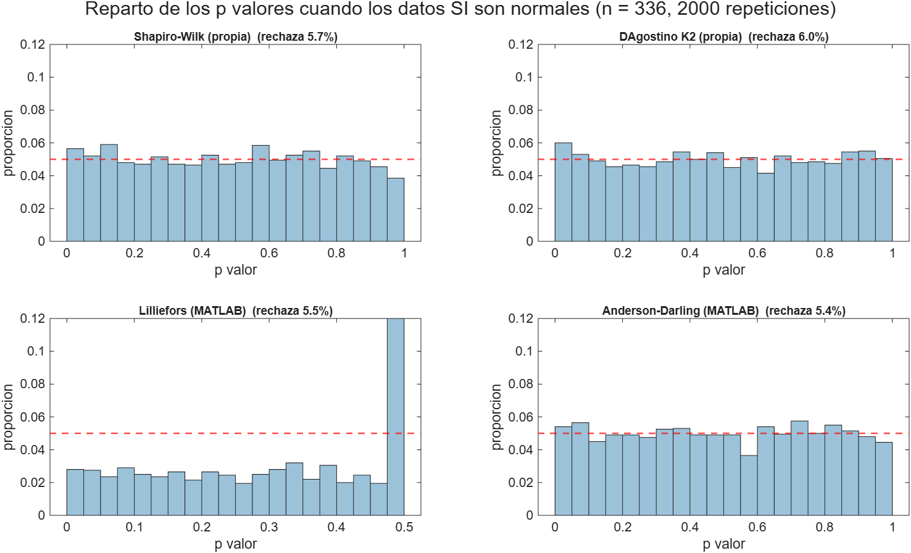
*Los cuatro histogramas deberían ser planos. Los de las dos funciones propias lo son. Los de Lilliefors se ven cortados porque MATLAB trunca ese p valor al rango de su tabla interna, entre 0,001 y 0,5, así que la prueba de uniformidad no le aplica.*

La segunda comprobación es al revés. Genero datos que no son normales y miro cuántas veces la prueba se da cuenta. Con n grande todas las pruebas detectan prácticamente todo y no se distinguen, así que la comparación se hace con n de 30, que es donde se separan.

| Distribución | Shapiro Wilk, propia | D'Agostino K², propia | Lilliefors | Anderson Darling |
|---|---|---|---|---|
| Exponencial | 96,6 % | 78,8 % | 80,2 % | 94,1 % |
| Uniforme | 36,6 % | 40,2 % | 15,0 % | 28,5 % |
| t de Student con 5 gl | 24,5 % | 29,3 % | 16,4 % | 21,9 % |
| Lognormal con sigma 0,25 | 25,9 % | 23,2 % | 15,3 % | 22,1 % |

Y la misma tabla con n de 336, para ver cómo se cierra la brecha al crecer la muestra.

| Distribución | Shapiro Wilk, propia | D'Agostino K², propia | Lilliefors | Anderson Darling |
|---|---|---|---|---|
| Exponencial | 100 % | 100 % | 100 % | 100 % |
| Uniforme | 100 % | 100 % | 99,95 % | 100 % |
| t de Student con 5 gl | 95,0 % | 95,4 % | 74,7 % | 90,7 % |
| Lognormal con sigma 0,25 | 100 % | 99,8 % | 92,4 % | 99,4 % |

Aquí sale un matiz que vale la pena documentar. Shapiro Wilk es la mejor detectando asimetría, que es el caso de la exponencial y de la lognormal. D'Agostino gana cuando el problema está en las colas, que es el caso de la uniforme y de la t de Student, lo cual tiene sentido porque su estadístico está construido justamente sobre asimetría y curtosis. Y Lilliefors es la más floja de las cuatro en todos los escenarios, con diferencias grandes: en la t de Student con n de 336 detecta el 74,7 por ciento cuando las otras andan por el 90 y pico. Eso coincide con lo que dice la guía cuando la califica de menos potente que Shapiro Wilk.

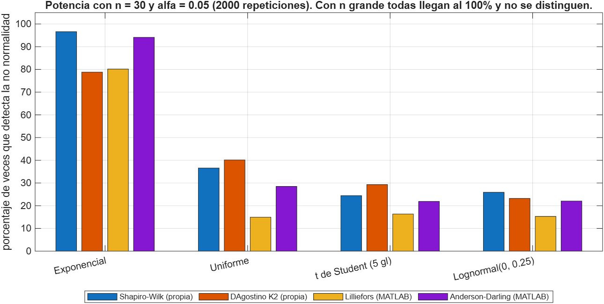
*Con muestras chicas ninguna prueba domina en todo. Shapiro Wilk gana contra la asimetría y D’Agostino contra las colas raras. Con muestras del tamaño de este dataset la comparación deja de tener sentido porque todas llegan al 100 por ciento.*

Vale aclarar que en este dataset Shapiro Wilk se corre sobre una submuestra aleatoria de 5.000 registros, porque la aproximación de Royston pierde validez por encima de ese tamaño. Para el total se usan Lilliefors y Anderson Darling.

## El dataset y cómo quedó tipificado

45.211 registros y 17 columnas. Las 16 primeras son predictoras y la última es la clase. El significado de cada una viene del archivo `bank-names.txt` que trae el propio dataset.

Las primeras ocho describen al cliente.

| Variable | Tipo | Qué es | Valores |
|---|---|---|---|
| `age` | numérica discreta | edad del cliente en años | de 18 a 95 |
| `job` | categórica nominal | tipo de trabajo | 12 niveles: admin., unknown, unemployed, management, housemaid, entrepreneur, student, blue collar, self employed, retired, technician, services |
| `marital` | categórica nominal | estado civil, donde divorced incluye también viudo | married, divorced, single |
| `education` | categórica ordinal | nivel educativo alcanzado | unknown, primary, secondary, tertiary |
| `default` | binaria | si tiene algún crédito en mora | yes, no |
| `balance` | numérica continua | saldo medio anual de la cuenta, en euros | de −8.019 a 102.127 |
| `housing` | binaria | si tiene crédito de vivienda | yes, no |
| `loan` | binaria | si tiene crédito de consumo | yes, no |

Las cuatro siguientes describen el último contacto de la campaña actual.

| Variable | Tipo | Qué es | Valores |
|---|---|---|---|
| `contact` | categórica nominal | medio por el que se hizo el contacto | cellular, telephone, unknown |
| `day` | numérica discreta | día del mes del último contacto | de 1 a 31 |
| `month` | categórica nominal cíclica | mes del último contacto | los 12 meses abreviados en inglés |
| `duration` | numérica continua | duración del último contacto, en segundos | de 0 a 4.918 |

Las cuatro últimas son el historial de contactos del cliente.

| Variable | Tipo | Qué es | Valores |
|---|---|---|---|
| `campaign` | numérica discreta | número de contactos hechos a este cliente durante esta campaña, incluyendo el último | de 1 a 63 |
| `pdays` | numérica discreta | días transcurridos desde que se contactó al cliente en una campaña anterior | de 0 a 871, y el valor −1 significa que nunca se le había contactado |
| `previous` | numérica discreta | número de contactos hechos a este cliente antes de esta campaña | de 0 a 275 |
| `poutcome` | categórica nominal | resultado de la campaña de marketing anterior | success, failure, other, unknown |

Y la variable objetivo.

| Variable | Tipo | Qué es | Valores |
|---|---|---|---|
| `y` | binaria | si el cliente terminó contratando el depósito a plazo | yes con 5.289 casos, no con 39.922 |

Resumiendo la tipificación, quedan siete numéricas, que son `age`, `balance`, `day`, `duration`, `campaign`, `pdays` y `previous`, nueve categóricas, que son `job`, `marital`, `education`, `default`, `housing`, `loan`, `contact`, `month` y `poutcome`, y la clase binaria `y`.

Hay tres cosas de esta tipificación que condicionan todo lo que viene después.

La primera es que `duration` no debería usarse para predecir. La duración de una llamada solo se conoce cuando la llamada ya terminó, así que no está disponible en el momento en que uno querría decidir a quién llamar. La documentación del dataset lo advierte de forma explícita.

La segunda es que `pdays` mezcla dos informaciones en una sola columna. Cuando vale un número positivo es una cantidad de días, y cuando vale −1 es una etiqueta que significa "nunca contactado". Un modelo que la reciba tal cual va a tratar ese −1 como si fuera una cantidad de días.

La tercera es que `education` es ordinal, porque primary, secondary y tertiary tienen un orden natural, pero el nivel unknown no encaja en esa escala. En este trabajo se trató como nominal y se convirtió a columnas indicadoras, que es la opción conservadora.

Sobre las variables derivadas que aparecen más adelante, en la etapa B1 se crea `contactado_antes`, que vale 1 si el cliente había sido contactado en una campaña anterior y 0 si no, y `pdays` se deja en 0 cuando no aplica. Las nueve categóricas se convierten en columnas indicadoras de cero y uno, con nombres del tipo `job_management` o `poutcome_success`, una por cada nivel salvo el primero.

## Faltantes disfrazados

El dataset no tiene ni un solo NaN, y ahí está la trampa. Los faltantes vienen codificados como texto dentro de las categorías.

| Variable | Categorías | Registros en "unknown" | Porcentaje |
|---|---|---|---|
| poutcome | 4 | 36.959 | 81,7 |
| contact | 3 | 13.020 | 28,8 |
| education | 4 | 1.857 | 4,1 |
| job | 12 | 288 | 0,64 |

Y aparte de eso, `pdays` vale menos uno en 36.954 registros, el 81,7 por ciento. Ese menos uno no es un número de días, es la etiqueta "nunca lo habían contactado". Si se deja como número, el modelo entiende literalmente que a esos clientes se les contactó hace menos un días, y cualquier distancia euclidiana calculada entre menos uno y trescientos es basura.

Sobre los "unknown" tomé la decisión de dejarlos como categoría propia y no imputarlos. Con el 81,7 por ciento de `poutcome` en esa categoría, imputar habría sido inventar. Sobre `pdays` sí hubo corrección, y está explicada en la sección de etapas.

## Descriptivos

| Variable | Media | Mediana | Desv | Mín | Máx | IQR | Asimetría | Curtosis |
|---|---|---|---|---|---|---|---|---|
| age | 40,94 | 39 | 10,62 | 18 | 95 | 15 | 0,68 | 3,32 |
| balance | 1.362 | 448 | 3.045 | −8.019 | 102.127 | 1.356 | 8,36 | 143,7 |
| day | 15,81 | 16 | 8,32 | 1 | 31 | 13 | 0,09 | 1,94 |
| duration | 258,2 | 180 | 257,5 | 0 | 4.918 | 216 | 3,14 | 21,15 |
| campaign | 2,76 | 2 | 3,10 | 1 | 63 | 2 | 4,90 | 42,25 |
| pdays | 40,20 | −1 | 100,1 | −1 | 871 | 0 | 2,62 | 9,93 |
| previous | 0,58 | 0 | 2,30 | 0 | 275 | 0 | 41,85 | 4.509 |

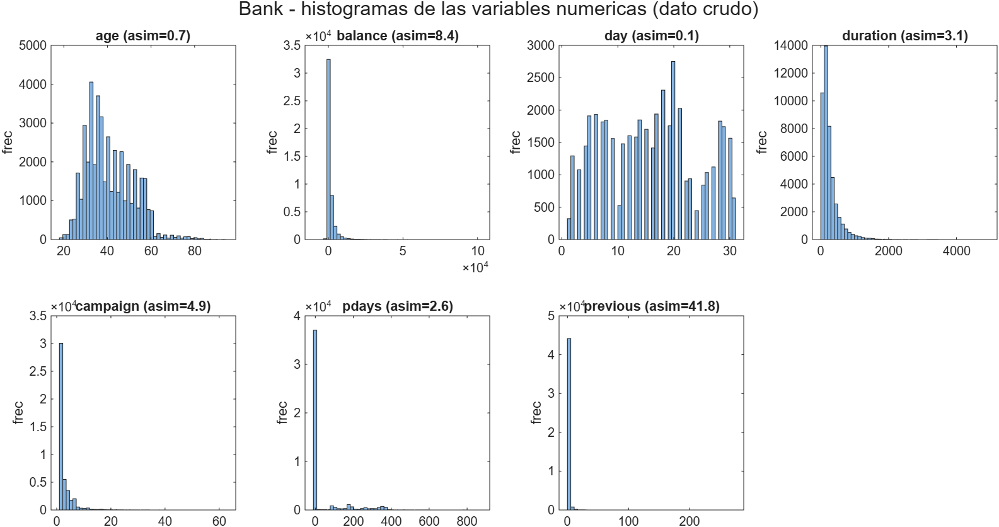
*`balance`, `duration`, `campaign` y `previous` tienen colas larguísimas. `pdays` se ve bimodal por culpa del menos uno.*

`previous` con curtosis de 4.509 es un caso de manual. Casi todos los valores son cero y hay un cliente con 275 contactos previos.

Y hay algo que rompe la receta estándar. `pdays` y `previous` tienen IQR igual a cero, porque más del 75 por ciento de los registros vale lo mismo. Con IQR de cero la regla de Tukey marca como atípico todo valor distinto del cuartil, y winsorizar dejaría la variable convertida en una constante. Es un caso donde aplicar el procedimiento a ciegas destruye el dato, y se trata aparte.

## Balance de la variable objetivo

| Clase | N | Porcentaje |
|---|---|---|
| no | 39.922 | 88,30 |
| yes | 5.289 | 11,70 |

La prueba binomial exacta contra la hipótesis de 50 y 50 devuelve un p valor por debajo de 2,2e−308, que es el mínimo representable en doble precisión, así que MATLAB entrega cero exacto. No es un error de cálculo, es desborde, y conviene decirlo así en vez de reportar un cero. El chi cuadrado de bondad de ajuste da 26.529,9 con un grado de libertad. La razón de desbalance es de 7,55 a 1.

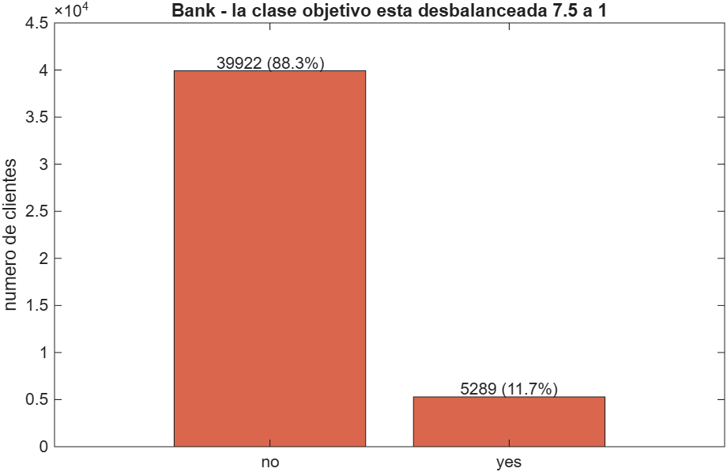
*Siete clientes y medio que dicen que no por cada uno que dice que sí.*

La consecuencia práctica es la que importa. Un modelo que diga siempre "no" acierta el 88,30 por ciento. Ese es el piso contra el que hay que comparar todo, y no el 50 por ciento.

## Normalidad

Con 45.211 registros hice dos cosas distintas. Shapiro Wilk sobre una submuestra aleatoria de 5.000, porque por encima de ese tamaño la aproximación pierde validez, y Lilliefors más Anderson Darling sobre el total.

| Variable | p Shapiro sobre 5.000 | p Lilliefors | p Anderson Darling | Asimetría | Curtosis |
|---|---|---|---|---|---|
| age | 1,6e−35 | menor a 0,001 | menor a 0,0005 | 0,68 | 3,32 |
| balance | 1,3e−77 | menor a 0,001 | menor a 0,0005 | 8,36 | 143,7 |
| day | 2,0e−35 | menor a 0,001 | menor a 0,0005 | 0,09 | 1,94 |
| duration | 1,6e−68 | menor a 0,001 | menor a 0,0005 | 3,14 | 21,15 |
| campaign | 1,8e−76 | menor a 0,001 | menor a 0,0005 | 4,90 | 42,25 |
| pdays | 9,8e−82 | menor a 0,001 | menor a 0,0005 | 2,62 | 9,93 |
| previous | 1,4e−85 | menor a 0,001 | menor a 0,0005 | 41,85 | 4.509 |

Cero de siete. Ruta no paramétrica sin discusión. Vale la pena anotar que con este tamaño de muestra las pruebas de normalidad casi no informan, porque cualquier desviación mínima sale significativa. Los que sí informan son la asimetría, la curtosis y los Q-Q plots.

## Homogeneidad de varianzas y comparación entre las dos clases

Levene y Bartlett rechazan homocedasticidad en las siete variables, y el p más alto de todos es el de `day` con 0,0127. Sin normalidad y sin homocedasticidad, el t de Student clásico queda descartado, así que se reportan Welch y Mann Whitney junto con el tamaño del efecto.

| Variable | Diferencia de medias | p Student | p Welch | p Mann Whitney | d de Cohen | r biserial | Efecto al menos pequeño |
|---|---|---|---|---|---|---|---|
| duration | +316,1 | menor a 1e−300 | menor a 1e−300 | menor a 1e−300 | 1,336 | 0,615 | sí |
| pdays | +32,3 | 3,8e−108 | 7,3e−78 | 2,5e−235 | 0,324 | 0,186 | sí |
| previous | +0,67 | 7,8e−88 | 1,4e−71 | 3,5e−283 | 0,291 | 0,205 | sí |
| campaign | −0,71 | 1,0e−54 | 3,7e−112 | 1,9e−71 | −0,228 | −0,145 | sí |
| balance | +500,6 | 2,5e−29 | 4,4e−23 | 6,6e−101 | 0,165 | 0,180 | no |
| day | −0,73 | 1,7e−09 | 3,4e−09 | 3,3e−10 | −0,088 | −0,053 | no |
| age | +0,83 | 8,8e−08 | 1,6e−05 | 0,063 | 0,078 | −0,016 | no |

Este es el punto más importante de toda la revisión de este dataset. Las siete variables salen significativas con Welch, o sea siete de siete, pero solo cuatro tienen un tamaño de efecto que llegue siquiera al umbral de "pequeño", que se suele poner en 0,2 de d de Cohen.

El caso de `age` lo resume. El p valor da 1,6e−05, aparentemente contundente, pero la diferencia de medias es de 0,83 años y la d de Cohen es 0,078. Con 45 mil datos una diferencia de diez meses de edad es estadísticamente detectable y prácticamente irrelevante. Y el detalle final es que Mann Whitney ni siquiera la encuentra significativa, con p de 0,063, porque las medianas no se mueven. Reportar solo el p valor del t test aquí sería directamente engañoso.

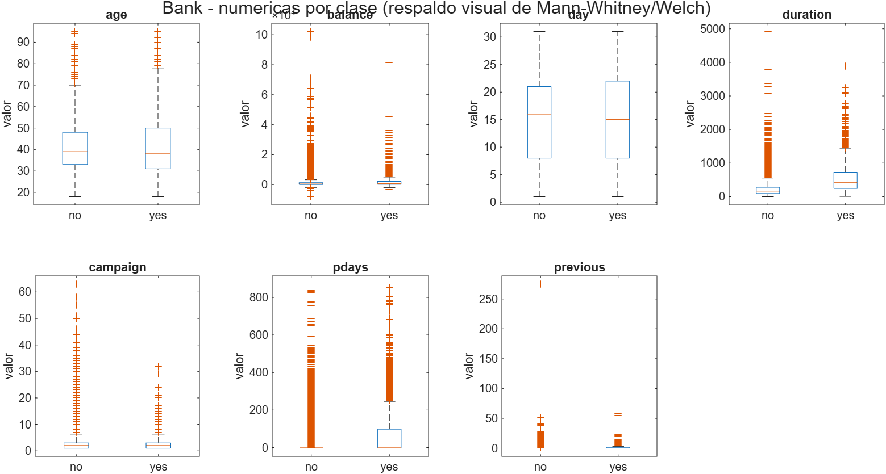
*En `age` las dos cajas son casi idénticas, que es lo que dice la d de Cohen y no lo que dice el p valor.*

## Las categóricas contra la clase

| Variable | Niveles | Chi cuadrado | gl | p | V de Cramér | Mínimo esperado | Cumple la regla del 5 |
|---|---|---|---|---|---|---|---|
| poutcome | 4 | 4.391,5 | 3 | menor a 1e−300 | 0,312 | 176,8 | sí |
| month | 12 | 3.061,8 | 11 | menor a 1e−300 | 0,260 | 25,0 | sí |
| contact | 3 | 1.035,7 | 2 | 1,3e−225 | 0,151 | 340,0 | sí |
| housing | 2 | 875,7 | 1 | 1,9e−192 | 0,139 | 2.349 | sí |
| job | 12 | 836,1 | 11 | 3,3e−172 | 0,136 | 33,7 | sí |
| education | 4 | 238,9 | 3 | 1,6e−51 | 0,073 | 217,2 | sí |
| loan | 2 | 210,2 | 1 | 1,2e−47 | 0,068 | 847,4 | sí |
| marital | 3 | 196,5 | 2 | 2,1e−43 | 0,066 | 609,1 | sí |
| default | 2 | 22,7 | 1 | 1,9e−06 | 0,022 | 95,3 | sí |

Las nueve cumplen la regla del conteo esperado mayor o igual a 5, así que el test exacto de Fisher no hace falta y por eso no se aplicó. Es una de las pruebas de la guía que se revisó, se determinó que no correspondía y se documenta la razón en vez de correrla por correrla.

Otra vez todas dan un p ridículamente pequeño y otra vez es la V de Cramér la que ordena de verdad. `poutcome` con 0,312 sí discrimina. `default` con 0,022 es prácticamente ruido pese a su p de 1,9e−06.

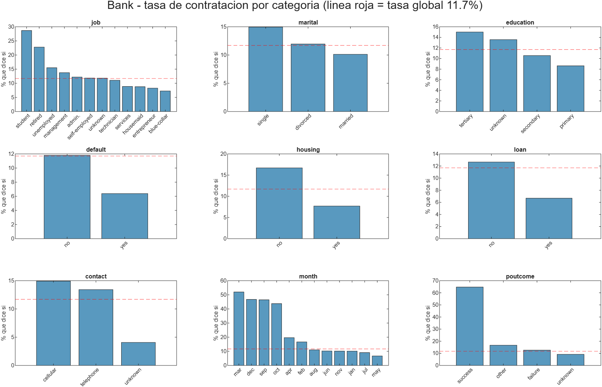
*La línea roja es la tasa global de 11,7 por ciento. En `poutcome` igual a success contrata el 64,7 por ciento y en marzo la tasa llega al 52 por ciento. `poutcome` y `month` son las que más se despegan, que es lo que decía la V de Cramér.*

## Correlación y multicolinealidad

Entre las numéricas no hay nada preocupante. El VIF queda entre 1,01 y 1,28 en las siete y el número de condición de la matriz estandarizada es 1,7. Tiene sentido, porque son variables de naturaleza muy distinta entre sí: edad, saldo, día del mes, número de contactos.

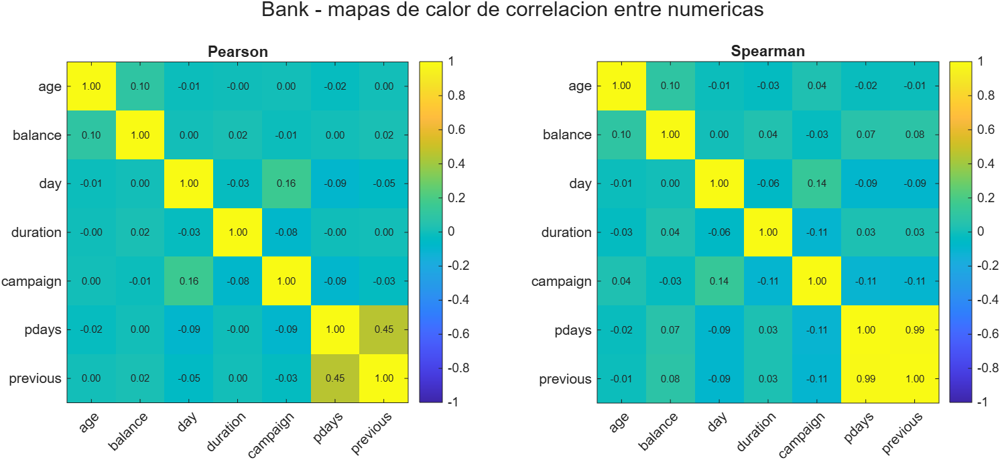
*La correlación más alta es entre `pdays` y `previous`, y ni siquiera llega a niveles problemáticos.*

## Relevancia de las variables frente a la clase

El ranking se hizo con MRMR sobre una tabla mixta, con numéricas y categóricas juntas, de modo que los puntajes son comparables entre los dos tipos.

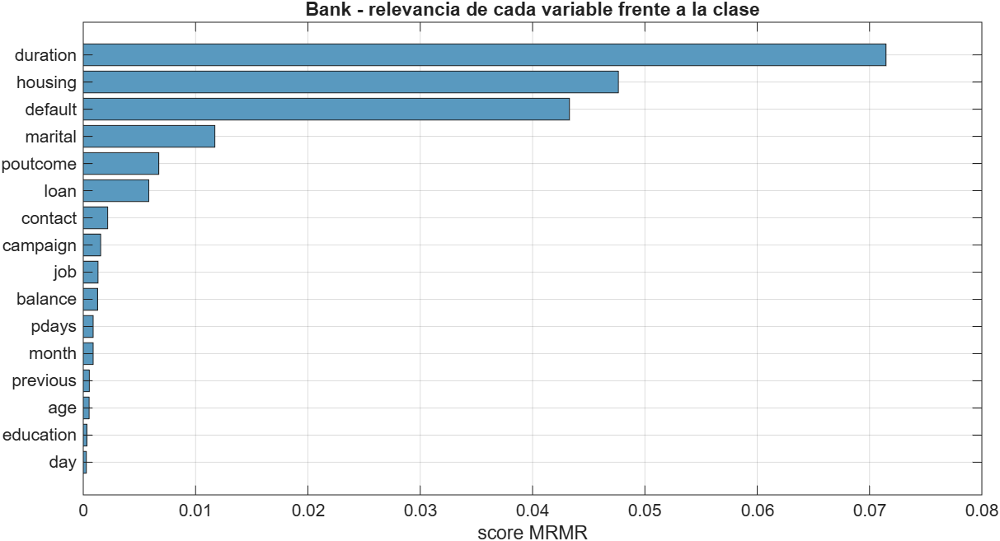
*`duration` encabeza, como era de esperar tratándose de la variable con fuga de información.*

Este ranking hay que mirarlo con lupa, porque no coincide con la V de Cramér. MRMR pone a `default` en tercer lugar cuando es justamente la categórica con la asociación más débil de todas. No es un error de cálculo. MRMR pondera la relevancia dividida por la redundancia, y `default` vale "no" en el 98 por ciento de los registros, así que no se parece a ninguna otra variable y su redundancia sale bajísima. Cuando todas las relevancias son pequeñas ese cociente se vuelve inestable y premia a las variables raras aunque no aporten.

Es un argumento más para no casarse con un solo criterio de selección. Aquí la V de Cramér es más creíble que el MRMR, y de hecho la etapa B5, que se construyó siguiendo el ranking MRMR, terminó empeorando todos los modelos.

## Atípicos

| Variable | IQR | Atípicos por IQR | Porcentaje | Atípicos por z mayor a 3 | Porcentaje |
|---|---|---|---|---|---|
| age | 15 | 487 | 1,08 | 381 | 0,84 |
| balance | 1.356 | 4.729 | 10,46 | 745 | 1,65 |
| day | 13 | 0 | 0,00 | 0 | 0,00 |
| duration | 216 | 3.235 | 7,16 | 963 | 2,13 |
| campaign | 2 | 3.064 | 6,78 | 840 | 1,86 |
| pdays | 0 | 8.257 | 18,26 | 1.723 | 3,81 |
| previous | 0 | 8.257 | 18,26 | 582 | 1,29 |

Las filas con al menos un atípico son 17.018, o sea el 37,6 por ciento del dataset. Borrar filas queda descartado de entrada.

Y como ya se dijo, en `pdays` y `previous` la regla del IQR ni siquiera está bien definida, porque su IQR es cero. Los 8.257 "atípicos" de cada una no son atípicos, son simplemente los valores distintos del centinela.

## Las seis etapas del dataset

Todas las etapas quedan en matriz numérica. Las categóricas se convierten en columnas indicadoras de cero y uno, una por nivel menos el primero, que se deja fuera para no crear columnas linealmente dependientes entre sí. Siete numéricas más 35 indicadoras dan 42 columnas. Se hizo así porque KNN, LDA y la regresión logística necesitan números, y además es lo que Classification Learner termina haciendo internamente con esos modelos.

| Etapa | Qué se hizo | Filas | Columnas | no y yes | IR |
|---|---|---|---|---|---|
| B0 crudo | one hot de las categóricas, incluye `duration` y `pdays` con el menos uno | 45.211 | 42 | 39.922 y 5.289 | 7,55 |
| B1 correcciones | fuera `duration`, `pdays` partido en bandera más valor, winsorización | 45.211 | 42 | 39.922 y 5.289 | 7,55 |
| B2 balanceado | submuestreo aleatorio de la clase `no` hasta 50 y 50 | 10.578 | 42 | 5.289 y 5.289 | 1,00 |
| B3 estandarizado | B2 con z score | 10.578 | 42 | 5.289 y 5.289 | 1,00 |
| B4 normalizado | B2 reescalado a 0 y 1 | 10.578 | 42 | 5.289 y 5.289 | 1,00 |
| B5 selección | B3 con las 20 columnas mejor rankeadas por MRMR | 10.578 | 20 | 5.289 y 5.289 | 1,00 |

Conviene aclarar que B3 y B4 son ramas alternativas sobre B2, no pasos encadenados.

Las tres decisiones de B1, en orden de importancia.

La primera es que **se elimina `duration`**. La documentación de UCI lo dice de frente: la duración de la llamada solo se conoce después de hacerla, y si la llamada dura cero segundos la respuesta es "no" por definición. Usarla es predecir con información del futuro. No es casualidad que sea la variable con mayor efecto de todas, con d de Cohen de 1,336, lo es precisamente porque hace trampa.

La segunda es que **`pdays` se parte en dos**. Se crea una bandera binaria `contactado_antes`, con valores cero y uno, y el valor numérico se pone en cero cuando no aplica. Así se separa "no lo habían contactado" de "lo contactaron hace X días", que son dos informaciones distintas metidas en la misma columna.

La tercera es una **winsorización selectiva**. Se aplica 1,5 por IQR solo en `age`, `balance` y `campaign`, que son las que tienen IQR mayor que cero, y eso toca 7.860 filas, el 17,4 por ciento. En `pdays` y `previous` se recortó el percentil 99 en su lugar, dejando `pdays` en 370, lo que tocó 385 valores, y `previous` en 9, lo que tocó 361 valores.

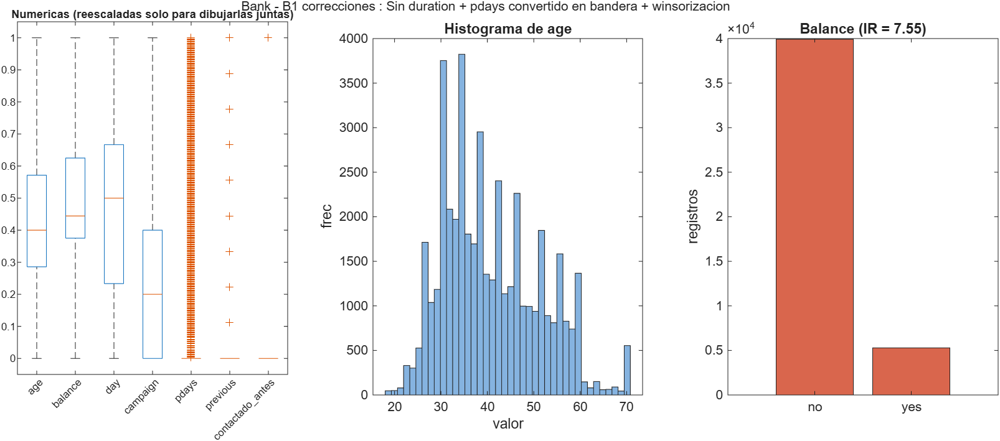
*En el boxplot se ve que `pdays` y `previous` siguen siendo casi constantes. Son variables con IQR cero y ninguna winsorización las arregla.*

Sobre B2 hay que ser explícito con lo que se pierde. El submuestreo tira 34.633 registros de la clase `no`, que es el 76,6 por ciento de esa clase. Es una pérdida enorme de información. Se eligió sobre SMOTE porque con 5.289 registros de la clase `yes` quedan 10.578 filas, que alcanzan de sobra para entrenar, mientras que sobremuestrear habría dejado 79.844 filas con 34.633 registros inventados, más lento en Classification Learner y, como se ve al final, más peligroso.

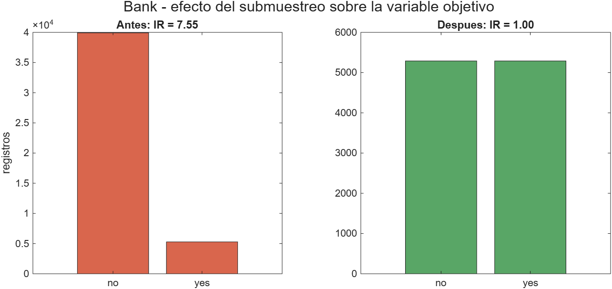
*El precio de llegar a 50 y 50 es botar tres cuartas partes de la clase mayoritaria.*

## Los modelos

Cuatro clasificadores en todas las etapas y un quinto solo en las balanceadas, con validación cruzada de 5 pliegues.

El árbol aguanta variables mezcladas y no le afecta la escala. El KNN es justo lo contrario y debería ser el que más note el escalado. El LDA es la ruta paramétrica clásica. La regresión logística es el modelo de referencia para un problema binario como este. El SVM lineal se corrió solo en las etapas de 10.578 filas, porque con 45.211 el entrenamiento se dispara y no aporta nada nuevo al análisis.

Naive Bayes se dejó por fuera a propósito. Asume que las predictoras son independientes dentro de cada clase, y las columnas indicadoras de una misma variable categórica son mutuamente excluyentes, o sea lo más dependiente que puede haber. Aplicarlo aquí sería violar su supuesto central de forma estructural y no accidental.

| Etapa | Modelo | Exactitud | Exactitud balanceada | Kappa | Recall de yes | Precisión de yes | F1 de yes |
|---|---|---|---|---|---|---|---|
| B0 crudo | Árbol | 0,883 | 0,705 | 0,420 | 0,474 | 0,498 | 0,486 |
| B0 crudo | KNN | 0,882 | 0,617 | 0,291 | 0,270 | 0,494 | 0,349 |
| B0 crudo | LDA | 0,900 | 0,699 | 0,452 | 0,437 | 0,601 | 0,506 |
| B0 crudo | Logística | 0,883 | 0,500 | −0,0001 | 0,000 | 0,000 | 0,000 |
| B1 correcciones | Árbol | 0,854 | 0,619 | 0,252 | 0,312 | 0,358 | 0,334 |
| B1 correcciones | KNN | 0,876 | 0,545 | 0,130 | 0,113 | 0,392 | 0,176 |
| B1 correcciones | LDA | 0,890 | 0,624 | 0,318 | 0,276 | 0,561 | 0,370 |
| B1 correcciones | Logística | 0,883 | 0,500 | −0,0001 | 0,0002 | 0,100 | 0,0004 |
| B2 balanceado | Árbol | 0,650 | 0,650 | 0,299 | 0,645 | 0,651 | 0,648 |
| B2 balanceado | KNN | 0,600 | 0,600 | 0,200 | 0,562 | 0,608 | 0,584 |
| B2 balanceado | LDA | 0,701 | 0,701 | 0,402 | 0,638 | 0,730 | 0,681 |
| B2 balanceado | Logística | 0,676 | 0,676 | 0,351 | 0,676 | 0,676 | 0,676 |
| B2 balanceado | SVM | 0,695 | 0,695 | 0,389 | 0,571 | 0,759 | 0,652 |
| B3 estandarizado | Árbol | 0,648 | 0,648 | 0,296 | 0,644 | 0,649 | 0,646 |
| B3 estandarizado | KNN | 0,687 | 0,687 | 0,373 | 0,648 | 0,702 | 0,674 |
| B3 estandarizado | LDA | 0,701 | 0,701 | 0,402 | 0,638 | 0,730 | 0,681 |
| B3 estandarizado | Logística | 0,702 | 0,702 | 0,404 | 0,635 | 0,733 | 0,680 |
| B3 estandarizado | SVM | 0,695 | 0,695 | 0,389 | 0,571 | 0,759 | 0,651 |
| B4 normalizado | Árbol | 0,649 | 0,649 | 0,297 | 0,643 | 0,650 | 0,647 |
| B4 normalizado | KNN | 0,684 | 0,684 | 0,367 | 0,649 | 0,697 | 0,672 |
| B4 normalizado | LDA | 0,701 | 0,701 | 0,402 | 0,638 | 0,730 | 0,681 |
| B4 normalizado | Logística | 0,702 | 0,702 | 0,404 | 0,636 | 0,733 | 0,681 |
| B4 normalizado | SVM | 0,695 | 0,695 | 0,389 | 0,571 | 0,759 | 0,651 |
| B5 selección | Árbol | 0,630 | 0,630 | 0,259 | 0,622 | 0,632 | 0,627 |
| B5 selección | KNN | 0,662 | 0,662 | 0,325 | 0,639 | 0,670 | 0,654 |
| B5 selección | LDA | 0,690 | 0,690 | 0,379 | 0,635 | 0,713 | 0,672 |
| B5 selección | Logística | 0,689 | 0,689 | 0,379 | 0,630 | 0,715 | 0,670 |
| B5 selección | SVM | 0,685 | 0,685 | 0,370 | 0,585 | 0,731 | 0,650 |

Antes de leerla, una advertencia. Las exactitudes de B0 y B1 no se comparan de frente con las de B2 a B5, porque la referencia de "predecir siempre la clase mayoritaria" vale 0,883 en las primeras y 0,500 en las segundas. Por eso el Excel incluye la columna de mejora sobre la base.

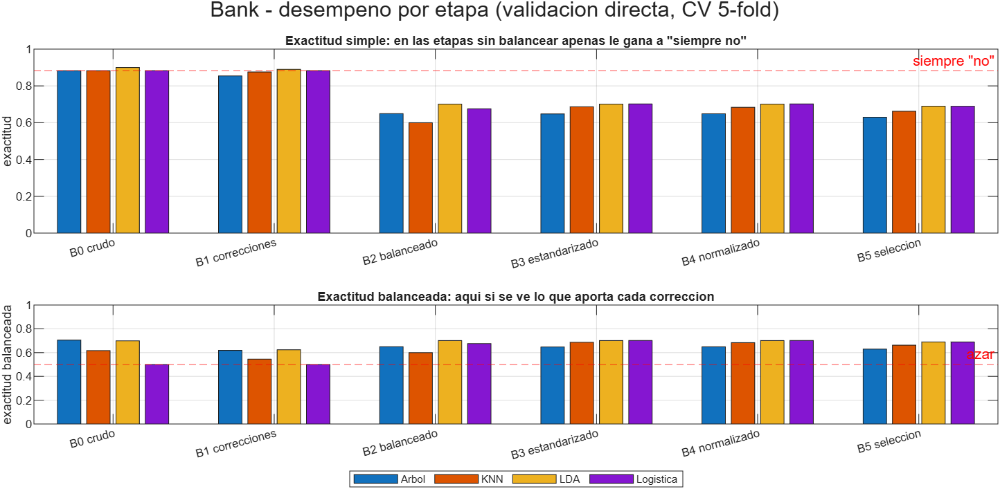
*Arriba la exactitud simple con la tasa base marcada. Abajo la exactitud balanceada. La primera no distingue nada y la segunda sí.*

Visto por modelo, quién llega más alto y qué tan sensible es a cómo le llegue el dato.

| Modelo | Mejor | En la etapa | Peor | En la etapa | Diferencia |
|---|---|---|---|---|---|
| Árbol | 0,7054 | B0 crudo, con fuga | 0,6189 | B1 correcciones | 0,087 |
| Logística | 0,7021 | B4 normalizado | 0,5000 | B0 crudo | 0,202 |
| LDA | 0,7010 | B2 balanceado | 0,6238 | B1 correcciones | 0,077 |
| SVM | 0,6946 | B2 balanceado | 0,6849 | B5 selección | 0,010 |
| KNN | 0,6866 | B3 estandarizado | 0,5450 | B1 correcciones | 0,142 |

El 0,7054 del árbol está marcado porque es la etapa que todavía tiene `duration`. Descontando esa, el mejor resultado legítimo del dataset es la regresión logística sobre B4 con 0,7021, prácticamente empatada con B3.

La columna de la diferencia vuelve a ser la más informativa. La regresión logística es el modelo más sensible al preprocesamiento, con 0,202 entre su mejor y su peor versión, y el SVM el más estable con 0,010, porque `templateSVM` estandariza internamente y ya trae puesta la corrección que a los demás hay que darles.

Lo que se lee de la tabla completa es lo siguiente.

La regresión logística en B0 y B1 predice "no" para absolutamente todos los clientes. Exactitud de 0,883, idéntica a la tasa base, exactitud balanceada de 0,500, kappa de menos 0,0001 y recall de la clase `yes` igual a cero. Si uno mirara solo la exactitud, este modelo parecería tan bueno como los demás y en realidad es inútil. Es la demostración más limpia de por qué la exactitud no sirve con clases desbalanceadas.

Quitar `duration` en B1 hunde el desempeño. El árbol cae de 0,705 a 0,619 de exactitud balanceada y el KNN de 0,617 a 0,545. Eso confirma que esa sola variable cargaba casi toda la señal, y confirma también que había que quitarla, porque ese 0,705 no era real.

Balancear en B2 sube el recall de la clase `yes` de 0,312 a 0,645 en el árbol. Ese es el objetivo del negocio, porque al banco le interesa detectar a quién llamar y no acertar en los que van a decir que no.

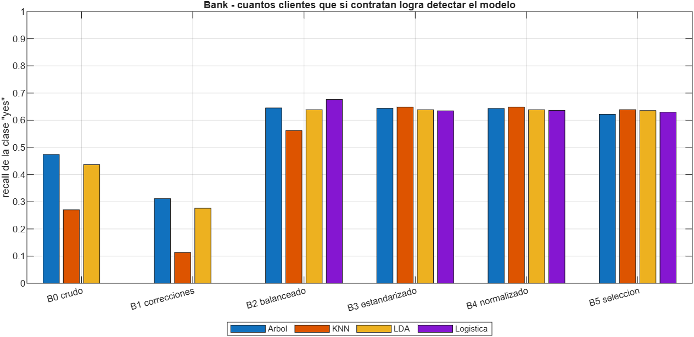
*Cuántos de los clientes que sí contratan detecta cada modelo en cada etapa.*

Estandarizar en B3 es donde este dataset brilla. El KNN salta de 0,600 a 0,687, que son 8,7 puntos, y la logística de 0,676 a 0,702. En cambio el árbol y el LDA no se mueven ni una milésima. Es exactamente lo esperado: el árbol parte por umbrales, que son invariantes a transformaciones monótonas, y el LDA ya estandariza implícitamente al invertir la matriz de covarianza. El KNN, que compara distancias euclidianas, estaba dominado por `balance`, que llega a 102.127, frente a columnas que solo valen cero o uno.

Normalizar en B4 da prácticamente lo mismo que estandarizar, con diferencias de más o menos 0,003. Con este tipo de datos da igual cuál de las dos se use.

La selección de variables en B5 empeora todo, entre 1,0 y 2,4 puntos abajo en los cinco modelos. Quedarse con 20 de 42 columnas pierde información útil.

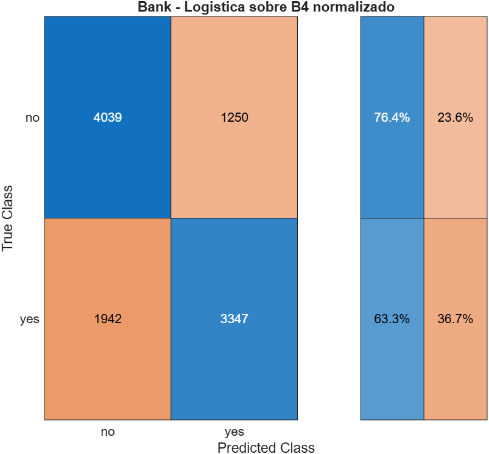
*Matriz de confusión del mejor modelo sin fuga de información.*

## Balancear antes de partir, y por qué aquí no infla

Cuando uno balancea el dataset completo y después se lo pasa a Classification Learner, la validación cruzada está partiendo un conjunto que ya fue modificado. Para medir si eso importa, hice la validación cruzada a mano aplicando el submuestreo solo dentro del bloque de entrenamiento de cada pliegue.

| Modelo | Submuestreo antes de partir | Submuestreo dentro del pliegue | Diferencia |
|---|---|---|---|
| Árbol | 0,6496 | 0,6473 | 0,0023 |
| KNN | 0,5998 | 0,5961 | 0,0037 |
| LDA | 0,7010 | 0,7047 | −0,0037 |
| Logística | 0,6757 | 0,6851 | −0,0093 |

El promedio de la diferencia es 0,0000, con signos mezclados. O sea que aquí balancear antes de particionar no infla nada.

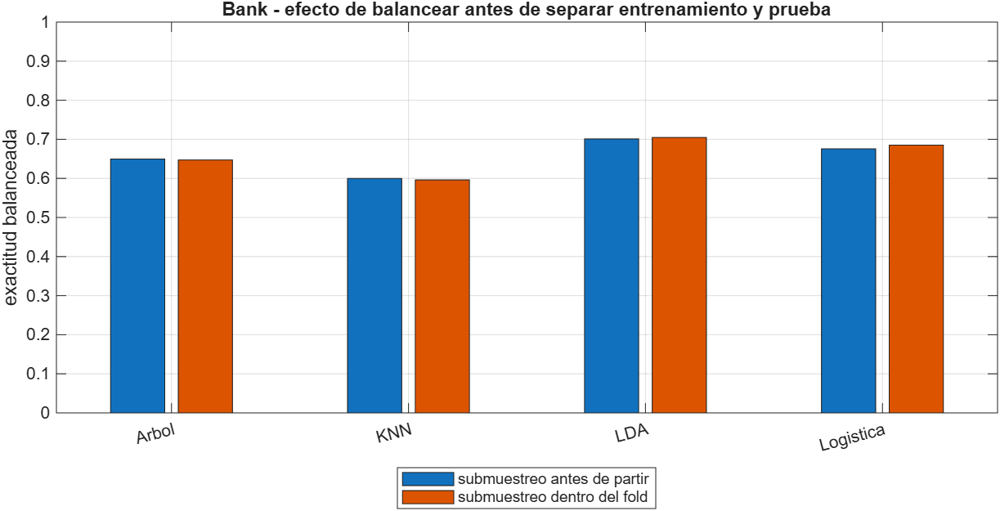
*Las dos barras de cada par son prácticamente iguales.*

Esto contrasta con lo que ocurre en el otro dataset de la actividad, donde el balanceo se hizo con SMOTE y el inflado promedio fue de 0,0738 puntos. La explicación es la naturaleza del método. El submuestreo solo elimina filas, no crea información nueva, así que el bloque de prueba nunca se contamina. SMOTE en cambio construye puntos sintéticos interpolando vecinos, y si se aplica antes de partir, esos sintéticos se derivaron de puntos que van a terminar en el bloque de prueba.

La lección práctica es concreta. Un CSV balanceado por submuestreo se puede cargar en Classification Learner y el número que sale es confiable. Uno balanceado con SMOTE, no.

Hay un segundo efecto que sí importa en este dataset y conviene verlo. En la validación honesta el bloque de prueba conserva la proporción real de 88 y 12, y ahí las métricas de la clase minoritaria cambian mucho.

| Métrica del LDA | Con el CSV balanceado | Con la proporción real |
|---|---|---|
| Recall de yes | 0,638 | 0,639 |
| Precisión de yes | 0,730 | 0,269 |

El recall es el mismo, pero la precisión se derrumba de 0,73 a 0,27. Con el CSV balanceado parece que 7 de cada 10 clientes marcados van a contratar, y en la realidad son menos de 3. La exactitud balanceada del CSV balanceado sí es honesta, pero la precisión no lo es, y eso hay que saberlo antes de prometerle algo al área comercial.

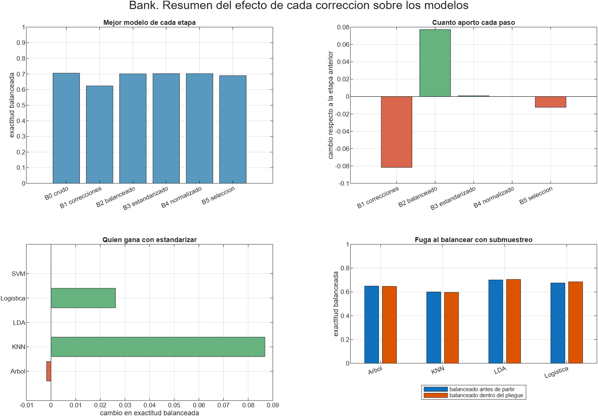
*Los cuatro resultados del dataset en una sola figura.*

## Lo que no funcionó

| Intento | Resultado | Por qué |
|---|---|---|
| Quitar `duration` | el desempeño cae entre 6 y 9 puntos | era la variable que cargaba la señal, pero era fuga de información y había que sacarla |
| Selección de variables en B5 | entre 0,010 y 0,024 por debajo | quedarse con 20 de 42 columnas pierde información útil |
| Normalizar en vez de estandarizar | empate técnico | con estos datos las dos hacen lo mismo |
| Regla de 1,5 por IQR en `pdays` y `previous` | inaplicable | su IQR es cero y winsorizar las volvería constantes |
| Ranking MRMR como criterio de selección | contradice a la V de Cramér | con relevancias todas pequeñas el cociente relevancia sobre redundancia se vuelve inestable |
| Exactitud simple como métrica | inservible | la tasa base ya es 0,883 y la logística la iguala prediciendo siempre "no" |

## Cómo revisarlo en Classification Learner

Los CSV de cada etapa están en `resultados/bank/etapas/`, son seis y todos tienen la clase en la última columna con el nombre `clase`.

Se abre con Apps, Classification Learner, New Session, From File, se selecciona el CSV y se pone `clase` como Response. Hay que dejar Cross Validation con 5 folds para que los números sean comparables con los de este informe.

Lo que más vale la pena mirar es el KNN entrenado sobre `bank_B2_balanceado.csv` y después sobre `bank_B3_estandarizado.csv`. Ahí está el salto de 8,7 puntos que produce el escalado. Y al leer los resultados de `bank_B0_crudo.csv` hay que cambiar la métrica que muestra la app, porque la exactitud va a decir 88 por ciento y no significa nada cuando la tasa base ya es 88,3.

## Limitaciones

Los hiperparámetros no se ajustaron. El KNN va con k igual a 5 fijo, el árbol sin podar, el SVM lineal. La comparación es entre etapas del dataset y no entre modelos, así que mantenerlos fijos es lo correcto, pero significa que ninguno de estos números es el mejor alcanzable.

Se usó una sola semilla, la 42. No hay repeticiones ni intervalos de confianza, así que diferencias menores a 0,01 no deberían interpretarse como reales.

Los "unknown" se dejaron como categoría propia. Con el 81,7 por ciento de `poutcome` en esa categoría, imputar habría sido inventar, pero tampoco se probó la alternativa de eliminar la variable.

El SVM no se corrió sobre las etapas de 45.211 filas por costo computacional, así que para B0 y B1 hay un modelo menos en la comparación.

## Anexo. Qué pruebas de la guía se aplicaron y cuáles no

| Sección de la guía | Prueba | Estado |
|---|---|---|
| 1 | Tipificación, descriptivos, histogramas, boxplots, Q-Q | aplicada |
| 2 | Shapiro Wilk | aplicada sobre submuestra de 5.000, programada y validada por simulación |
| 2 | Kolmogorov Smirnov con Lilliefors | aplicada sobre el total |
| 2 | Anderson Darling | aplicada sobre el total |
| 2 | D'Agostino Pearson K² | aplicada, programada y validada por simulación |
| 3 | Levene | aplicada |
| 3 | Bartlett | aplicada |
| 3 | Fligner Killeen | no aplicada, no es nativa de MATLAB y Levene ya cubre el caso robusto |
| 4 | t de Student | aplicada |
| 4 | t de Welch | aplicada, es la que se reporta por la heterocedasticidad |
| 4 | Mann Whitney U | aplicada |
| 5 | ANOVA y Kruskal Wallis | no aplican, la clase es binaria |
| 6 | Pearson y Spearman | aplicadas |
| 6 | Kendall | no aplicada, es de orden n al cuadrado y con 45.211 filas es inviable |
| 7 | Chi cuadrado de independencia | aplicada a las nueve categóricas |
| 7 | Test exacto de Fisher | no hizo falta, ninguna celda esperada quedó por debajo de 5 |
| 7 | V de Cramér | aplicada, y es la que ordena de verdad |
| 8 | ANOVA F para selección | aplicada, equivale al cuadrado del estadístico t con dos clases |
| 8 | Chi cuadrado para selección | aplicada |
| 8 | Información mutua mediante MRMR | aplicada sobre tabla mixta |
| 9 | Matriz de correlación con mapa de calor | aplicada |
| 9 | VIF | aplicada |
| 9 | Número de condición | aplicada |
| 10 | Z score | aplicada |
| 10 | Regla de 1,5 por IQR | aplicada, con la excepción documentada de las variables con IQR cero |
| 10 | Grubbs | no aplicada, detecta un solo atípico y exige normalidad, que no hay |
| 10 | Mahalanobis | no aplicada, con 35 columnas indicadoras la distancia pierde sentido |
| 11 | Prueba binomial | aplicada |
| 11 | Chi cuadrado de bondad de ajuste | aplicada como respaldo por el desborde de precisión |
| 12 | Wilcoxon pareado, McNemar, Q de Cochran | no aplican, no hay datos pareados |
| 13.1 | Histograma, boxplot, Q-Q | aplicados |
| 13.2 | Boxplot por clase | aplicado |
| 13.3 | Matriz de dispersión | no aplicada, con 42 columnas es ilegible |
| 13.4 | Mapa de calor de correlación | aplicado |
| 13.5 | Barras por categoría contra la clase | aplicado como tasa de contratación por categoría |
| 13.6 | Boxplot de atípicos | aplicado |
| 13.7 | PCA | aplicado |
| 13.7 | t-SNE y UMAP | no aplicados, sirven para mirar pero no cambian ninguna decisión de esta actividad |
| 13.8 | Mapa de valores faltantes | reemplazado por la tabla de "unknown", que es donde estaban los faltantes de verdad |

## Anexo. Funciones que hubo que programar

| Archivo | Qué hace | Por qué existe |
|---|---|---|
| `swtest.m` | Shapiro Wilk con el algoritmo de Royston | MATLAB no la trae y la guía la pide como principal |
| `dagostino_k2.m` | D'Agostino Pearson K² | tampoco es nativa |
| `cramersv.m` | Chi cuadrado más V de Cramér | MATLAB da el chi cuadrado pero no el tamaño del efecto |
| `calcular_vif.m` | Factor de inflación de la varianza | no es nativo |
| `tratar_outliers.m` | Winsorización o eliminación por 1,5 por IQR, con protección para IQR igual a 0 | |
| `smote_simple.m` | SMOTE básico con k vecinos | MATLAB no trae SMOTE |
| `balancear.m` | SMOTE, sobremuestreo o submuestreo | |
| `metricas_clf.m` | Exactitud, exactitud balanceada, F1 macro, kappa, recall y precisión de la clase positiva | |
| `evaluar_cv.m` | Validación cruzada manual con balanceo y escalado dentro del pliegue | es lo que permite medir la fuga |
| `guardar_fig.m` | Exporta PNG con fondo blanco | R2026a dibuja en tema oscuro por defecto |
