# Ecoli. Revisión estadística de variables y efecto de cada corrección sobre los modelos

Actividad 1, Inteligencia Computacional. Dataset 39 del repositorio UCI, localización de proteínas en E. coli.

## Bitácora

Arranqué bajando el dataset y abriéndolo en MATLAB para ver qué tenía enfrente. Son 336 filas y 8 columnas, y la primera columna resultó ser el código de la proteína en SWISS PROT, o sea un identificador, así que la boté de una. Quedaron 7 predictoras y la clase, que es el sitio de la célula donde se localiza la proteína, con 8 valores posibles.

Lo primero que me llamó la atención fue el conteo de clases. Hay 143 muestras de cp y hay 2 de imL. Dos. Con eso ya sabía que el balanceo iba a ser el paso importante del trabajo y que la validación cruzada me iba a dar problemas, porque una clase de 2 muestras no puede aparecer en los 5 pliegues.

Después vino el tema de las pruebas. La guía dice que para muestras de este tamaño la prueba de normalidad recomendada es Shapiro Wilk, y MATLAB no la trae. Tampoco trae D'Agostino Pearson, ni SMOTE, ni la V de Cramér, ni el VIF. Terminé programando diez funciones a mano. Como no quería confiar a ciegas en código propio, antes de usarlo monté una simulación para comprobar que las dos pruebas de normalidad estuvieran bien calibradas, y esa comprobación quedó como el paso 0 de la entrega.

De ahí en adelante fue seguir la guía en orden. Descriptivos, gráficos, normalidad global, normalidad por clase, homocedasticidad, ANOVA contra Kruskal Wallis, correlaciones, VIF, relevancia de variables, atípicos y balance. Con todo eso armé seis versiones del mismo dataset, desde el crudo hasta uno con selección de variables, y sobre cada una entrené cinco clasificadores con validación cruzada de 5 pliegues.

Un par de cosas me costaron tiempo. `fscmrmr` devuelve los puntajes en el orden original de las columnas y no en el orden del ranking, así que la primera tabla de relevancia que saqué estaba con los nombres desemparejados de los puntajes. `relieff` es peor, porque su primera salida son índices y no pesos, y como los índices son números plausibles uno se lo cree. Los dos errores salieron a la luz cuando me puse a mirar si el ranking tenía sentido, no cuando corrí el código.

Lo que no esperaba, y terminó siendo lo más interesante, es lo que pasó al medir bien el efecto del balanceo. Con SMOTE aplicado sobre el dataset completo el KNN da 0,919 de exactitud balanceada. Aplicando el mismo SMOTE solo dentro de cada bloque de entrenamiento da 0,815. Diez puntos de diferencia que no son mejora sino contaminación. Y peor todavía, el mejor resultado honesto de todo el trabajo se consigue sin balancear nada.

Todo lo que sigue está en `codigo/`, se corre con `run_todo` y usa semilla fija, así que los números se repiten idénticos. Los resultados numéricos completos están en `Resultados_Ecoli.xlsx`.

## Comprobación previa de las dos pruebas que programé

`swtest.m` implementa Shapiro Wilk con el algoritmo de Royston y `dagostino_k2.m` implementa D'Agostino Pearson. Como son código propio, hay que verificarlos antes de sacar conclusiones con ellos. La verificación se hizo con MATLAB mismo por simulación, sin depender de nada externo.

La idea es simple. Si genero datos que sí son normales y le paso la prueba 2000 veces con alfa de 0,05, una prueba bien calibrada debe rechazar la normalidad aproximadamente el 5 por ciento de las veces. Si rechaza mucho más es alarmista y si rechaza mucho menos es sorda. Además sus p valores deberían repartirse de forma uniforme entre 0 y 1.

| Prueba | n | Rechaza | Debería rechazar | Desvío | p de uniformidad |
|---|---|---|---|---|---|
| Shapiro Wilk, propia | 30 | 5,05 % | 5 % | +0,0005 | 0,683 |
| D'Agostino K², propia | 30 | 5,30 % | 5 % | +0,0030 | 0,004 |
| Lilliefors, de MATLAB | 30 | 4,45 % | 5 % | −0,0055 | no aplica |
| Anderson Darling, de MATLAB | 30 | 4,85 % | 5 % | −0,0015 | 0,328 |
| Shapiro Wilk, propia | 100 | 5,65 % | 5 % | +0,0065 | 0,580 |
| D'Agostino K², propia | 100 | 5,45 % | 5 % | +0,0045 | 0,838 |
| Lilliefors, de MATLAB | 100 | 4,85 % | 5 % | −0,0015 | no aplica |
| Anderson Darling, de MATLAB | 100 | 5,70 % | 5 % | +0,0070 | 0,877 |
| Shapiro Wilk, propia | 336 | 5,65 % | 5 % | +0,0065 | 0,257 |
| D'Agostino K², propia | 336 | 6,00 % | 5 % | +0,0100 | 0,769 |
| Lilliefors, de MATLAB | 336 | 5,55 % | 5 % | +0,0055 | no aplica |
| Anderson Darling, de MATLAB | 336 | 5,40 % | 5 % | +0,0040 | 0,867 |

Las cuatro pruebas quedan entre 4,45 y 6,00 por ciento cuando deberían dar 5, o sea dentro de lo esperable con 2000 repeticiones. Las dos funciones propias se comportan igual de bien que las nativas de MATLAB, que es lo que había que demostrar.

La única anotación es que D'Agostino con n de 30 da un p de uniformidad de 0,004, o sea que sus p valores no se reparten del todo uniforme con muestras chicas. Tiene explicación: la aproximación de D'Agostino Pearson es asintótica y por eso la función exige un mínimo de 20 datos. Con n de 100 y de 336 el problema desaparece.

*Los cuatro histogramas deberían ser planos. Los de las dos funciones propias lo son. Los de Lilliefors se ven cortados porque MATLAB trunca ese p valor al rango de su tabla interna, entre 0,001 y 0,5, así que la prueba de uniformidad no le aplica.*

La segunda comprobación es al revés. Genero datos que no son normales y miro cuántas veces la prueba se da cuenta. Con n grande todas las pruebas detectan prácticamente todo y no se distinguen, así que la comparación se hace con n de 30, que es donde se separan.

| Distribución | Shapiro Wilk, propia | D'Agostino K², propia | Lilliefors | Anderson Darling |
|---|---|---|---|---|
| Exponencial | 96,6 % | 78,8 % | 80,2 % | 94,1 % |
| Uniforme | 36,6 % | 40,2 % | 15,0 % | 28,5 % |
| t de Student con 5 gl | 24,5 % | 29,3 % | 16,4 % | 21,9 % |
| Lognormal con sigma 0,25 | 25,9 % | 23,2 % | 15,3 % | 22,1 % |

Y la misma tabla con n de 336, que es el tamaño del dataset Ecoli.

| Distribución | Shapiro Wilk, propia | D'Agostino K², propia | Lilliefors | Anderson Darling |
|---|---|---|---|---|
| Exponencial | 100 % | 100 % | 100 % | 100 % |
| Uniforme | 100 % | 100 % | 99,95 % | 100 % |
| t de Student con 5 gl | 95,0 % | 95,4 % | 74,7 % | 90,7 % |
| Lognormal con sigma 0,25 | 100 % | 99,8 % | 92,4 % | 99,4 % |

Aquí sale un matiz que vale la pena documentar. Shapiro Wilk es la mejor detectando asimetría, que es el caso de la exponencial y de la lognormal. D'Agostino gana cuando el problema está en las colas, que es el caso de la uniforme y de la t de Student, lo cual tiene sentido porque su estadístico está construido justamente sobre asimetría y curtosis. Y Lilliefors es la más floja de las cuatro en todos los escenarios, con diferencias grandes: en la t de Student con n de 336 detecta el 74,7 por ciento cuando las otras andan por el 90 y pico. Eso coincide con lo que dice la guía cuando la califica de menos potente que Shapiro Wilk.

*Con muestras chicas ninguna prueba domina en todo. Shapiro Wilk gana contra la asimetría y D’Agostino contra las colas raras. Lilliefors queda última en los cuatro escenarios.*

Con esto las dos funciones quedan validadas y se pueden usar.

## El dataset y cómo quedó tipificado

336 muestras y 9 columnas. La primera es un identificador, las siete siguientes son predictoras y la última es la clase. El significado de cada una viene del archivo `ecoli.names` que trae el propio dataset.

| Variable | Tipo | Qué es | Rango |
|---|---|---|---|
| `secuencia` | identificador | número de acceso de la proteína en la base SWISS PROT, por ejemplo AAT_ECOLI | texto, uno distinto por fila |
| `mcg` | continua | puntaje del método de McGeoch para reconocimiento de la secuencia señal | de 0 a 0,89 |
| `gvh` | continua | puntaje del método de von Heijne para reconocimiento de la secuencia señal | de 0,16 a 1,00 |
| `lip` | binaria | puntaje del consenso de peptidasa señal II de von Heijne, declarado binario en la documentación | 0,48 o 1,00 |
| `chg` | binaria | presencia de carga en el extremo N terminal de las lipoproteínas predichas | 0,50 o 1,00 |
| `aac` | continua | puntaje del análisis discriminante del contenido de aminoácidos de proteínas de membrana externa y periplásmicas | de 0 a 0,88 |
| `alm1` | continua | puntaje del programa ALOM, que predice regiones que atraviesan la membrana | de 0,03 a 1,00 |
| `alm2` | continua | puntaje del mismo programa ALOM, pero después de excluir las regiones señal cortables | de 0 a 0,99 |
| `clase` | categórica nominal | sitio de la célula donde se localiza la proteína | 8 niveles |

La columna `secuencia` se descarta de entrada. Es un código único por fila, así que un modelo que la reciba puede memorizar la respuesta sin aprender nada.

Los ocho valores posibles de la clase son estos.

| Clase | Qué significa | Muestras |
|---|---|---|
| cp | citoplasma | 143 |
| im | membrana interna sin secuencia señal | 77 |
| pp | periplasma | 52 |
| imU | membrana interna con secuencia señal no cortable | 35 |
| om | membrana externa | 20 |
| omL | lipoproteína de membrana externa | 5 |
| imL | lipoproteína de membrana interna | 2 |
| imS | membrana interna con secuencia señal cortable | 2 |

Vale la pena notar que las cinco variables continuas no son mediciones físicas independientes sino puntajes de salida de cinco métodos bioinformáticos distintos, todos aplicados a la misma proteína. Eso explica dos cosas que aparecen más adelante: que todas estén ya reescaladas al rango de 0 a 1, y que `alm1` y `alm2` correlacionen 0,81, porque salen del mismo programa con una diferencia de configuración.

Valores faltantes, cero. No hay NaN ni valores centinela disfrazados. Es de los pocos datasets donde el paso de imputación simplemente no aplica, y así queda documentado.

## Descriptivos

| Variable | Media | Mediana | Desv | Varianza | IQR | Asimetría | Curtosis | N únicos |
|---|---|---|---|---|---|---|---|---|
| mcg | 0,500 | 0,500 | 0,195 | 0,0379 | 0,325 | −0,165 | 2,136 | 78 |
| gvh | 0,500 | 0,470 | 0,148 | 0,0220 | 0,170 | 0,772 | 3,238 | 63 |
| lip | 0,495 | 0,480 | 0,088 | 0,0078 | 0,000 | 5,535 | 31,63 | 2 |
| chg | 0,501 | 0,500 | 0,027 | 0,00074 | 0,000 | 18,25 | 334,0 | 2 |
| aac | 0,500 | 0,495 | 0,122 | 0,0150 | 0,150 | 0,063 | 4,298 | 59 |
| alm1 | 0,500 | 0,455 | 0,216 | 0,0465 | 0,380 | 0,261 | 1,953 | 82 |
| alm2 | 0,500 | 0,430 | 0,209 | 0,0439 | 0,360 | 0,412 | 2,058 | 77 |

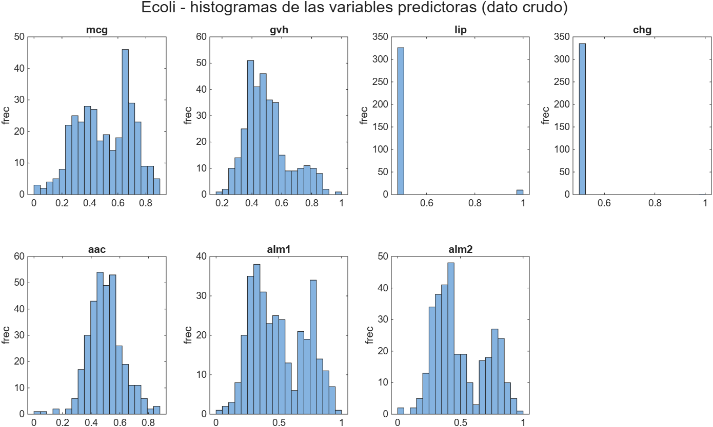
*En el histograma se ve de una que `lip` y `chg` no son continuas.*

Hay dos cosas que saltan de esta tabla. La primera es que las cinco variables continuas tienen media 0,500 clavada, lo cual no es casualidad sino que el dataset ya viene reescalado por los autores. Eso explica por qué más adelante la normalización min max no cambia prácticamente nada.

La segunda es `chg`. El 99,7 por ciento de las filas tiene el mismo valor, su varianza es 0,00074, su asimetría 18,2 y su curtosis 334. Una sola muestra de las 336 vale distinto. Una variable así no puede generalizar nada y por eso se elimina en la etapa siguiente.

## Normalidad

Cuatro pruebas, cada una mirando algo distinto. Shapiro Wilk como principal porque con 336 muestras estamos en su rango de validez. Lilliefors, que es la versión de Kolmogorov Smirnov cuando media y varianza se estiman de los mismos datos. Anderson Darling, que pesa más las colas. Y D'Agostino Pearson, que junta asimetría y curtosis en un solo estadístico y por eso dice por qué falla la normalidad, no solo que falla.

Las dos variables binarias quedan fuera de esta sección. Pasarle una prueba de normalidad a una variable de dos valores no tiene ningún sentido, así que se analizan por la rama categórica con chi cuadrado.

| Variable | W | p Shapiro | p Lilliefors | p Anderson Darling | K² | p K² | Normal con alfa 0,05 |
|---|---|---|---|---|---|---|---|
| mcg | 0,9737 | 8,2e−06 | menor a 0,001 | menor a 0,0005 | 35,20 | 2,3e−08 | no |
| gvh | 0,9510 | 3,9e−09 | menor a 0,001 | menor a 0,0005 | 28,97 | 5,1e−07 | no |
| aac | 0,9814 | 2,4e−04 | 0,0097 | 0,0015 | 11,69 | 0,0029 | no |
| alm1 | 0,9554 | 1,4e−08 | menor a 0,001 | menor a 0,0005 | 83,79 | 6,4e−19 | no |
| alm2 | 0,9329 | 3,7e−11 | menor a 0,001 | menor a 0,0005 | 57,41 | 3,4e−13 | no |

Ninguna pasa, y las cuatro pruebas coinciden, lo cual da confianza en el resultado.

Ahora bien, para decidir si se puede usar un ANOVA lo que importa no es que la variable sea normal en total sino que lo sea dentro de cada clase. Repetí Shapiro Wilk clase por clase, solo en las cinco clases con al menos 20 muestras, y el resultado cambia el panorama: 17 de las 25 combinaciones variable por clase sí pasan normalidad. O sea que buena parte de la no normalidad global viene de estar mezclando cinco poblaciones distintas, cada una razonablemente normal por separado.

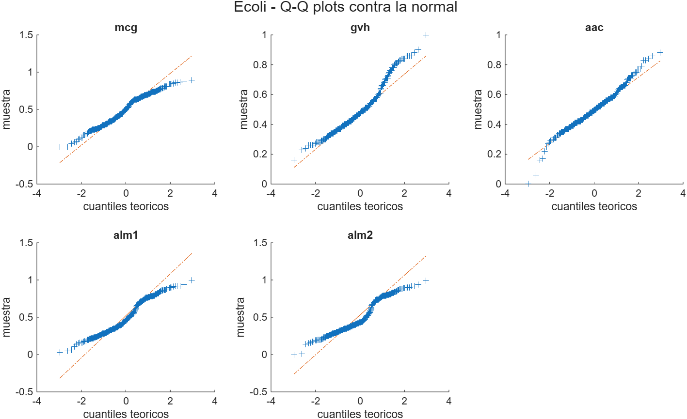
*La desviación respecto de la línea se concentra en los extremos, no en el centro. Es coherente con lo anterior.*

La decisión que salió de aquí fue reportar las dos rutas, la paramétrica y la no paramétrica, y darle el peso a la no paramétrica, porque además la homocedasticidad tampoco se cumple.

## Homogeneidad de varianzas

| Variable | p Levene | Homocedástica según Levene | p Bartlett | Homocedástica según Bartlett |
|---|---|---|---|---|
| mcg | 8,5e−11 | no | 3,9e−11 | no |
| gvh | 0,0013 | no | 0,0048 | no |
| aac | 0,605 | sí | 0,0316 | no |
| alm1 | 0,659 | sí | 0,637 | sí |
| alm2 | 0,0025 | no | 5,7e−08 | no |

Levene y Bartlett discrepan en `aac`. Le hice caso a Levene, y no por gusto: Bartlett exige normalidad estricta y ya quedó demostrado que no la hay, así que usarlo aquí es aplicarlo fuera de sus supuestos. La propia guía lo advierte cuando dice que Bartlett solo sirve si los datos ya son normales.

Con tres de cinco variables violando homocedasticidad, la ruta correcta es Kruskal Wallis, con el ANOVA como referencia de contraste.

## Comparación entre clases

Multiclase, así que ANOVA de un factor por la ruta paramétrica y Kruskal Wallis por la no paramétrica. Se corrió sobre las cinco clases con al menos 20 muestras, que son 327 de las 336.

| Variable | F del ANOVA | p | eta cuadrado | H de Kruskal Wallis | p | epsilon cuadrado |
|---|---|---|---|---|---|---|
| alm1 | 318,1 | 1,8e−110 | 0,798 | 247,9 | 1,9e−52 | 0,757 |
| alm2 | 164,9 | 1,2e−76 | 0,672 | 180,7 | 5,4e−38 | 0,549 |
| gvh | 107,1 | 6,5e−58 | 0,571 | 159,8 | 1,6e−33 | 0,484 |
| mcg | 84,7 | 4,5e−49 | 0,513 | 173,6 | 1,8e−36 | 0,527 |
| aac | 48,9 | 4,1e−32 | 0,378 | 113,1 | 1,6e−23 | 0,339 |

Las dos rutas dan el mismo orden salvo un cruce entre `mcg` y `gvh`, lo cual es tranquilizador. `alm1` explica ella sola el 80 por ciento de la varianza entre clases.

El post hoc por rangos con corrección de Bonferroni sobre `alm1` da 8 de 10 pares de clases significativamente distintos. Los dos pares que no salen distintos son justamente los que en el boxplot se ven solapados.

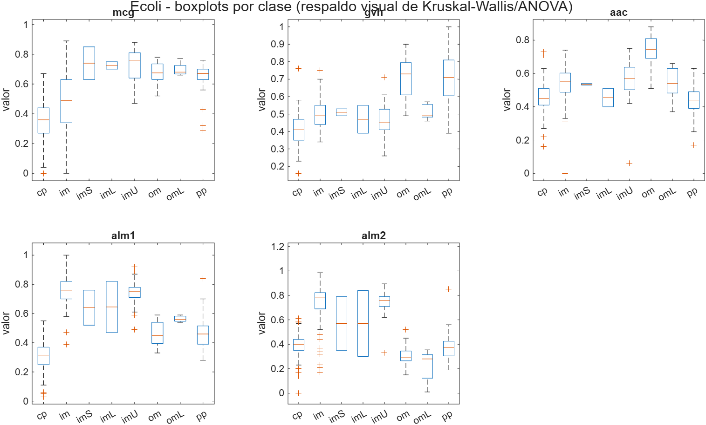
*En `alm1` se ve la separación entre el grupo cp, om, pp y el grupo im, imU. Ese es el 80 por ciento de varianza explicada de la tabla anterior.*

## Las variables binarias contra la clase

| Variable | Chi cuadrado | gl | p | V de Cramér | Mínimo esperado | Cumple la regla del 5 |
|---|---|---|---|---|---|---|
| lip | 235,3 | 7 | 3,7e−47 | 0,837 | 0,060 | no |
| chg | 167,5 | 7 | 8,5e−33 | 0,706 | 0,006 | no |

Aquí toca ser honesto. Los dos chi cuadrado están mal calculados por construcción. La regla dice que el conteo esperado por celda debe ser al menos 5 y aquí los mínimos son 0,060 y 0,006, porque hay clases de 2 muestras cruzadas con variables de dos niveles muy desbalanceados. El p valor no es confiable aunque salga espectacular.

La alternativa que propone la guía es el test exacto de Fisher, pero Fisher aplica a tablas de dos por dos y estas son de dos por ocho. Se podría hacer Fisher Freeman Halton o simulación de Monte Carlo, pero para el caso de `chg` no vale la pena el esfuerzo: una variable donde 335 de 336 muestras valen lo mismo no aporta nada aunque cualquier prueba salga significativa. Por eso `chg` se descarta por la vía descriptiva, mirando su varianza, y no por la vía del test. `lip` sí se conserva.

## Correlación y multicolinealidad

El único par fuerte es `alm1` con `alm2`, con Pearson de 0,809 y Spearman de 0,715. Tiene sentido biológico, porque `alm2` es el mismo programa ALOM que `alm1` pero excluyendo la señal cortable.

En VIF, `alm1` da 4,05 y `alm2` da 3,71, y el resto queda por debajo de 1,5. Ninguno pasa de 5, así que formalmente no hay multicolinealidad problemática. El número de condición de la matriz estandarizada es 4,0, muy lejos del umbral de alarma que suele ponerse en 30.

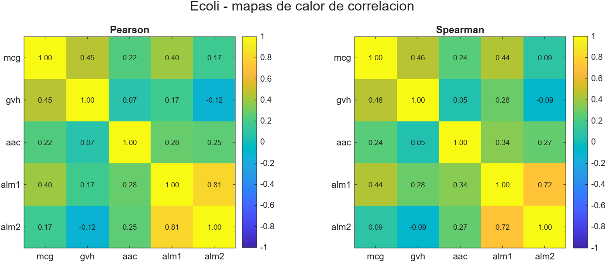
*La correlación se ve en el mapa pero no llega a ser un problema numérico.*

Aun así probé quitar `alm2` en la última etapa, para ver qué pasaba. El resultado está más abajo y no fue el esperado.

## Relevancia de las variables frente a la clase

Cuatro criterios distintos, para no depender de uno solo.

| Variable | F del ANOVA | H de Kruskal Wallis | MRMR | ReliefF | Rank ANOVA | Rank KW | Rank MRMR | Rank ReliefF |
|---|---|---|---|---|---|---|---|---|
| mcg | 84,7 | 173,6 | 0,421 | 0,112 | 4 | 3 | 2 | 3 |
| gvh | 107,1 | 159,8 | 0,354 | 0,074 | 3 | 4 | 4 | 4 |
| aac | 48,9 | 113,1 | 0,401 | 0,050 | 5 | 5 | 3 | 5 |
| alm1 | 318,1 | 247,9 | 0,610 | 0,172 | 1 | 1 | 1 | 1 |
| alm2 | 164,9 | 180,7 | 0,105 | 0,134 | 2 | 2 | 5 | 2 |

Los cuatro criterios coinciden en que `alm1` es la más relevante. En lo demás se pelean, y ahí está lo interesante.

El caso claro es `alm2`. Es la segunda para ANOVA, para Kruskal Wallis y para ReliefF, y cae al último lugar en MRMR con 0,105 contra 0,610 de `alm1`. No es una contradicción. Los tres primeros criterios miden cuánto separa la variable a las clases por sí sola, y `alm2` separa bien. MRMR es el único que además penaliza la redundancia, y `alm2` está diciendo casi lo mismo que `alm1`, con quien correlaciona 0,81.

O sea que si uno quiere quedarse con pocas variables, el ranking que hay que mirar es el de MRMR y no el del ANOVA. Aunque en este caso concreto quitar `alm2` terminó empeorando el modelo, así que el criterio acertó en señalar la redundancia pero la redundancia no era total.

## Atípicos

| Variable | Atípicos por IQR | Porcentaje | Atípicos por z mayor a 3 | Porcentaje |
|---|---|---|---|---|
| mcg | 0 | 0,00 | 0 | 0,00 |
| gvh | 13 | 3,87 | 1 | 0,30 |
| aac | 9 | 2,68 | 3 | 0,89 |
| alm1 | 0 | 0,00 | 0 | 0,00 |
| alm2 | 0 | 0,00 | 0 | 0,00 |

Son muy pocos, 22 valores en total y concentrados en dos variables. El z score marca menos que el IQR, que es lo esperable cuando la distribución tiene colas pesadas, porque el propio atípico infla la desviación estándar que se usa para detectarlo.

La distancia de Mahalanobis robusta, con estimación MCD y umbral chi cuadrado al 97,5 por ciento, marca 102 muestras, o sea el 30,4 por ciento del dataset.

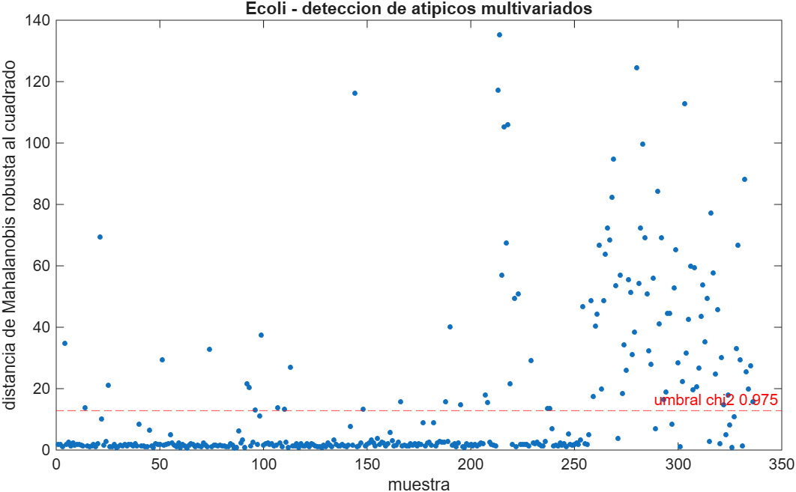
*Ese umbral deja fuera casi un tercio de los datos, que como criterio de limpieza es absurdo.*

Ese número no sirve para limpiar y conviene entender por qué. Mahalanobis asume normalidad multivariada, que ya sabemos que no se cumple. Y sobre todo, con cinco clases mezcladas, las muestras de las clases minoritarias quedan lejos del centroide global por definición: no son errores, son otra clase. La prueba se aplicó, se reporta y se descarta como criterio de limpieza. Es un buen ejemplo de una técnica de la guía que hay que saber cuándo no usar.

## Balance de la variable objetivo

| Clase | N | Porcentaje | Esperado si fuera uniforme |
|---|---|---|---|
| cp | 143 | 42,56 | 42 |
| im | 77 | 22,92 | 42 |
| pp | 52 | 15,48 | 42 |
| imU | 35 | 10,42 | 42 |
| om | 20 | 5,95 | 42 |
| omL | 5 | 1,49 | 42 |
| imL | 2 | 0,60 | 42 |
| imS | 2 | 0,60 | 42 |

Chi cuadrado de bondad de ajuste contra la distribución uniforme igual a 395,90 con 7 grados de libertad y p de 1,8e−81. La razón de desbalance entre la clase más grande y la más chica es de 71,5 a 1. La entropía normalizada da 0,730 sobre un máximo de 1.

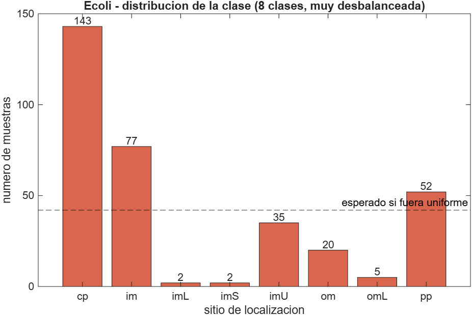
*La línea punteada marca dónde estaría cada barra si las ocho clases estuvieran equilibradas.*

Pero el problema real no es el desbalance en sí, es que tres clases tienen menos de 6 muestras. Con validación cruzada de 5 pliegues una clase de 2 muestras no puede estar presente en todos los pliegues, y MATLAB lo avisa explícitamente. Y SMOTE, que necesita 5 vecinos de la misma clase para generar un sintético, tampoco puede hacer nada con una clase de 2.

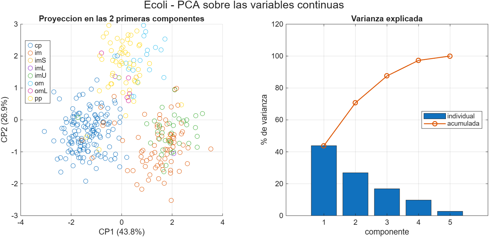
*Las clases se separan razonablemente bien en dos componentes, lo cual anticipa las exactitudes altas que aparecen después.*

## Las seis etapas del dataset

| Etapa | Qué se hizo | Filas | Vars | Clases | IR |
|---|---|---|---|---|---|
| E0 crudo | tal como viene de UCI | 336 | 7 | 8 | 71,5 |
| E1 outliers | se quita `chg` y se winsorizan las continuas con 1,5 por IQR | 336 | 6 | 8 | 71,5 |
| E2 balanceado | fuera las clases con menos de 10 muestras y SMOTE hasta igualar la mayoritaria | 715 | 6 | 5 | 1,0 |
| E3 estandarizado | E2 con z score | 715 | 6 | 5 | 1,0 |
| E4 normalizado | E2 reescalado a 0 y 1 | 715 | 6 | 5 | 1,0 |
| E5 selección | E3 sin `alm2` | 715 | 5 | 5 | 1,0 |

Conviene aclarar que E3 y E4 son ramas alternativas sobre E2, no pasos encadenados. No se normaliza lo que ya está estandarizado.

Qué se pierde en cada paso, de forma explícita.

En **E1** se elimina una variable, que es `chg`, y se recortan 22 valores en `gvh` y `aac`. En total 20 filas quedan tocadas, el 6,0 por ciento, pero no se pierde ninguna fila porque se winsoriza en vez de borrar. Con 336 muestras, tirar el 6 por ciento del dataset por 22 valores es un mal negocio.

En **E2** se pierden 9 muestras, el 2,7 por ciento, al eliminar imL con 2, imS con 2 y omL con 5. Es una pérdida real y hay que decirla: el modelo resultante ya no sabe reconocer esas tres localizaciones. La alternativa era dejarlas y aceptar que la validación cruzada no es válida. Después SMOTE sube de 327 a 715 filas, lo que significa que 388 de las 715 filas finales, el 54 por ciento, son sintéticas.

En **E3** hay un efecto poco intuitivo. Al estandarizar, `lip`, que es binaria y tiene el 92 por ciento de los datos en un solo valor, genera z scores de hasta 11,46. Estandarizar una binaria muy desbalanceada le termina dando un peso enorme al valor raro.

En **E4** el min max casi no hace nada, porque los datos ya venían en el rango 0 a 1 de fábrica.

En **E5** se pierde una variable más y quedan 5.

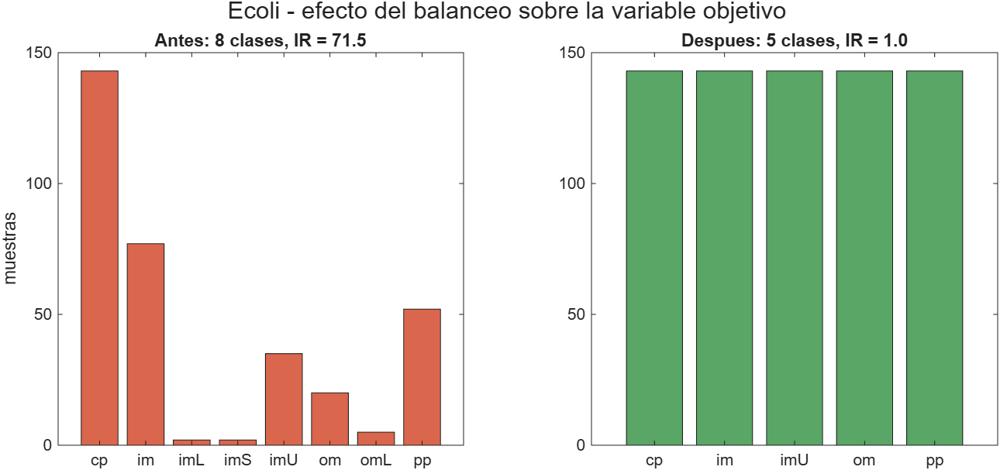
*A la izquierda 8 clases con razón de desbalance 71,5. A la derecha 5 clases perfectamente equilibradas, al costo de 9 muestras y 3 clases enteras.*

## Los modelos

Cinco clasificadores con validación cruzada de 5 pliegues sobre cada etapa. Se reporta exactitud balanceada, que es el promedio de los recalls por clase, porque la exactitud simple engaña con 8 clases desbalanceadas.

| Etapa | Modelo | Exactitud | Exactitud balanceada | F1 macro | Kappa |
|---|---|---|---|---|---|
| E0 crudo | Árbol | 0,801 | 0,497 | 0,494 | 0,724 |
| E0 crudo | KNN | 0,872 | 0,644 | 0,631 | 0,823 |
| E0 crudo | LDA | 0,878 | 0,722 | 0,698 | 0,833 |
| E0 crudo | Naive Bayes | 0,830 | 0,543 | 0,549 | 0,765 |
| E0 crudo | SVM | 0,869 | 0,640 | 0,627 | 0,819 |
| E1 outliers | Árbol | 0,798 | 0,496 | 0,493 | 0,720 |
| E1 outliers | KNN | 0,872 | 0,644 | 0,631 | 0,823 |
| E1 outliers | LDA | 0,875 | 0,716 | 0,689 | 0,828 |
| E1 outliers | Naive Bayes | 0,830 | 0,543 | 0,549 | 0,764 |
| E1 outliers | SVM | 0,863 | 0,636 | 0,623 | 0,811 |
| E2 balanceado | Árbol | 0,887 | 0,887 | 0,887 | 0,858 |
| E2 balanceado | KNN | 0,919 | 0,919 | 0,918 | 0,899 |
| E2 balanceado | LDA | 0,909 | 0,909 | 0,908 | 0,886 |
| E2 balanceado | Naive Bayes | 0,876 | 0,876 | 0,874 | 0,844 |
| E2 balanceado | SVM | 0,897 | 0,897 | 0,896 | 0,871 |
| E3 estandarizado | Árbol | 0,887 | 0,887 | 0,887 | 0,858 |
| E3 estandarizado | KNN | 0,909 | 0,909 | 0,909 | 0,886 |
| E3 estandarizado | LDA | 0,909 | 0,909 | 0,908 | 0,886 |
| E3 estandarizado | Naive Bayes | 0,881 | 0,881 | 0,879 | 0,851 |
| E3 estandarizado | SVM | 0,897 | 0,897 | 0,896 | 0,871 |
| E4 normalizado | Árbol | 0,887 | 0,887 | 0,887 | 0,858 |
| E4 normalizado | KNN | 0,906 | 0,906 | 0,906 | 0,883 |
| E4 normalizado | LDA | 0,909 | 0,909 | 0,908 | 0,886 |
| E4 normalizado | Naive Bayes | 0,878 | 0,878 | 0,877 | 0,848 |
| E4 normalizado | SVM | 0,897 | 0,897 | 0,896 | 0,871 |
| E5 selección | Árbol | 0,887 | 0,887 | 0,887 | 0,858 |
| E5 selección | KNN | 0,899 | 0,899 | 0,899 | 0,874 |
| E5 selección | LDA | 0,895 | 0,895 | 0,894 | 0,869 |
| E5 selección | Naive Bayes | 0,880 | 0,880 | 0,878 | 0,850 |
| E5 selección | SVM | 0,885 | 0,885 | 0,885 | 0,857 |

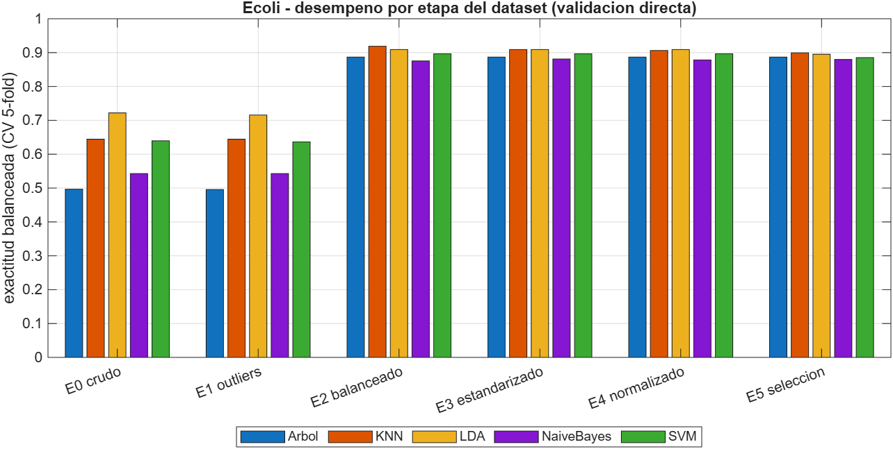
*Todo el salto está en E2. De ahí en adelante las barras son prácticamente iguales.*

Visto por modelo, quién llega más alto y qué tan sensible es a cómo le llegue el dato.

| Modelo | Mejor | En la etapa | Peor | En la etapa | Diferencia |
|---|---|---|---|---|---|
| KNN | 0,9189 | E2 balanceado | 0,6443 | E0 crudo | 0,275 |
| LDA | 0,9091 | E2 balanceado | 0,7157 | E1 outliers | 0,193 |
| SVM | 0,8965 | E2 balanceado | 0,6363 | E1 outliers | 0,260 |
| Árbol | 0,8867 | E2 balanceado | 0,4957 | E1 outliers | 0,391 |
| Naive Bayes | 0,8811 | E3 estandarizado | 0,5428 | E0 crudo | 0,338 |

La columna de la diferencia es la que más dice. El árbol es el modelo más sensible al preprocesamiento, con 0,391 entre su mejor y su peor versión, y el LDA el más estable con 0,193. Cuatro de los cinco modelos tocan techo en E2, o sea con el balanceo hecho y sin escalar.

Lo que se lee de la tabla completa es lo siguiente.

En E0 la exactitud simple da 0,88 y la balanceada 0,64, y esa brecha de 24 puntos es exactamente el desbalance. El árbol es el caso extremo, con 0,80 de exactitud simple y 0,497 de balanceada, o sea que acierta bien en cp y en im y se pierde en todo lo demás.

La corrección de atípicos, que es toda la etapa E1, no cambia nada. Las diferencias contra E0 son de más o menos 0,006 en los cinco modelos. Era previsible, porque 22 valores recortados sobre 336 muestras es demasiado poco para mover una métrica. Es un resultado válido y hay que reportarlo así: no todo paso de limpieza mejora el modelo, y gastar esfuerzo ahí sin medir es perder el tiempo.

El balanceo es el paso que aporta, con la exactitud balanceada subiendo de alrededor de 0,64 a alrededor de 0,90. Pero esa cifra tiene un problema serio que se explica en la sección siguiente.

Estandarizar y normalizar no cambian nada aquí, e incluso bajan un poco el KNN, que pasa de 0,919 a 0,909 con z score. La razón es que los datos ya venían todos entre 0 y 1, así que no había ninguna diferencia de escala que corregir. Lo único que consigue el z score es inflar el peso de `lip`, que es binaria. Este dataset no es un buen ejemplo del valor del escalado.

La selección de variables empeora. El KNN baja de 0,909 a 0,899 y el LDA de 0,909 a 0,895. Quitar `alm2` pierde información aunque esté correlacionada con `alm1`, lo que confirma que correlación de 0,81 no es lo mismo que redundancia total.

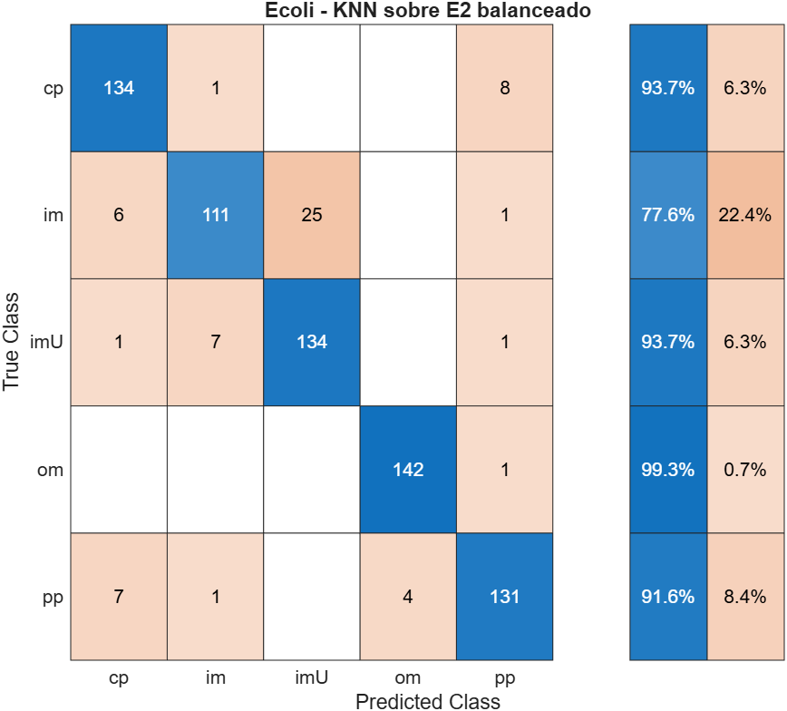
*La confusión que queda es entre im e imU, que son justamente las dos clases que el post hoc no lograba separar.*

## Balancear antes de partir infla el resultado

Cuando uno balancea el dataset completo y después se lo pasa a Classification Learner, la validación cruzada está partiendo un conjunto que ya fue modificado. Si el balanceo generó datos sintéticos, esos sintéticos se construyeron a partir de puntos que van a terminar en el bloque de prueba, y la métrica sale inflada.

Para medir cuánto, hice la validación cruzada a mano aplicando SMOTE solo dentro del bloque de entrenamiento de cada pliegue.

| Modelo | Con SMOTE antes de partir | Con SMOTE dentro del pliegue | Diferencia |
|---|---|---|---|
| KNN | 0,9189 | 0,8146 | 0,1043 |
| Árbol | 0,8867 | 0,7975 | 0,0892 |
| Naive Bayes | 0,8755 | 0,7922 | 0,0833 |
| SVM | 0,8965 | 0,8367 | 0,0598 |
| LDA | 0,9091 | 0,8671 | 0,0419 |

El promedio del inflado es de 0,0738 puntos de exactitud balanceada, y el KNN es el más afectado con 0,1043. Tiene sentido: SMOTE genera puntos por interpolación entre vecinos, así que un sintético queda literalmente entre dos puntos reales, y el KNN es el modelo que más se beneficia de tener un vecino artificial cerca del punto que está clasificando.

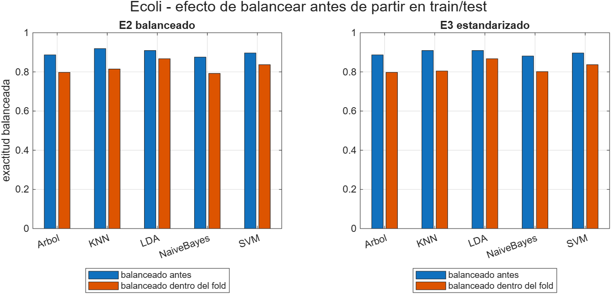
*La barra de la izquierda de cada par es el balanceo hecho antes de partir y la de la derecha es el balanceo hecho dentro del pliegue. La primera está sistemáticamente por encima.*

Y aquí viene el remate, que es el resultado que menos esperaba. Corriendo la misma validación honesta pero sin balancear nada, el LDA da 0,8747 de exactitud balanceada. Con SMOTE dentro del pliegue da 0,8671. Sin SMOTE le va mejor.

| Configuración honesta | Mejor modelo | Exactitud balanceada |
|---|---|---|
| Sin balancear | LDA | 0,8747 |
| SMOTE dentro del pliegue | LDA | 0,8671 |
| SMOTE más z score dentro del pliegue | LDA | 0,8671 |
| SMOTE más min max dentro del pliegue | SVM | 0,8467 |

O sea que en Ecoli el balanceo no aportó nada real. Lo que aportó fue apariencia. El 0,919 del KNN sobre el CSV balanceado se ve muy bien pero no sobrevive a una evaluación correcta, y termina por debajo del 0,8747 que da un LDA sobre el dato desbalanceado tal como viene.

Esto no significa que balancear esté mal en general, significa que en este dataset concreto el problema no era el desbalance sino la falta de muestras en las clases chicas, y eso SMOTE no lo arregla porque no puede inventar información que no está.

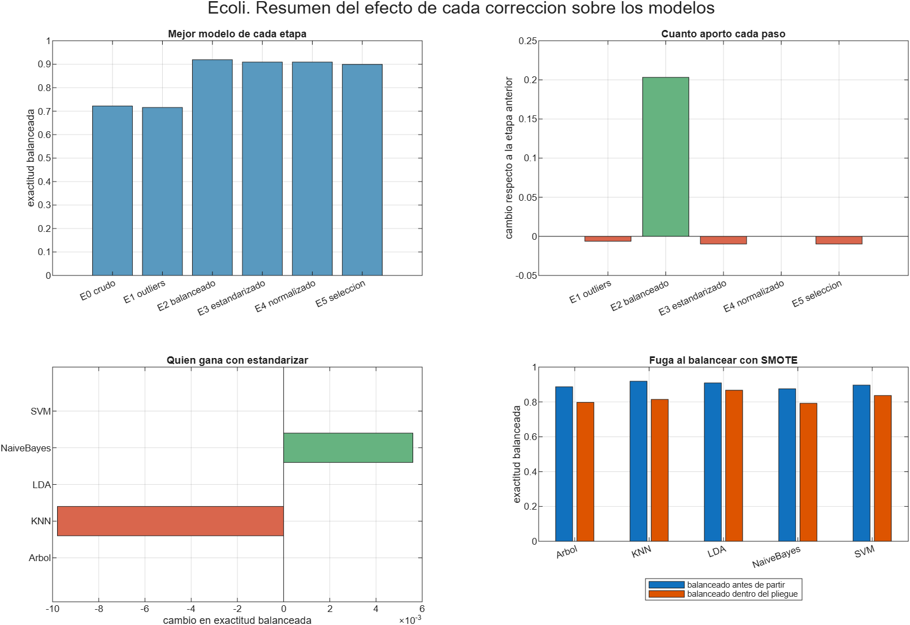
*Los cuatro resultados del dataset en una sola figura.*

## Lo que no funcionó

| Intento | Resultado | Por qué |
|---|---|---|
| Corregir atípicos en E1 | sin efecto, más o menos 0,006 | 22 valores sobre 336 muestras no mueven una métrica |
| Quitar `alm2` en E5 | hasta 0,014 por debajo | `alm2` sí aportaba, aunque correlacione 0,81 con `alm1` |
| Estandarizar y normalizar | sin efecto o levemente negativo | los datos ya venían entre 0 y 1 |
| SMOTE evaluado bien | peor que no balancear | el problema era falta de muestras, no proporción |
| Mahalanobis robusto | marcó el 30,4 por ciento del dataset | asume normalidad multivariada y las clases minoritarias quedan lejos del centroide por definición |
| Chi cuadrado sobre `lip` y `chg` | p valor no confiable | conteos esperados de 0,060 y 0,006, muy por debajo del mínimo de 5 |

## Cómo revisarlo en Classification Learner

Los CSV de cada etapa están en `resultados/ecoli/etapas/`, son seis y todos tienen la clase en la última columna con el nombre `clase`.

Se abre con Apps, Classification Learner, New Session, From File, se selecciona el CSV y se pone `clase` como Response. Hay que dejar Cross Validation con 5 folds para que los números sean comparables con los de este informe.

Vale la pena comparar la matriz de confusión de E0 contra la de E2. En E0 las clases chicas quedan prácticamente vacías y en E2 se llenan. Y vale la pena tener presente que el número que muestre la app para `ecoli_E2_balanceado.csv` está inflado alrededor de 7 puntos por lo explicado más arriba.

## Limitaciones

Los hiperparámetros no se ajustaron. El KNN va con k igual a 5 fijo, el árbol sin podar y el SVM lineal. La comparación es entre etapas del dataset y no entre modelos, así que mantenerlos fijos es lo correcto, pero significa que ninguno de estos números es el mejor alcanzable.

Se usó una sola semilla, la 42. No hay repeticiones ni intervalos de confianza sobre la validación cruzada, así que diferencias menores a 0,01 no deberían interpretarse como reales.

Se perdieron tres clases. El modelo final no distingue imL, imS ni omL. Para un problema real de localización de proteínas eso puede ser inaceptable, y ahí la salida sería conseguir más muestras y no balancear.

PCA se usó solo para inspección visual. No se probó modelar sobre las componentes principales.

## Anexo. Qué pruebas de la guía se aplicaron y cuáles no

| Sección de la guía | Prueba | Estado |
|---|---|---|
| 1 | Tipificación, descriptivos, histogramas, boxplots, Q-Q | aplicada |
| 2 | Shapiro Wilk | aplicada, programada y validada por simulación |
| 2 | Kolmogorov Smirnov con Lilliefors | aplicada |
| 2 | Anderson Darling | aplicada |
| 2 | D'Agostino Pearson K² | aplicada, programada y validada por simulación |
| 3 | Levene | aplicada |
| 3 | Bartlett | aplicada, y descartada por incumplir su supuesto de normalidad |
| 3 | Fligner Killeen | no aplicada, no es nativa de MATLAB y Levene ya cubre el caso robusto |
| 4 | t de Student, Welch, Mann Whitney | no aplican, la clase tiene 8 niveles y no 2 |
| 5 | ANOVA de un factor | aplicada |
| 5 | Post hoc con corrección de Bonferroni | aplicada |
| 5 | Kruskal Wallis | aplicada |
| 6 | Pearson, Spearman, Kendall | aplicadas las tres |
| 7 | Chi cuadrado de independencia | aplicada, con la advertencia sobre la regla del 5 |
| 7 | Test exacto de Fisher | no aplicable, las tablas son de dos por ocho |
| 7 | V de Cramér | aplicada |
| 8 | ANOVA F para selección | aplicada |
| 8 | Información mutua mediante MRMR | aplicada |
| 8 | Kruskal Wallis como criterio de ranking | aplicada |
| 8 | ReliefF | aplicada, no está en la guía pero complementa bien |
| 9 | Matriz de correlación con mapa de calor | aplicada |
| 9 | VIF | aplicada |
| 9 | Número de condición | aplicada |
| 10 | Z score | aplicada |
| 10 | Regla de 1,5 por IQR | aplicada |
| 10 | Grubbs | no aplicada, detecta un solo atípico y exige normalidad, que no hay |
| 10 | Mahalanobis | aplicada en su versión robusta, y descartada como criterio de limpieza |
| 11 | Chi cuadrado de bondad de ajuste | aplicada |
| 11 | Prueba binomial | no aplica, la clase es multiclase |
| 12 | Wilcoxon pareado, McNemar, Q de Cochran | no aplican, no hay datos pareados |
| 13.1 | Histograma, boxplot, Q-Q | aplicados |
| 13.2 | Boxplot por clase | aplicado |
| 13.3 | Matriz de dispersión | aplicada |
| 13.4 | Mapa de calor de correlación | aplicado |
| 13.5 | Gráfico de conteo de clases | aplicado |
| 13.6 | Boxplot de atípicos | aplicado |
| 13.7 | PCA | aplicado |
| 13.7 | t-SNE y UMAP | no aplicados, sirven para mirar pero no cambian ninguna decisión de esta actividad |
| 13.8 | Mapa de valores faltantes | no aplica, no hay faltantes |

## Anexo. Funciones que hubo que programar

| Archivo | Qué hace | Por qué existe |
|---|---|---|
| `swtest.m` | Shapiro Wilk con el algoritmo de Royston | MATLAB no la trae y la guía la pide como principal |
| `dagostino_k2.m` | D'Agostino Pearson K² | tampoco es nativa |
| `cramersv.m` | Chi cuadrado más V de Cramér | MATLAB da el chi cuadrado pero no el tamaño del efecto |
| `calcular_vif.m` | Factor de inflación de la varianza | no es nativo |
| `tratar_outliers.m` | Winsorización o eliminación por 1,5 por IQR, con protección para IQR igual a 0 | |
| `smote_simple.m` | SMOTE básico con k vecinos | MATLAB no trae SMOTE |
| `balancear.m` | SMOTE, sobremuestreo o submuestreo | |
| `metricas_clf.m` | Exactitud, exactitud balanceada, F1 macro, kappa | |
| `evaluar_cv.m` | Validación cruzada manual con balanceo y escalado dentro del pliegue | es lo que permite medir la fuga |
| `guardar_fig.m` | Exporta PNG con fondo blanco | R2026a dibuja en tema oscuro por defecto |
