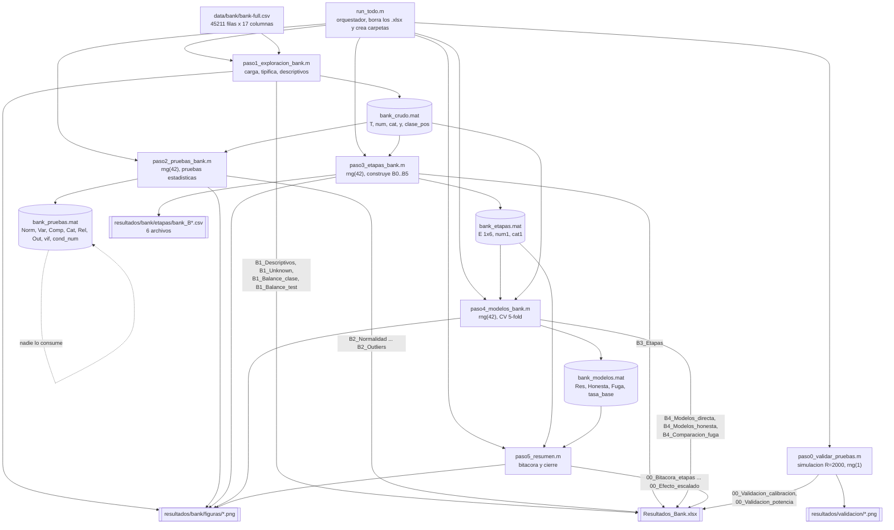

# Reporte técnico interno: pipeline BANK MARKETING

Documento de trabajo para ti mismo. No es el informe que se entrega, es el mapa del código: qué hace cada bloque, qué variable produce, con qué nombre y dimensión, y qué se rompe si lo tocas. Todo lo que está aquí sale de leer los `.m` reales; los números que aparecen son los que están escritos en el código o los que se derivan directamente de `data/bank/bank-full.csv`.

TL;DR: son cinco scripts encadenados por cuatro archivos `.mat`. `paso1` carga y describe, `paso2` corre las pruebas estadísticas, `paso3` construye seis versiones del dataset (B0 a B5), `paso4` entrena cinco modelos sobre esas versiones con validación cruzada, `paso5` resume. El corazón del pipeline es la función local `codificar` al final de `paso3_etapas_bank.m`, que convierte la tabla de 16 predictoras en una matriz de 42 columnas.

---

## 1. Diagrama del pipeline



Fíjate en dos cosas del diagrama. Primero, `bank_pruebas.mat` es un callejón sin salida: `paso2` lo escribe pero ningún script posterior lo carga, sirve solo como respaldo de las tablas que ya fueron al Excel. Segundo, `paso4` carga dos `.mat` a la vez: de `bank_etapas.mat` saca la estructura `E`, y de `bank_crudo.mat` saca solo `y` y `clase_pos` con la sintaxis `load(..., 'y', 'clase_pos')`, porque necesita la variable objetivo original sin balancear para calcular la tasa base del dataset completo.

---

## 2. Tabla maestra de dónde a dónde

| Paso | Script | Estado del dato al entrar | Qué le hace el código | Estado del dato al salir | Archivos que escribe |
|---|---|---|---|---|---|
| 0 | `paso0_validar_pruebas.m` | No entra dato de Bank. Genera muestras sintéticas con `randn`, `exprnd`, `rand`, `trnd`, `lognrnd` | Simula R = 2000 repeticiones por escenario con n en `[30 100 336]`, mide tasa de rechazo y potencia de `swtest`, `dagostino_k2`, `lillietest` y `adtest` | Dos tablas: `Calib` de 12x6 y `Potencia` de 48x4 | `Resultados_Bank.xlsx` hojas `00_Validacion_calibracion` y `00_Validacion_potencia`; PNG `01_calibracion_pvalores` y `02_potencia` en `resultados/validacion` |
| 1 | `paso1_exploracion_bank.m` | `bank-full.csv` en disco, separado por punto y coma | `readtable` con `'Delimiter',';'` y `'TextType','char'`, tipifica en 7 numéricas y 9 categóricas, cuenta `unknown`, cuenta `pdays == -1`, descriptivos, prueba binomial y chi2 sobre el balance, seis figuras | `T` table de 45211x17, `X` de 45211x7 double, `y` cell de 45211x1, `num` cell 1x7, `cat` cell 1x9 | `bank_crudo.mat`; hojas `B1_Descriptivos`, `B1_Unknown`, `B1_Balance_clase`, `B1_Balance_test`; PNG `01` a `06` |
| 2 | `paso2_pruebas_bank.m` | `T`, `num`, `cat`, `y` desde `bank_crudo.mat` | Normalidad en cuatro pruebas, Levene y Bartlett, Student, Welch y Mann-Whitney con d de Cohen y r biserial, chi2 y V de Cramer por categórica, Pearson y Spearman, VIF, número de condición, MRMR sobre las 16 predictoras, conteo de atípicos, PCA | Nueve tablas de diagnóstico. El dato NO cambia, `T` sale igual que entró | `bank_pruebas.mat`; hojas `B2_Normalidad`, `B2_Varianzas`, `B2_Comparacion`, `B2_Categoricas`, `B2_Corr_Pearson`, `B2_Corr_Spearman`, `B2_VIF`, `B2_Relevancia`, `B2_Outliers`; PNG `07`, `08`, `09` |
| 3 | `paso3_etapas_bank.m` | `T` de 45211x17 desde `bank_crudo.mat` | Construye seis matrices numéricas encadenadas: one-hot, quita `duration`, parte `pdays`, winsoriza, submuestrea, estandariza, normaliza, selecciona 20 columnas por MRMR | Struct `E` de 1x6 con campos `nombre`, `desc`, `X`, `y`, `vars`. `E(1).X` y `E(2).X` son 45211x42, `E(3)`, `E(4)` y `E(5)` son 10578x42, `E(6)` es 10578x20 | `bank_etapas.mat`; seis CSV `bank_B0_crudo.csv` a `bank_B5_seleccion.csv`; hoja `B3_Etapas`; PNG `10_etapa_B0_crudo` a `10_etapa_B5_seleccion` y `11_balance_antes_despues` |
| 4 | `paso4_modelos_bank.m` | `E` desde `bank_etapas.mat`, más `y` y `clase_pos` desde `bank_crudo.mat` | Bloque (a): CV 5-fold directa sobre cada etapa, con SVM solo si `n <= tope_svm`. Bloque (b): CV honesta sobre `E(2).X` con balanceo y escalado dentro del pliegue. Bloque de comparación: resta directa menos honesta | `Res` table de 28x13, `Honesta` de 16x10, `Fuga` de 12x6 | `bank_modelos.mat`; hojas `B4_Modelos_directa`, `B4_Modelos_honesta`, `B4_Comparacion_fuga`; PNG `12` a `15` |
| 5 | `paso5_resumen.m` | `bank_etapas.mat` y `bank_modelos.mat` | Bitácora de cambios entre etapas con `setdiff` sobre `vars`, mejor modelo por etapa, mejor y peor etapa por modelo, efecto de estandarizar comparando `B2_balanceado` contra `B3_estandarizado` | `Bitacora` de 6x11, `Conteos` de 12x4, `Resumen` de 6x8, `PorModelo` de 5x6, `Escalado` | Hojas `00_Bitacora_etapas`, `00_Balance_por_etapa`, `00_Resumen_por_etapa`, `00_Resumen_por_modelo`, `00_Efecto_escalado`; PNG `00_resumen_bank` |

---

## 3. Script por script

### 3.0. `run_todo.m`

No carga ningún `.mat`. Calcula `base` con `fileparts(fileparts(mfilename('fullpath')))`, o sea sube dos niveles desde `codigo/run_todo.m` hasta `Primera actividad`. Ese mismo patrón se repite en todos los scripts, así que el pipeline funciona sin importar desde dónde lo lances.

Agrega al path `codigo` y `codigo/funciones`, crea cinco carpetas de salida si no existen, y borra `Resultados_Ecoli.xlsx` y `Resultados_Bank.xlsx` con `delete`. Ese borrado es deliberado: `writetable` con la opción `'Sheet'` agrega o reemplaza hojas pero nunca borra las que ya estaban, así que si no borras el libro te quedan hojas fantasma de corridas anteriores con dimensiones viejas.

El vector `scripts` tiene diez entradas en orden fijo. Las de Bank son las posiciones 6 a 9, y `paso5_resumen` va de último porque necesita los `.mat` de los dos datasets.

El detalle no obvio está en la función local `correr(nombre)` al final del archivo. Cada paso se lanza dentro de una función, no con `run()` en el cuerpo del script, porque cada `pasoN` empieza con `clear`. Si los llamaras directamente en el mismo espacio de variables, ese `clear` te borraría `scripts`, `i` y `t_total`, y el bucle explotaría en la segunda iteración.

### 3.1. `paso0_validar_pruebas.m`

No es específico de Bank pero escribe en `Resultados_Bank.xlsx`, así que forma parte del libro.

Fija `rng(1)`, distinto del `rng(42)` que usan los demás. Silencia cuatro warnings de `lillietest` y `adtest` sobre p valores fuera de la tabla tabulada, porque en 2000 repeticiones eso pasa constantemente y llenaría la consola.

Parámetros: `R = 2000`, `alfa = 0.05`, `tam = [30 100 336]`. El 336 está ahí por Ecoli, no por Bank.

El bloque de calibración genera `x = randn(n,1)`, o sea datos que sí son normales, y guarda los cuatro p valores en `P` de 2000x4. Para cada prueba calcula `tasa = mean(p < alfa)`, que debería dar cerca de 0.05, y además corre `kstest` contra `makedist('Uniform','lower',0,'upper',1)` para verificar que los p valores se reparten uniformemente. Esa segunda comprobación es más exigente que la primera: una prueba puede tener la tasa correcta en 0.05 y aun así tener los p valores mal distribuidos. Cuando `n == 336` guarda la matriz completa en `P_guardado` para el histograma.

El bloque de potencia recorre cuatro alternativas no normales, cada una eligiendo un tipo distinto de desviación: exponencial para asimetría fuerte, uniforme para colas cortas, t de Student con 5 grados de libertad para colas pesadas, y lognormal con sigma 0.25 para asimetría leve, que es el caso difícil. Guarda en `Pot30` de 4x4 solo el escenario `n == 30`, porque con n grande las cuatro pruebas llegan al 100 por ciento y la gráfica no distingue nada.

Salida: `Calib` es una tabla de 12 filas por 6 columnas (3 tamaños por 4 pruebas) con nombres `Prueba`, `n`, `Tasa_rechazo_H0`, `Nominal`, `Desvio`, `p_uniformidad`. `Potencia` es de 48 filas por 4 columnas (3 tamaños por 4 alternativas por 4 pruebas) con `Distribucion`, `n`, `Prueba`, `Potencia`. El `unstack` que se hace para mostrar en consola no se guarda, es solo cosmético.

El bucle final `for xls = {xls_e, xls_b}` escribe las mismas dos tablas en los dos libros. Ojo con la sintaxis `xls{1}`: cuando iteras un cell array con `for`, la variable de bucle es un cell de 1x1, no su contenido.

### 3.2. `paso1_exploracion_bank.m`

Entrada: no carga `.mat`, lee directo `data/bank/bank-full.csv`.

**Bloque 1, carga.** `T = readtable(archivo, 'Delimiter', ';', 'TextType', 'char')` produce una table de 45211x17. El `'TextType','char'` es clave: hace que las columnas de texto queden como cell de char en vez de `string`. Todo el resto del pipeline usa `strcmp` sobre cell arrays, y si vinieran como `string` varias comparaciones cambiarían de comportamiento. Se declaran a mano `num` con 7 nombres y `cat` con 9, y `y = T.y` queda como cell de 45211x1. `clase_pos = 'yes'`.

Nota de estilo peligrosa: la variable se llama `cat`, que es el nombre de una función interna de MATLAB para concatenar. Dentro de este script eso no molesta porque nunca se usa la función, pero es una bomba si algún día agregas una línea que sí la necesite.

**Bloque 2, faltantes disfrazados.** El dataset no trae ningún `NaN`, pero seis de las nueve categóricas usan la etiqueta `unknown`, que en la práctica es un faltante. El bucle cuenta `sum(strcmp(v,'unknown'))` por variable y arma `Unk`, cell2table de 9x4 con `Variable`, `N_categorias`, `N_unknown`, `Pct_unknown`. Se usa `strcmp` y no `ismissing` justamente porque `unknown` es un valor válido de texto, no un hueco. Aparte se cuenta `sum(T.pdays == -1)`, el otro faltante disfrazado, esta vez dentro de una numérica.

**Bloque 3, descriptivos.** `X = T{:, num}` extrae una matriz de 45211x7 double. La llave `{}` en vez del paréntesis es lo que devuelve matriz en lugar de subtabla. `Desc` se arma con `table(...)` y trae `Media`, `Mediana`, `Desv`, `Min`, `Max`, `IQR` calculado como `quantile(X,0.75) - quantile(X,0.25)`, `Asimetria`, `Curtosis` y `N_unicos` vía `arrayfun`. Todas se transponen con apóstrofe porque `mean(X)` devuelve fila y la tabla necesita columna.

**Bloque 4, balance de la clase.** Dos pruebas para lo mismo. La binomial exacta usa `2 * min(binocdf(n_si,n,0.5), 1 - binocdf(n_si-1,n,0.5))`, que es la construcción de dos colas correcta con la corrección de continuidad discreta en el `n_si-1`. El chi2 de bondad de ajuste se calcula a mano con la fórmula de dos celdas contra la esperanza `n/2`, y su p sale de `chi2cdf(chi2_bal, 1, 'upper')`. La razón de existir del chi2 está explicada en el propio comentario: con n = 45211 el p binomial cae por debajo del mínimo representable en doble precisión, 2.2e-308, y MATLAB devuelve 0 exacto. Por eso hay un `if p_binom == 0` que sustituye el texto por la leyenda de desborde en lugar de imprimir un cero engañoso. Se calcula `IR = n_no / n_si`.

Salen dos tablas: `Balance` de 2x3 con las columnas `Clase`, `N`, `Porcentaje`, y `Bal_test` de 6x2 en formato largo con `Indicador` y `Valor`, que empaqueta `p_binomial`, `chi2`, `p_chi2`, `IR`, `Tasa_base_no` y `N_total`.

**Bloque 5, gráficos.** Seis figuras, todas con `figure('Visible','off',...)` para no llenar la pantalla.

| PNG | Qué dibuja | Detalle |
|---|---|---|
| `01_histogramas_crudo` | `histogram` de las 7 numéricas con 50 bins, subplot 2x4 | El título incluye la asimetría de cada una |
| `02_boxplot_crudo` | `boxplot` uno por variable | Deliberadamente separados: `balance` llega a 102000 y `duration` a 4918, en un solo eje las demás quedarían aplastadas |
| `03_balance_clases_crudo` | Barra de conteo por clase con `compose` para las etiquetas | `ylim([0 45000])` fijo |
| `04_boxplot_por_clase` | `boxplot(X(:,j), y)`, un panel por numérica | Es el respaldo visual de Mann-Whitney y Welch del paso 2 |
| `05_qqplots` | `qqplot` contra la normal | Respaldo visual de las pruebas de normalidad |
| `06_tasa_por_categoria` | Para cada categórica, porcentaje de `yes` por nivel, ordenado descendente | Lleva una `yline` roja con la tasa global |

En el panel `06` hay un truco que vale la pena entender. La línea es `title(cat(j))`, con paréntesis y no con llaves. `cat{j}` devolvería el char `'default'`, y `default` es una palabra reservada de las propiedades gráficas de MATLAB: si se la pasas suelta a `title`, no dibuja nada. Con `cat(j)` le pasas un cell de 1x1 y `title` lo trata como texto literal. El comentario del código lo dice explícito.

**Bloque 6, exportar.** Cuatro `writetable` a las hojas `B1_Descriptivos`, `B1_Unknown`, `B1_Balance_clase`, `B1_Balance_test`, y `save` de `bank_crudo.mat` con exactamente cinco variables: `T`, `num`, `cat`, `y`, `clase_pos`.

### 3.3. `paso2_pruebas_bank.m`

Entrada: `load(fullfile(base,'resultados','bank','bank_crudo.mat'))` sin lista de variables, o sea trae las cinco. Fija `rng(42)`. Reconstruye `X = T{:, num}` de 45211x7, `nn = 7`, y un vector lógico `es_si = strcmp(y,'yes')` de 45211x1.

**Bloque 2, normalidad.** Aquí es donde el tamaño de muestra obliga a cambiar de estrategia respecto de Ecoli. `swtest` es válida hasta unos 5000 datos, así que se define `n_sub = 5000` y se sortea `sub = randperm(height(T), n_sub)`, un vector de índices de 1x5000. La misma submuestra `sub` se usa para las siete variables, no se re-sortea por columna, lo cual es correcto: así los siete p valores son comparables entre sí. `lillietest` se corre sobre el total con `'MCTol',0.01`, que le pide estimar el p valor por Monte Carlo con esa tolerancia en lugar de interpolar la tabla; es lo que permite usarla con n grande. `adtest` y `dagostino_k2` van sobre el total sin más.

`R` es una matriz de 7x7 pero solo se usan las seis primeras columnas, la séptima queda en cero y nunca se lee. La tabla `Norm` es de 7x8 con `Variable`, `p_Shapiro_sub5000`, `p_Lilliefors`, `p_AndersonD`, `p_DAgostino`, `Asimetria`, `Curtosis`, `Normal_alfa05`. Fíjate que el veredicto `Normal_alfa05` se construye con `R(:,1) > alfa`, o sea depende solo de Shapiro sobre la submuestra, aunque en la tabla se reporten las cuatro pruebas.

**Bloque 3, homocedasticidad.** `vartestn(X(:,j), y, 'TestType','LeveneAbsolute')` y la variante `'Bartlett'`, con `'Display','off'` para que no abra ventanas. Se corren las dos porque Bartlett asume normalidad y Levene no, así que cuando difieren te está diciendo algo sobre la forma de la distribución. `Var` es 7x5.

**Bloque 4, comparación entre clases.** Para cada numérica se parten los datos en `a = X(es_si,j)` y `b = X(~es_si,j)` y se corren tres pruebas: `ttest2` estándar, `ttest2` con `'Vartype','unequal'` que es Welch, y `ranksum` que es Mann-Whitney.

Lo importante del bloque no son los p valores sino los dos tamaños de efecto, porque con n = 45211 cualquier diferencia mínima sale significativa. La d de Cohen se calcula con desviación combinada:

```
s_comb = sqrt(((n1-1)*var(a) + (n2-1)*var(b)) / (n1+n2-2));
d = (mean(a) - mean(b)) / s_comb;
```

Y la correlación biserial por rangos se deriva de la U de Mann-Whitney, que `ranksum` no devuelve directamente pero se reconstruye desde `st.ranksum`:

```
U1 = st.ranksum - n1*(n1+1)/2;
r_rb = 2*U1/(n1*n2) - 1;
```

`Comp` es 7x8. La columna `Efecto_al_menos_pequeno` es `abs(C(:,4)) >= 0.2`, el umbral clásico de Cohen. El resumen impreso compara cuántas son significativas por Welch contra cuántas tienen efecto real, y esa brecha es el punto del bloque.

**Bloque 5, categóricas contra la clase.** Se llama a la función propia `cramersv` que devuelve `[V, chi2, p, gl]`. Aparte se reconstruye la tabla con `crosstab` y se calculan las frecuencias esperadas con el producto exterior `sum(tabla,2)*sum(tabla,1)/sum(tabla(:))`, para verificar la regla de las celdas esperadas mayores a 5. El test exacto de Fisher solo se dispara si `min_esp < 5 && all(size(tabla) == [2 2])`, y el comentario deja constancia de que en este dataset no aplica en ninguna variable, así que `p_Fisher` sale `NaN` en las nueve filas. `Cat` es una cell2table de 9x9 que al final se ordena con `sortrows(Cat,'V_Cramer','descend')`.

**Bloque 6, correlación y multicolinealidad.** `corr(X,'type','Pearson')` y `'Spearman'` dan dos matrices de 7x7. `calcular_vif(X)` devuelve un vector 7x1. `cond(zscore(X))` da el número de condición sobre los datos estandarizados, no sobre los crudos, porque si no el número estaría dominado por la escala de `balance`. Se guardan como `Corr_P` y `Corr_S`, array2table de 7x7 con `RowNames`, y `Vif` de 7x3. La figura `07_correlacion` dibuja las dos matrices con `imagesc` fijando la escala en `[-1 1]` y superpone el valor numérico celda por celda con un doble bucle de `text`.

**Bloque 7, relevancia MRMR.** Se arma `Tm = T(:, [num cat])`, una table de 45211x16, y se convierten las nueve categóricas a `categorical` con un bucle. Esto es necesario porque `fscmrmr` acepta tablas mixtas pero necesita que las categóricas estén tipificadas como tales, si no las trataría como texto libre. La ventaja de meter numéricas y categóricas juntas es que obtienes un ranking único comparable entre los dos tipos, cosa que no lograrías con correlaciones por un lado y V de Cramer por otro.

El detalle que está comentado en el código y que es fácil de arruinar: `fscmrmr` devuelve `[idx, scores]` donde `idx` es el orden del ranking pero `scores` viene en el **orden original de las columnas**. Por eso hace falta `sc_ord = sc_mrmr(idx_mrmr)` antes de armar la tabla. Si te saltas ese reordenamiento, los nombres del ranking quedan pegados a scores que no les corresponden. `Rel` es 16x3 con `Variable`, `Score_MRMR`, `Ranking`. La figura `08_relevancia_mrmr` usa `barh(flipud(sc_ord'))` porque `barh` dibuja de abajo hacia arriba y sin el `flipud` el primero del ranking quedaría al fondo.

**Bloque 8, outliers.** Para cada numérica calcula el IQR y cuenta atípicos por dos criterios: regla de Tukey con factor 1.5 y z score con umbral 3. `Out` es 7x7 e incluye la columna `IQR_cero`, que es `O(:,1) == 0`.

Ese flag es el que justifica el tratamiento especial del paso 3. `pdays` y `previous` tienen IQR igual a cero porque más del 75 por ciento de los registros valen lo mismo, menos 1 y 0 respectivamente. Con IQR cero la regla de Tukey marca como atípico todo valor distinto del cuartil, y winsorizar dejaría la variable convertida en constante.

Al final se calcula `filas_con_out`, un lógico de 45211x1 que acumula con OR si la fila tiene al menos un atípico en cualquier columna. El mensaje impreso es la justificación de winsorizar en vez de eliminar.

**Bloque 9, PCA.** `pca(zscore(X))` sobre las siete numéricas. Se estandariza antes porque PCA maximiza varianza y sin z score `balance` se comería la primera componente. El scatter dibuja solo `mu = randperm(height(T), 4000)` puntos porque 45 mil satura el gráfico.

**Bloque 10, exportar.** Nueve `writetable`. Las dos de correlación llevan `'WriteRowNames', true` para que los nombres de fila no se pierdan. Después `save` de `bank_pruebas.mat` con `Norm`, `Var`, `Comp`, `Cat`, `Rel`, `Out`, `vif`, `cond_num`.

### 3.4. `paso3_etapas_bank.m`

Entrada: `bank_crudo.mat` completo. Fija `rng(42)`. Inicializa `E = struct()` vacío que después se va llenando por índice.

**B0, crudo.** Una sola línea de trabajo: `[X0, v0] = codificar(T, num, cat)`. Devuelve `X0` de 45211x42 double y `v0` cell de 1x42. Se registra en `E(1)` con `nombre = 'B0_crudo'`. Incluye `duration` y deja `pdays` con el menos 1.

**B1, correcciones y outliers.** Aquí pasan tres cosas y el orden importa.

Primero se copia `T1 = T` y se agregan las dos líneas de `pdays`:

```
T1.contactado_antes = double(T1.pdays >= 0);
T1.pdays(T1.pdays < 0) = 0;
```

El orden es obligatorio. La bandera se calcula sobre el `pdays` original; si aplanaras primero los negativos a cero, la comparación `>= 0` daría verdadero para todos y la bandera sería una columna constante de unos, inútil. `T1` queda como table de 45211x18.

Luego se define `num1 = {'age','balance','day','campaign','pdays','previous','contactado_antes'}`, que sigue teniendo 7 nombres: sale `duration` y entra `contactado_antes`. `cat1 = cat` sin cambios. `[X1, v1] = codificar(T1, num1, cat1)` da otra vez 45211x42, con las mismas 35 columnas dummy pero con las siete primeras cambiadas.

Segundo, la winsorización. `cols_iqr = find(ismember(v1, {'age','balance','campaign'}))` da los índices 1, 2 y 4 dentro de `v1`. Se llama `[X1, info_out] = tratar_outliers(X1, cols_iqr, 'winsor', 1.5)`. Fíjate en dos exclusiones: `day` queda fuera aunque tiene IQR distinto de cero, porque es un día del mes entre 1 y 31 y recortarlo no significa nada; y `duration` aparece en el comentario del bloque pero ya no existe en `v1`, así que `ismember` simplemente no la encuentra. Ese comentario está desactualizado respecto al código.

Tercero, el recorte al percentil 99 para las dos de IQR cero:

```
for nombre = {'pdays','previous'}
    jj = strcmp(v1, nombre{1});
    tope = quantile(X1(:, jj), 0.99);
    X1(X1(:, jj) > tope, jj) = tope;
end
```

Es un recorte de una sola cola, solo por arriba, porque ambas variables son conteos no negativos y no tienen cola inferior que recortar. Nota que este recorte se aplica sobre `pdays` ya aplanado a cero, no sobre el original con menos 1.

`E(2)` guarda `X1` de 45211x42, `y` original de 45211x1 y `v1` de 1x42.

**B2, balanceo.** `[X2, y2] = balancear(X1, y, 'submuestreo')`. Se recorta la clase `no` al tamaño de la clase `yes`. El comentario del código explica el criterio: hay 5289 registros `yes`, así que quedan 10578 filas; sobremuestrear habría dejado 79844 filas con 34633 sintéticas, y volvería lentísimo el Classification Learner. `X2` es 10578x42, `y2` es cell de 10578x1. `E(3).vars` sigue siendo `v1`, porque el submuestreo no toca columnas.

**B3, estandarización.** `E(4).X = zscore(X2)`, 10578x42. Se aplica a **todas** las columnas, incluidas las 35 dummy. Eso es discutible pero es lo que hace el código, y es coherente con `E(5)` que también toca todo.

**B4, normalización.** Min-max a mano en lugar de usar `normalize`:

```
mn = min(X2); mx = max(X2); rg = mx - mn; rg(rg == 0) = 1;
E(5).X = (X2 - mn) ./ rg;
```

La línea `rg(rg == 0) = 1` es la guarda contra división por cero: si después del submuestreo alguna columna dummy quedó constante, su rango es cero y sin esa línea te llenaría la columna de `NaN` o `Inf`.

**B5, selección de variables.** `n_sel = 20`. Se corre `[idx_sel, ~] = fscmrmr(X2, y2)` sobre **B2**, o sea sobre los datos sin escalar, y luego `sel = sort(idx_sel(1:n_sel))`.

Hay dos sutilezas encadenadas. La primera es que el ranking se calcula sobre `X2` pero las columnas que se extraen salen de `E(4).X`, que es B3 estandarizado: `E(6).X = E(4).X(:, sel)`. O sea B5 no es "B2 con menos columnas", es "B3 con menos columnas", y así lo dice la descripción generada con `sprintf`. La segunda es el `sort`: sin él, las columnas quedarían en orden de ranking y no en orden original, y `v1(sel)` seguiría casando bien pero el CSV saldría con las columnas revueltas respecto de las otras etapas, imposible de comparar de frente. `E(6).X` es 10578x20 y `E(6).vars` es 1x20.

**Resumen y CSV.** El bucle final recorre las seis etapas, arma la fila de `Etapas` con diez campos y escribe un CSV por etapa. La conversión es `Ti = array2table(Xi, 'VariableNames', E(i).vars)` seguido de `Ti.clase = yi`, así que cada CSV tiene las columnas de datos más una columna final llamada `clase`. Los archivos quedan en `resultados/bank/etapas` con los nombres `bank_B0_crudo.csv`, `bank_B1_correcciones.csv`, `bank_B2_balanceado.csv`, `bank_B3_estandarizado.csv`, `bank_B4_normalizado.csv` y `bank_B5_seleccion.csv`. Son los que se abren en Classification Learner.

**Gráficos por etapa.** El bucle usa `cols_n = find(ismember(E(i).vars, [num num1]))`, la unión de los dos vectores de nombres numéricos. Para B0 encuentra los 7 de `num`, para B1 a B4 encuentra los 7 de `num1`, y para B5 encuentra los que hayan sobrevivido a la selección. El primer panel reescala con `normalize(..., 'range')` solo para poder dibujarlas juntas, no altera los datos guardados. El segundo panel hace el histograma de `age` buscándola con `strcmp(E(i).vars,'age')`; si `age` no quedara entre las 20 de B5 ese índice sería todo falso y el panel saldría vacío. Cada figura se guarda como `10_etapa_<nombre>`.

Aparte se genera `11_balance_antes_despues` comparando `y` contra `y2`.

**Exportar.** `writetable(Etapas, xls, 'Sheet', 'B3_Etapas')` y `save` de `bank_etapas.mat` con `E`, `num1` y `cat1`.

### 3.5. `paso4_modelos_bank.m`

Entrada: `E` desde `bank_etapas.mat`, y `y` más `clase_pos` desde `bank_crudo.mat` con carga selectiva. `rng(42)`. Define `tope_svm = 15000`.

**Bloque (a), validación directa.** Recorre las seis etapas. Si `size(E(i).X,1) > tope_svm` usa cuatro modelos, si no usa cinco añadiendo SVM. Con los números reales eso significa que B0 y B1, de 45211 filas, corren cuatro modelos, y B2 a B5, de 10578, corren cinco. De ahí que `Res` tenga 4 + 4 + 5 + 5 + 5 + 5 = 28 filas.

Las opciones se pasan como `op = struct('k',5, 'semilla',42, 'modelos',{mods}, 'clase_pos',clase_pos)`. Las llaves alrededor de `mods` son obligatorias: `struct` interpreta un cell array como instrucción de crear un arreglo de structs, uno por elemento, y las llaves lo protegen para que quede como un solo campo con el cell adentro.

Se llama `Ti = evaluar_cv(E(i).X, E(i).y, op)`, que devuelve una tabla de `numel(mods)` filas por 9 columnas. Después se le pegan cuatro columnas:

```
Ti.Etapa             = repmat({E(i).nombre}, height(Ti), 1);
Ti.N                 = repmat(size(E(i).X,1), height(Ti), 1);
base_i               = max(mean(strcmp(E(i).y,'no')), mean(strcmp(E(i).y,'yes')));
Ti.Tasa_base_etapa   = repmat(base_i, height(Ti), 1);
Ti.Mejora_sobre_base = Ti.Exactitud - base_i;
```

`base_i` se recalcula **dentro del bucle**, con la `y` de esa etapa. No es constante: en B0 y B1 la clase mayoritaria es `no` y la base ronda 0.883 según el comentario del código, y en las etapas balanceadas la base es exactamente 0.5. Por eso la columna `Exactitud` no se puede comparar de frente entre una etapa sin balancear y una balanceada, y por eso existe `Mejora_sobre_base`.

Las filas se acumulan con `Res = [Res; Ti]`, y al final `movevars` mueve `Etapa` y `N` delante de `Modelo`. `Res` queda de 28x13. Aparte se calcula `tasa_base = mean(strcmp(y,'no'))` sobre la `y` original de 45211, que es la que se dibuja como línea de referencia en la figura 12.

**Bloque (b), validación honesta.** Aquí está el experimento central del informe. Se parte siempre de `E(2).X`, o sea B1, que está corregido pero **sin balancear** y con las 45211 filas. Se prueban cuatro configuraciones:

| Config | balanceo | escala |
|---|---|---|
| `H0_sin_nada` | `ninguno` | `ninguna` |
| `H1_sub_en_fold` | `submuestreo` | `ninguna` |
| `H2_sub_zscore` | `submuestreo` | `zscore` |
| `H3_sub_minmax` | `submuestreo` | `minmax` |

La diferencia con el bloque (a) es que aquí el balanceo y el escalado se le pasan a `evaluar_cv` como opciones, y esa función los aplica **dentro de cada pliegue**, solo al bloque de entrenamiento. En el bloque (a) el balanceo ya venía hecho desde `paso3` sobre el dataset entero, así que el bloque de prueba de cada pliegue estaba contaminado. `mods` aquí son solo cuatro, sin SVM, porque B1 tiene 45211 filas. `Honesta` queda de 16x10 con `Config` movida al frente.

**Bloque de comparación.** `pares` empareja tres etapas directas con sus equivalentes honestas: `B2_balanceado` con `H1_sub_en_fold`, `B3_estandarizado` con `H2_sub_zscore`, `B4_normalizado` con `H3_sub_minmax`. Para cada par y cada modelo extrae la `ExactBalanceada` de las dos tablas con indexación lógica doble y calcula `a-b`. `Fuga` queda de 12x6. El promedio de esa diferencia es la cuantificación de la fuga de información.

**Gráficos.** Se preconstruyen matrices `M` y `M2` de 6x4 (etapas por modelos) rellenando con `NaN` donde no hay dato, para poder pasarlas a `bar` de golpe. Igual con `Rc` para el recall. En `14_fuga_por_balanceo` se hace `reshape(Fuga.ExactBal_directa, numel(mods), [])` que da 4x3 y se dibuja solo la primera columna, o sea solo el par B2 contra H1.

**Matriz de confusión del mejor.** Se excluye B0 antes de buscar el máximo:

```
candidatas = ~strcmp(Res.Etapa, 'B0_crudo');
eb = Res.ExactBalanceada;  eb(~candidatas) = -Inf;
[~, imej] = max(eb);
```

Poner `-Inf` en lugar de borrar las filas es lo que hace que `imej` siga siendo un índice válido sobre `Res`. B0 se excluye porque todavía tiene `duration` y ganaría con información que en la vida real no tienes antes de hacer la llamada.

Después se reentrena el modelo ganador a mano en un bucle de 5 pliegues con `cvpartition(E(ie).y, 'KFold', 5)`, acumulando `yreal` y `ypred` en cells, y se dibuja con `confusionchart(..., 'RowSummary','row-normalized')`. El `switch mod_mej` repite las mismas llamadas de entrenamiento que están en la función local `entrenar` de `evaluar_cv`, duplicadas.

**Exportar.** Tres hojas y `save` de `bank_modelos.mat` con `Res`, `Honesta`, `Fuga`, `tasa_base`.

### 3.6. `paso5_resumen.m`

Es un script común a los dos datasets. La struct `DS` de 1x2 parametriza qué cambia entre ellos: `carpeta`, `xls`, `balanceo` (que para Bank es `submuestreo`), `etapa_sin_escalar` (`B2_balanceado`) y `etapa_escalada` (`B3_estandarizado`). El bucle `for d = 1:numel(DS)` corre lo mismo dos veces.

Entrada por iteración: carga `bank_modelos.mat` en la struct `Mod` y `bank_etapas.mat` en `Eta`, con la forma `Mod = load(...)`, que mete todas las variables del archivo como campos en lugar de volcarlas al workspace. De ahí saca `Et = Eta.E` y `R = Mod.Res`.

**Bitácora.** Recorre las etapas y para cada una, salvo la primera, calcula los deltas contra la anterior: `dfil` en filas, `dvar` en número de nombres de `vars`, `dcla` en número de clases, y sobre todo los cambios de variables con `setdiff(Et(i-1).vars, Et(i).vars)` y `setdiff(Et(i).vars, Et(i-1).vars)`. Para Bank el paso de B0 a B1 es el que tiene contenido: quita `duration` y agrega `contactado_antes`. Si los `setdiff` salen vacíos se sustituyen por `{'-'}` para que `strjoin` no falle. `Bitacora` es cell2table de 6x11.

El comentario del código deja constancia de por qué la columna se llama `N_variables` y no `Variables`: ese nombre choca con el nombre de dimensión que traen las tables de MATLAB.

`Conteos` acumula, por etapa y clase, `N` y porcentaje usando `groupcounts`. Para Bank son 6 etapas por 2 clases, o sea 12 filas.

**Resumen por etapa.** Para cada valor único de `R.Etapa` en orden estable, toma el máximo de `ExactBalanceada` y reporta el modelo que lo logró más sus otras métricas. Después agrega `Resumen.Cambio_vs_etapa_previa = [NaN; diff(Resumen.ExactBalanceada)]`, que es la columna que responde "cuánto aportó cada paso".

**Resumen por modelo.** Para cada modelo, mejor etapa, peor etapa y la resta, que se llama `Sensibilidad` porque mide cuánto le afecta el preprocesamiento a ese modelo. Se ordena descendente por `Mejor`. Para Bank tiene 5 filas, pero ojo que SVM solo aparece en cuatro etapas, así que su mejor y peor se calculan sobre menos datos que los demás.

**Efecto de estandarizar.** Compara `B2_balanceado` contra `B3_estandarizado` modelo por modelo. El `if isempty(a) || isempty(b), continue; end` está ahí por si algún modelo no corrió en una de las dos etapas.

**Figura de cierre.** `00_resumen_bank.png` con cuatro paneles: exactitud balanceada por etapa, aporte de cada paso con barras coloreadas por signo usando `b.FaceColor = 'flat'` y `b.CData`, ganancia de estandarizar por modelo, y la comparación directa contra honesta.

**Exportar.** Cinco hojas con prefijo `00_` para que queden arriba en el libro: `00_Bitacora_etapas`, `00_Balance_por_etapa`, `00_Resumen_por_etapa`, `00_Resumen_por_modelo`, `00_Efecto_escalado`.

---

## 4. La función local `codificar` en detalle

Está al final de `paso3_etapas_bank.m`, líneas 169 a 184. Es la pieza que convierte el mundo de tablas mixtas en el mundo de matrices numéricas, y todo lo demás depende de que su salida sea estable.

```matlab
function [X, nombres] = codificar(T, num, cat)
X = T{:, num};
nombres = num;
for j = 1:numel(cat)
    v = categorical(T.(cat{j}));
    niveles = categories(v);
    D = dummyvar(v);
    X = [X, D(:, 2:end)];
    for k = 2:numel(niveles)
        nombres{end+1} = matlab.lang.makeValidName([cat{j} '_' niveles{k}]);
    end
end
end
```

**Cómo arranca.** `X = T{:, num}` toma las numéricas en el orden exacto en que están escritas en el cell `num`, no en el orden en que aparecen en el CSV. Eso significa que el orden del vector `num` define el orden de las primeras columnas de `X`. `nombres = num` copia ese cell y se le van agregando entradas.

**Cómo hace el one hot.** Por cada categórica hace tres cosas. `categorical(T.(cat{j}))` convierte el cell de char en un arreglo categórico, y en ese momento MATLAB ordena los niveles **alfabéticamente**. `categories(v)` devuelve esos niveles ordenados. `dummyvar(v)` devuelve una matriz de 45211 por número de niveles, con un 1 en la columna del nivel de cada fila y ceros en el resto.

**Por qué descarta el primer nivel.** La línea `X = [X, D(:, 2:end)]` se queda con todas las columnas dummy menos la primera. La razón es que las columnas de `dummyvar` de una misma variable suman exactamente 1 en cada fila, o sea son linealmente dependientes entre sí. Si además metieras un intercepto tendrías colinealidad perfecta, la matriz sería singular y `fitcdiscr` o una regresión reventarían al invertir. Descartando un nivel el nivel eliminado pasa a ser la categoría de referencia, codificada implícitamente como "todas las dummy de esa variable valen cero". Ese esquema se llama codificación dummy o de referencia, frente a la codificación one hot completa. El `pseudoLinear` que usa `fitcdiscr` en `evaluar_cv` es un seguro adicional contra colinealidad residual, pero la reducción de nivel es la defensa principal.

Consecuencia práctica: los niveles de referencia de Bank son, por orden alfabético, `admin.` para `job`, `divorced` para `marital`, `primary` para `education`, `no` para `default`, `no` para `housing`, `no` para `loan`, `cellular` para `contact`, `apr` para `month` y `failure` para `poutcome`. Fíjate que en `month` el nivel de referencia es abril y no enero, porque el orden es alfabético y no cronológico.

**Cómo construye los nombres.** El bucle interno arranca en `k = 2` justamente para saltarse el nivel de referencia, y así los nombres quedan alineados uno a uno con las columnas que sí se agregaron. Concatena `[cat{j} '_' niveles{k}]` y lo pasa por `matlab.lang.makeValidName`, que garantiza un identificador válido de MATLAB: reemplaza caracteres no permitidos por guion bajo, quita espacios y antepone `x` si empieza por número. Hace falta porque el destino de estos nombres es `array2table(Xi, 'VariableNames', E(i).vars)`, y `array2table` rechaza nombres inválidos.

En Bank los que necesitan corrección son los que traen guion: `job_blue-collar` queda como `job_blue_collar` y `job_self-employed` como `job_self_employed`. El nivel `admin.`, que sí trae punto, ni siquiera llega porque es el nivel de referencia de `job` y se descarta.

**De 16 predictoras a 42 columnas.** La cuenta exacta:

| Variable | Tipo | Niveles | Columnas que aporta | Nivel de referencia descartado |
|---|---|---|---|---|
| `age` | numérica | | 1 | |
| `balance` | numérica | | 1 | |
| `day` | numérica | | 1 | |
| `duration` (solo en B0) | numérica | | 1 | |
| `campaign` | numérica | | 1 | |
| `pdays` | numérica | | 1 | |
| `previous` | numérica | | 1 | |
| `job` | categórica | 12 | 11 | `admin.` |
| `marital` | categórica | 3 | 2 | `divorced` |
| `education` | categórica | 4 | 3 | `primary` |
| `default` | categórica | 2 | 1 | `no` |
| `housing` | categórica | 2 | 1 | `no` |
| `loan` | categórica | 2 | 1 | `no` |
| `contact` | categórica | 3 | 2 | `cellular` |
| `month` | categórica | 12 | 11 | `apr` |
| `poutcome` | categórica | 4 | 3 | `failure` |
| **Total** | | | **42** | |

O sea 7 numéricas más 35 dummy. La suma de niveles categóricos es 44, y como se descarta uno por cada una de las 9 variables quedan 35.

**Por qué B1 también tiene 42 columnas.** Cuando `paso3` llama `codificar(T1, num1, cat1)`, `num1` sigue teniendo 7 nombres porque sale `duration` y entra `contactado_antes`. Las 35 dummy son idénticas porque `cat1 = cat`. Por eso `E(1).X` y `E(2).X` tienen la misma forma 45211x42 aunque el contenido de las siete primeras columnas sea distinto, y por eso la bitácora de `paso5` reporta `Cambio_variables` igual a cero entre B0 y B1 pero sí llena `Variables_eliminadas` con `duration` y `Variables_agregadas` con `contactado_antes`. Es una coincidencia numérica, no un invariante del diseño.

---

## 5. Las funciones de `codigo/funciones`

De las nueve funciones de la carpeta, el pipeline de Bank usa las nueve: `swtest`, `dagostino_k2` y `guardar_fig` también desde `paso0`, `cramersv` y `calcular_vif` desde `paso2`, `tratar_outliers` y `balancear` desde `paso3`, y `evaluar_cv` con `metricas_clf` desde `paso4`.

### `swtest.m`

Recibe un vector `x`, devuelve `[p, W]`. Implementa Shapiro-Wilk por el algoritmo de Royston de 1992, el AS R94. MATLAB no la trae, por eso está escrita a mano.

Primero limpia: `x(:)` la vuelve columna, quita `NaN`, ordena ascendente y calcula `n`. Si `n < 3` devuelve `NaN` porque el estadístico no existe.

Después construye los pesos. `m = norminv(((1:n)' - 0.375) / (n + 0.25))` son los valores esperados aproximados de los estadísticos de orden de una normal, con la fórmula de Blom. El 0.375 y el 0.25 son las constantes de esa aproximación. `c = m / sqrt(m'*m)` normaliza ese vector a norma 1, y `u = 1/sqrt(n)` es la variable en la que se evalúan los polinomios de corrección.

La corrección de Royston aplica solo a las colas, porque es ahí donde la aproximación de Blom se degrada. El peso del extremo superior se corrige con un polinomio de quinto grado en `u` cuyo término independiente es `c(n)`:

```
a(n) = polyval([-2.706056 4.434685 -2.071190 -0.147981 0.221157 c(n)], u);
a(1) = -a(n);
```

La simetría `a(1) = -a(n)` sale de que los estadísticos de orden de una normal son simétricos alrededor de la mediana.

**Los tramos de los pesos.** Si `n > 5` se corrige también el segundo peso desde cada extremo con otro polinomio, y el bloque central es `medio = 3:(n-2)`. Si `n <= 5` no hay segundo peso que corregir y el bloque central es `medio = 2:(n-1)`. En los dos casos el bloque central se escala con `a(medio) = m(medio) / sqrt(phi)`, donde `phi` es el factor que hace que el vector completo `a` vuelva a tener norma 1 después de haber sustituido los pesos de las colas:

```
% con n > 5
phi = (m'*m - 2*m(n)^2 - 2*m(n-1)^2) / (1 - 2*a(n)^2 - 2*a(n-1)^2);
% con n <= 5
phi = (m'*m - 2*m(n)^2) / (1 - 2*a(n)^2);
```

El numerador es la norma cuadrada de `m` quitándole las colas, el denominador es lo que le queda de presupuesto de norma al vector `a` después de gastar los pesos de cola. Si te equivocas en qué términos van en cada tramo, el estadístico deja de estar acotado en 1 y los p valores se van al diablo.

El estadístico es `W = (a'*x)^2 / sum((x - mean(x)).^2)`, o sea el cuadrado de la correlación entre los datos ordenados y los cuantiles normales esperados. Cerca de 1 significa que parece normal.

**Los tres tramos del p valor.** Aquí está la otra lógica de tramos, esta vez para transformar `W` en un p valor.

| Tramo | Condición | Cómo se calcula |
|---|---|---|
| Exacto | `n == 3` | `p = 6/pi * (asin(sqrt(W)) - asin(sqrt(0.75)))`, acotado a `[0,1]` con `max` y `min`. Con tres datos la distribución de W tiene forma cerrada |
| Muestra chica | `4 <= n <= 11` | Se usa una transformación logarítmica doble. `gama`, `mu` y `sg` son polinomios **en n**, y `z = (-log(gama - log(1-W)) - mu) / sg` |
| Muestra grande | `n > 11` | `mu` y `sg` son polinomios **en log(n)**, y `z = (log(1-W) - mu) / sg` |

La diferencia entre los dos últimos tramos no es cosmética: cambia la variable del polinomio (n contra log de n) y cambia la forma de la transformación (log doble con el `gama` contra log simple). Con n pequeño la distribución de W está muy comprimida contra 1 y necesita el doble log para estirarse.

En los dos tramos con `z` el p valor se obtiene como `normcdf(-z)` y no como `1 - normcdf(z)`. El comentario del código lo justifica: son matemáticamente lo mismo pero `1 - normcdf(z)` pierde toda la precisión cuando `normcdf(z)` está cerca de 1, porque la resta en punto flotante se come los dígitos significativos. Con `normcdf(-z)` obtienes p valores del orden de 1e-50 correctamente.

Nota de uso en Bank: la validez práctica llega hasta unos 5000 datos, y por eso `paso2` la corre sobre `x(sub)` con `n_sub = 5000` en lugar de sobre las 45211 filas.

### `dagostino_k2.m`

Recibe `x`, devuelve `[p, K2]`. Combina asimetría y curtosis en un solo estadístico chi cuadrado con 2 grados de libertad. Sirve como complemento de Shapiro-Wilk porque te dice **por qué** falla la normalidad: si la contribución grande viene de `Z1` es asimetría, si viene de `Z2` es curtosis.

Guarda de entrada: si `n < 20` devuelve `NaN`, porque las aproximaciones de momentos que usa no son fiables con muestras chicas.

**Parte de asimetría, la rama Z1.** Usa `skewness(x, 1)`, con el flag 1 que pide el estimador sesgado, o sea sin la corrección por grados de libertad. Eso importa porque las fórmulas de D'Agostino están derivadas para esa versión. El desarrollo es:

```
Y   = b1 * sqrt((n+1)*(n+3) / (6*(n-2)));
b2t = 3*(n^2 + 27*n - 70)*(n+1)*(n+3) / ((n-2)*(n+5)*(n+7)*(n+9));
W2  = -1 + sqrt(2*(b2t - 1));
del = 1 / sqrt(log(sqrt(W2)));
alf = sqrt(2/(W2 - 1));
Z1  = del * asinh(Y/alf);
```

`Y` es la asimetría estandarizada por su desviación teórica bajo normalidad. `b2t` es la curtosis teórica de la propia distribución muestral de la asimetría, y es lo que permite corregir el hecho de que `Y` no es normal ni siquiera bajo H0. `W2`, `del` y `alf` son los parámetros de la transformación de Johnson tipo SU, y el `asinh` es lo que la lleva finalmente a una normal estándar. Sin esa transformación, con n moderado, `Y` daría p valores mal calibrados.

**Parte de curtosis, la rama Z2.** Usa `kurtosis(x, 1)`, otra vez la versión sesgada, y con la convención de MATLAB donde la normal vale 3 y no 0.

```
Eb2 = 3*(n-1)/(n+1);
Vb2 = 24*n*(n-2)*(n-3) / ((n+1)^2*(n+3)*(n+5));
Xx  = (b2 - Eb2) / sqrt(Vb2);
sb1 = 6*(n^2 - 5*n + 2)/((n+7)*(n+9)) * sqrt(6*(n+3)*(n+5)/(n*(n-2)*(n-3)));
A   = 6 + 8/sb1 * (2/sb1 + sqrt(1 + 4/sb1^2));
Z2  = ((1 - 2/(9*A)) - ((1 - 2/A)/(1 + Xx*sqrt(2/(A-4))))^(1/3)) / sqrt(2/(9*A));
```

`Eb2` es el valor esperado de la curtosis muestral bajo normalidad, que no es 3 exacto sino `3(n-1)/(n+1)`; ese sesgo es la razón de que no puedas simplemente restar 3. `Vb2` es su varianza teórica, `Xx` la estandarización. `sb1` es la asimetría de la distribución muestral de la curtosis, y `A` es el parámetro de grados de libertad de la transformación de Wilson y Hilferty, que es la que aparece como la raíz cúbica. Ese exponente `1/3` es exactamente la transformación de Wilson y Hilferty que lleva una chi cuadrado a normal.

**El cierre.** `K2 = Z1^2 + Z2^2` y `p = chi2cdf(K2, 2, 'upper')`. La suma de dos normales estándar al cuadrado, independientes bajo H0, es chi cuadrado con 2 grados de libertad. El `'upper'` pide la cola superior directamente, otra vez para no perder precisión con la resta.

### `cramersv.m`

Recibe dos vectores categóricos `a` y `b`, devuelve `[V, chi2, p, gl]`. Es un envoltorio delgado sobre `crosstab`, que ya devuelve la tabla de contingencia, el chi cuadrado y su p valor. Lo que agrega es el tamaño de efecto:

```
V = sqrt(chi2 / (n * min(r-1, c-1)));
```

El punto es que el chi cuadrado crece proporcionalmente con n, así que con 45211 registros cualquier asociación por débil que sea sale con chi cuadrado enorme y p microscópico. La V de Cramer divide por n y por el mínimo de los grados de libertad marginales, lo que la deja acotada entre 0 y 1 y comparable entre variables con distinto número de niveles. Por eso `paso2` ordena `Cat` por `V_Cramer` y no por `p_valor`. `gl = (r-1)*(c-1)` se calcula aparte porque `crosstab` no lo devuelve.

### `calcular_vif.m`

Recibe la matriz `X`, devuelve un vector columna con un VIF por columna. Para cada columna `j` arma `otras` con el resto de columnas más una columna de unos como intercepto, resuelve la regresión por mínimos cuadrados con el operador de barra invertida `otras \ yj`, calcula el residuo y de ahí el R cuadrado:

```
R2 = 1 - sum(res.^2) / sum((yj - mean(yj)).^2);
vif(j) = 1 / max(1 - R2, 1e-12);
```

El detalle no obvio es el `max(1 - R2, 1e-12)`. Si una columna es combinación lineal exacta de las otras, `R2` da 1 y `1 - R2` da 0 o incluso negativo por error numérico, y la división daría `Inf` o un número negativo sin sentido. El piso de 1e-12 tope el VIF en 1e12, que es un número absurdamente grande pero finito, y así la tabla se puede escribir a Excel sin `Inf`.

Se usa el operador barra invertida y no `inv()` ni `regress` porque es numéricamente más estable y no requiere la Statistics Toolbox para esta parte.

En Bank se llama solo sobre las 7 numéricas, no sobre las 42 columnas de la matriz codificada. Si lo corrieras sobre las 42, las dummy de una misma variable darían VIF altos por construcción y el diagnóstico no significaría nada.

### `tratar_outliers.m`

Firma `[Xout, info] = tratar_outliers(X, cols, modo, factor)`, con `factor` por defecto 1.5.

Recibe la matriz completa pero solo toca las columnas listadas en `cols`. Ese parámetro existe porque no tiene sentido aplicar la regla de Tukey a una columna dummy de ceros y unos: el cuartil 25 y el 75 serían ambos 0 o ambos 1, y arrasaría con la variable.

Para cada columna calcula los cuartiles con `quantile(X(:,j), [0.25 0.75])` y el IQR.

**La guarda para IQR igual a cero.** Es la parte más importante de la función:

```
if iqr_j == 0
    det(i, :) = [0, 0, q(1), q(2)];
    continue
end
```

Si el IQR es cero significa que más del 50 por ciento de los datos están concentrados en un solo valor, hasta el punto de que el cuartil 25 y el 75 coinciden. Con IQR cero los límites de Tukey serían `li = q(1)` y `ls = q(2)`, que son el mismo número, así que la condición `X(:,j) < li | X(:,j) > ls` marcaría como atípico **absolutamente todo** valor distinto de ese, y la winsorización aplastaría la variable a una constante. Perderías la variable entera sin que ningún error te avise. Por eso la función registra la fila de detalle con cero atípicos y salta a la siguiente columna con `continue`, dejando la columna intacta.

En Bank esto aplica a `pdays` y `previous`, y es exactamente el motivo por el que `paso3` no las mete en `cols_iqr` sino que las trata aparte con el recorte al percentil 99.

**El resto.** Se acumula un lógico `marca` con OR de todas las columnas, o sea "esta fila tiene al menos un atípico en alguna de las columnas tratadas". Si `modo` es `'winsor'` se asigna el límite a los valores que se pasan, sin borrar filas. Si es `'eliminar'` se hace `Xout(marca,:) = []` al final. En Bank siempre se llama con `'winsor'`.

`info` tiene tres campos: `detalle` de tamaño `numel(cols)` por 4 con las columnas `[n_atipicos, porcentaje, lim_inf, lim_sup]`, `filas_malas` que es el lógico `marca`, y `pct_filas`. `paso3` imprime `sum(info_out.filas_malas)` y `info_out.pct_filas`.

Cuidado con una asimetría: si winsorizas, `info.filas_malas` sigue reportando las filas que **estaban** fuera antes del recorte, no después. Es informativo, no una máscara para aplicar.

### `balancear.m`

Firma `[Xb, yb] = balancear(X, y, metodo)`. Soporta tres métodos: `'submuestreo'`, `'smote'` y `'sobremuestreo'`.

Primero saca las clases con `categories(removecats(categorical(y)))`. El `removecats` es la parte importante: si `y` viene de una selección previa y alguna clase se quedó sin filas, el categórico conservaría la categoría vacía y el bucle intentaría muestrear de un conjunto vacío.

El objetivo depende del método: `min(conteo)` para submuestreo, `max(conteo)` para todo lo demás.

El bucle por clase tiene tres ramas. Si `ni > objetivo` recorta con `randperm(ni, objetivo)`, o sea muestreo **sin reemplazo**, cada fila aparece a lo sumo una vez. Si `ni < objetivo` genera lo que falta: con `'smote'` llama a `smote_simple(Xi, faltan, 5)` con 5 vecinos, y con cualquier otro método replica con `Xi(randi(ni, faltan, 1), :)`, o sea muestreo **con reemplazo**. Si `ni == objetivo` no hace nada.

Al final revuelve todo con `orden = randperm(size(Xb,1))`. Ese barajado no es cosmético: sin él las clases quedarían en bloques contiguos, y aunque `cvpartition` estratifica, cualquier código posterior que asuma orden aleatorio se rompería.

En Bank se llama solo con `'submuestreo'`. Se descarta el recorte de la clase `no` desde 39922 hasta 5289, dejando 10578 filas. Como el recorte usa `randperm`, el resultado depende del estado del generador, y por eso `paso3` fija `rng(42)` al inicio.

Nota: `smote_simple` es una función auxiliar que no está en la lista de archivos de este reporte porque el pipeline de Bank nunca la llama; solo la usa Ecoli.

### `metricas_clf.m`

Firma `m = metricas_clf(yreal, ypred, clases, clase_pos)`, devuelve una struct.

Construye la matriz de confusión con `confusionmat(cellstr(yreal), cellstr(ypred), 'Order', clases)`. El `'Order'` es obligatorio: sin él `confusionmat` ordena las clases como le parezca y el índice de la clase positiva dejaría de casar con lo que espera el resto de la función.

De la matriz saca tres vectores: `aciertos = diag(C)`, `por_fila = sum(C,2)` que es el soporte real de cada clase, y `por_col = sum(C,1)'` que es cuántas veces se predijo cada clase.

Las métricas por clase se calculan con guardas contra división por cero usando `max(..., 1)` y `max(..., eps)`:

```
recall    = aciertos ./ max(por_fila, 1);
precision = aciertos ./ max(por_col, 1);
f1        = 2*precision.*recall ./ max(precision + recall, eps);
f1(por_fila == 0) = NaN;
```

La línea `f1(por_fila == 0) = NaN` distingue el caso de una clase que no tiene ninguna muestra real en ese conjunto: su F1 no es 0, es indefinido, y marcarlo como `NaN` evita que arrastre el promedio macro hacia abajo.

Las métricas globales son tres:

| Métrica | Fórmula | Para qué |
|---|---|---|
| `exactitud` | `sum(aciertos)/n` | La engañosa. Con 88 por ciento de `no` ya sale alta sin hacer nada |
| `exact_balance` | `mean(recall(por_fila > 0))` | Promedio de recalls, cada clase pesa igual sin importar su tamaño. Es la métrica principal del informe de Bank |
| `f1_macro` | `mean(f1(~isnan(f1)))` | Promedio de F1 ignorando clases vacías |

El kappa de Cohen corrige la exactitud por lo que se acertaría al azar:

```
pe = sum(por_fila .* por_col) / n^2;
m.kappa = (m.exactitud - pe) / max(1 - pe, eps);
```

`pe` es el acuerdo esperado por azar dadas las marginales, calculado como suma de productos de proporciones marginales.

El bloque final, cuando se pasa `clase_pos`, agrega `recall_pos`, `precision_pos` y `f1_pos` de la clase `yes`. Esas son las que le interesan al banco: `recall_pos` responde cuántos de los clientes que sí contratan lograste detectar. Si `clase_pos` no aparece en `clases`, los tres quedan `NaN` sin error. También se devuelve `m.confusion` con la matriz completa, aunque `evaluar_cv` no la usa.

### `evaluar_cv.m`

Firma `T = evaluar_cv(X, y, opciones)`. Es la función más cargada del pipeline.

**Opciones y valores por defecto.** Los seis campos se rellenan con `if ~isfield(...)` al inicio: `k = 5`, `semilla = 42`, `balanceo = 'ninguno'`, `escala = 'ninguna'`, `modelos = {'Arbol','KNN','LDA'}`, `clase_pos = ''`. Como `paso4` siempre pasa todo explícito salvo en el bloque (a) donde omite `balanceo` y `escala`, esos defaults son los que hacen que el bloque (a) no toque nada.

**Por qué está escrita a mano.** El comentario de cabecera lo dice: la gracia de no usar `crossval()` es que el balanceo y el escalado se aplican **solo al bloque de entrenamiento de cada iteración**. Con `crossval` tendrías que preprocesar antes de partir, y el bloque de prueba quedaría contaminado. Comparar ese sesgo es justamente el experimento del bloque (b) de `paso4`.

**Partición.** `y = cellstr(y)`, `clases = unique(y)` que sale ordenado alfabéticamente (`no` antes que `yes`), `rng(opciones.semilla)` y `part = cvpartition(y, 'KFold', opciones.k)`. Pasarle `y` y no solo el número de filas es lo que hace la partición **estratificada**, o sea que cada pliegue conserva la proporción de clases. Se silencia el warning `stats:cvpartition:KFoldMissingGrp` porque en el dataset crudo de Ecoli hay clases con 2 muestras y algún pliegue se queda sin ellas.

Punto clave: `part` se construye **una sola vez**, antes del bucle de modelos. Los cinco modelos se evalúan sobre exactamente los mismos pliegues, que es lo que hace que las comparaciones entre modelos sean pareadas y justas.

**Bucle por modelo y por pliegue.** Para cada modelo se recorren los `k` pliegues. En cada uno:

Se extraen `Xtr`, `ytr`, `Xte`, `yte` con los lógicos de `training(part,f)` y `test(part,f)`.

Si el balanceo no es `'ninguno'`, se llama `balancear(Xtr, ytr, opciones.balanceo)`. Solo sobre entrenamiento. El bloque de prueba conserva su proporción real 88 contra 12.

Si la escala es `'zscore'`, los parámetros salen del entrenamiento y se aplican tal cual a la prueba:

```
mu = mean(Xtr); sg = std(Xtr); sg(sg == 0) = 1;
Xtr = (Xtr - mu) ./ sg;  Xte = (Xte - mu) ./ sg;
```

Idéntica lógica con `'minmax'` usando `min` y `max`. En los dos casos hay guarda contra columna constante: `sg(sg == 0) = 1` y `rg(rg == 0) = 1`. Que la prueba se escale con los parámetros del entrenamiento es la definición de escalado honesto; si recalcularas `mean` y `std` sobre `Xte` estarías filtrando información.

El entrenamiento va dentro de `try/catch`. Si un modelo revienta, se imprime el mensaje, se pone `ok = false` y se rompe el bucle de pliegues; esa fila de la tabla queda con `NaN` en todas las métricas pero la tabla se construye igual y el script no se cae. El tiempo se mide con `tic`/`toc` alrededor de los `k` pliegues completos, así que `Segundos` es el costo total de entrenar y predecir ese modelo en toda la validación cruzada.

**Acumulación.** Las predicciones y los reales de los `k` pliegues se acumulan en dos cells y se evalúan **de golpe** al final con `metricas_clf`. O sea las métricas se calculan sobre las predicciones agrupadas de toda la validación cruzada, no como promedio de métricas por pliegue. Son cosas distintas y esta es la versión más estable con pliegues chicos.

**Salida.** Una table de `numel(modelos)` filas por 9 columnas: `Modelo`, `Exactitud`, `ExactBalanceada`, `F1_macro`, `Kappa`, `Recall_pos`, `Precision_pos`, `F1_pos`, `Segundos`.

**La función local `entrenar`.** Un `switch` con seis casos:

| Nombre | Llamada | Por qué así |
|---|---|---|
| `Arbol` | `fitctree(X, y)` | Todo por defecto. Es el baseline insensible a la escala |
| `KNN` | `fitcknn(X, y, 'NumNeighbors', 5, 'Distance', 'euclidean')` | k = 5 fijo y distancia euclidiana explícita. Es el modelo que más debería notar el escalado |
| `LDA` | `fitcdiscr(X, y, 'DiscrimType', 'pseudoLinear')` | El `pseudo` usa pseudoinversa en vez de inversa, así no revienta si la matriz de covarianza es singular por columnas colineales. Con 35 dummy es un riesgo real |
| `NaiveBayes` | `fitcnb(X, y, 'DistributionNames', 'kernel')` | Existe en la función pero Bank nunca lo pide |
| `SVM` | `fitcecoc(X, y, 'Learners', templateSVM('KernelFunction','linear','Standardize',true))` | `fitcecoc` envuelve el SVM binario en un esquema uno contra uno, lo que lo hace válido para más de dos clases sin cambiar el código. El `'Standardize',true` estandariza internamente |
| `Logistica` | `fitclinear(X, y, 'Learner', 'logistic')` | `fitclinear` y no `fitglm` porque está pensado para datos con muchas observaciones y devuelve un objeto con `predict` que da etiquetas directamente |

El `otherwise` lanza error con el nombre, así que un typo en `mods` te avisa en vez de fallar en silencio.

### `guardar_fig.m`

Firma `guardar_fig(fig, carpeta, nombre)`. Crea la carpeta si no existe, intenta poner `fig.Theme = 'light'` dentro de un `try/catch` porque esa propiedad solo existe desde R2025a y en versiones anteriores hay que caer al `set(fig,'Color','w')` del `catch`. Llama `drawnow` para forzar el renderizado antes de exportar, guarda con `exportgraphics` a 150 dpi con fondo blanco explícito, y cierra la figura con `close(fig)`.

Ese `close` al final es lo que permite correr `run_todo` de principio a fin sin que se acumulen decenas de ventanas. Se usa `exportgraphics` en lugar de `saveas` o `print` porque respeta el tamaño en pantalla y recorta el margen sobrante automáticamente.

---

## 6. Puntos delicados del código de Bank

Esta es la sección para leer antes de tocar nada.

**El orden de las tres correcciones de B1.** Las tres operaciones de B1 no son conmutativas y hay dos dependencias duras. La primera es que `T1.contactado_antes = double(T1.pdays >= 0)` tiene que ir antes de `T1.pdays(T1.pdays < 0) = 0`, porque la bandera se lee del `pdays` original; invertirlas te deja una columna de unos constante. La segunda es que `codificar` tiene que llamarse después de crear `contactado_antes` en `T1` y con `num1` ya definido, porque `codificar` extrae `T{:, num}` y si la columna no existe todavía la llamada falla. Y la tercera dependencia, más sutil: la winsorización y el recorte al percentil 99 se aplican sobre `X1`, la matriz ya codificada, no sobre `T1`. Se localizan las columnas por nombre con `ismember(v1, ...)` y `strcmp(v1, ...)`. Si cambiaras el orden de `num1`, los índices cambiarían solos y todo seguiría funcionando, pero si renombraras una variable en `num1` sin actualizar `cols_iqr` o el bucle del percentil 99, `find` devolvería vacío y el código **no fallaría**, simplemente no winsorizaría nada. Es un fallo silencioso.

**Por qué la winsorización solo toca `age`, `balance` y `campaign`.** `cols_iqr = find(ismember(v1, {'age','balance','campaign'}))`. Quedan fuera tres cosas por tres razones distintas. `day` queda fuera porque es un día del mes entre 1 y 31, tiene IQR distinto de cero pero recortarlo no significa nada conceptualmente. `duration` aparece en el comentario del bloque pero ya no existe en `v1` porque B1 la elimina, o sea el comentario está desactualizado. Y `pdays` y `previous` quedan fuera porque su IQR es cero: si las metieras en `cols_iqr`, la guarda de `tratar_outliers` las saltaría igual con `continue`, así que no se romperían, pero tampoco se tratarían, y entonces el recorte al percentil 99 que viene después sería la única corrección. Las 35 columnas dummy nunca se tocan, y eso es correcto: una dummy con IQR distinto de cero solo pasa cuando la categoría tiene entre 25 y 75 por ciento de frecuencia, y ahí Tukey las marcaría como atípicas masivamente.

**Por qué a `pdays` y `previous` se les recorta el percentil 99.** Es la contrapartida directa de la guarda anterior. Como la regla de Tukey no aplica, se usa un criterio basado en cuantiles altos que sí funciona con distribuciones ultra concentradas. Es un recorte de una sola cola, solo por arriba, porque son conteos no negativos. Y se aplica sobre `pdays` **ya aplanado a cero**, no sobre el original con menos 1, así que el percentil 99 se calcula sobre una distribución donde el 81.7 por ciento de los valores son cero.

**El tope `tope_svm = 15000`.** Está en la línea 26 de `paso4_modelos_bank.m` y decide con un `if size(E(i).X,1) > tope_svm` si el SVM entra o no en la lista de modelos de esa etapa. Con los tamaños reales, 45211 para B0 y B1 y 10578 para B2 a B5, el resultado es que SVM corre en cuatro de las seis etapas. Si bajaras el tope por debajo de 10578, SVM desaparecería del todo y `Res` pasaría de 28 filas a 24, lo cual rompería los `reshape` de los gráficos que asumen dimensiones. Si lo subieras por encima de 45211, SVM correría en todas y el script tardaría muchísimo más, porque `fitcecoc` con kernel lineal sobre 45 mil filas por 42 columnas es donde se va la mayor parte del tiempo de ejecución.

**Naive Bayes está excluido a propósito.** La función `entrenar` de `evaluar_cv` sí tiene el caso `'NaiveBayes'` con `fitcnb` y `'DistributionNames','kernel'`, pero ninguna lista `mods` de Bank lo incluye. La razón está en el comentario de cabecera de `paso4_modelos_bank.m`: Naive Bayes asume que las predictoras son independientes dentro de cada clase, y las columnas one-hot de una misma variable categórica son mutuamente excluyentes, o sea lo más dependiente que existe. Si `job_management` vale 1, las otras diez dummy de `job` valen 0 con probabilidad 1. Meterlo daría un número pero sería un número construido sobre un supuesto que sabes falso por diseño.

**`Tasa_base_etapa` no es la misma en todas las etapas.** Se recalcula dentro del bucle con `base_i = max(mean(strcmp(E(i).y,'no')), mean(strcmp(E(i).y,'yes')))`. En B0 y B1 la clase mayoritaria es `no` y la base vale 0.883 según el comentario del código; en B2 a B5, balanceadas, vale exactamente 0.5. La consecuencia práctica es que **no puedes comparar la columna `Exactitud` entre una etapa sin balancear y una balanceada**: un modelo en B1 con 0.89 de exactitud está apenas por encima de su base, mientras que uno en B3 con 0.80 está muy por encima de la suya. Para eso está `Mejora_sobre_base`, y por eso todos los gráficos importantes usan `ExactBalanceada` y no `Exactitud`. La figura `12_modelos_por_etapa` dibuja las dos precisamente para hacer visible esa trampa.

**`fscmrmr` devuelve los scores en orden original de columnas.** Aparece dos veces en el pipeline y solo en una de ellas importa. En `paso2` línea 148 se usa `[idx_mrmr, sc_mrmr] = fscmrmr(Tm, y)` y hace falta `sc_ord = sc_mrmr(idx_mrmr)` para que los scores casen con los nombres del ranking; el comentario del código lo advierte explícitamente. En `paso3` línea 104 se usa `[idx_sel, ~] = fscmrmr(X2, y2)` descartando los scores, así que ahí el problema no existe. Si algún día quisieras reportar los scores de B5 tendrías que aplicar el mismo reordenamiento.

**El `sort` de `sel` en B5.** `sel = sort(idx_sel(1:n_sel))`. Si le quitas el `sort`, `E(6).X` seguiría teniendo las mismas 20 columnas y `E(6).vars` seguiría casando bien, pero saldrían en orden de ranking MRMR en vez de en orden original. El CSV `bank_B5_seleccion.csv` quedaría con las columnas revueltas respecto de las otras cinco etapas y sería incomparable de frente en Classification Learner.

**B5 se construye desde B3, no desde B2.** El ranking se calcula sobre `X2` pero las columnas se extraen de `E(4).X`, que es el z-score. Así que B5 hereda la estandarización. Si alguien lo cambiara a `E(3).X` pensando que "B5 es B2 con menos columnas", los resultados de KNN y SVM en B5 cambiarían drásticamente.

**La variable `cat` tapa la función `cat` de MATLAB.** En `paso1`, `paso2` y en el `.mat` guardado, `cat` es un cell de 1x9 con los nombres de las categóricas. Dentro de esos scripts nadie llama a la función de concatenación, así que no molesta, pero es una mina. En `paso1` línea 138 aparece `title(cat(j))` con paréntesis, y eso es indexación de cell, no llamada a función; funciona por casualidad pero se lee ambiguo.

**El barajado de `balancear` y la reproducibilidad.** `balancear` usa `randperm` dos veces, para el recorte y para el barajado final. Todo el pipeline depende de `rng(42)` al inicio de cada script. Si insertaras cualquier operación aleatoria antes de la llamada a `balancear` en `paso3`, el submuestreo elegiría otras filas y todos los resultados de `paso4` cambiarían. Lo mismo aplica a `randperm(height(T), n_sub)` en `paso2`.

**La partición de la matriz de confusión en `paso4` no es la misma que la de `evaluar_cv`.** El bloque final hace `part = cvpartition(E(ie).y, 'KFold', 5)` sin volver a fijar `rng`. Para ese punto el generador ya avanzó por todas las llamadas de los bloques (a) y (b), incluidas las de `balancear` dentro de los pliegues honestos. Así que la partición es reproducible entre corridas idénticas, pero **no coincide** con la que se usó para calcular la fila de `Res` que eligió a ese modelo. La matriz de confusión dibujada es del mismo modelo sobre la misma etapa, pero con otro sorteo de pliegues, y por tanto sus números no cuadran exactamente con `Res.ExactBalanceada(imej)` que se imprime dos líneas más abajo.

**El histograma de `age` en el bucle de figuras de `paso3`.** `histogram(E(i).X(:, strcmp(E(i).vars,'age')), 40, ...)`. Para B5, si `age` no quedara entre las 20 columnas seleccionadas por MRMR, ese índice sería todo falso, el argumento sería una matriz de 10578x0 y el panel saldría vacío sin avisar. No es un error hoy, es una dependencia implícita del resultado de `fscmrmr`.

**Borrar los `.xlsx` en `run_todo` es obligatorio.** `writetable` con `'Sheet'` reemplaza el contenido de una hoja pero no la reduce si la nueva tabla es más pequeña. Si corres el pipeline dos veces con distinto número de etapas o modelos sin borrar el libro, te quedan filas viejas colgando debajo de las nuevas y no lo notas hasta que revisas a mano.

**`bank_pruebas.mat` no lo consume nadie.** Puedes borrar su `save` sin romper nada. Lo dejo apuntado porque si algún día decides que `paso3` filtre variables según el VIF o la V de Cramer del paso 2, ese es el archivo que tendrías que cargar.

---

## 7. Si quiero cambiar X, toco Y

| Quiero cambiar | Archivo | Dónde exactamente | Qué hacer y qué se arrastra |
|---|---|---|---|
| El número de pliegues de la validación cruzada | `paso4_modelos_bank.m` | Líneas 38 y 68, el campo `'k',5` de las dos structs `op` | Cambia el 5 en **las dos** llamadas o los bloques (a) y (b) dejan de ser comparables. Aparte, la línea 159 crea su propia partición con `'KFold', 5` literal y las líneas 161 y 173 tienen el `for fo = 1:5` hardcodeado; los tres hay que cambiarlos juntos |
| Agregar un modelo nuevo | `funciones/evaluar_cv.m` y `paso4_modelos_bank.m` | `entrenar`, líneas 89 a 108, agregar un `case`; luego los cells `mods` de `paso4` líneas 34, 35 y 59 | Si el modelo va a aparecer en los gráficos, agrégalo también a `mods_todos` en la línea 96, y revisa el `switch mod_mej` de las líneas 163 a 170 por si sale elegido como mejor. Las matrices `M`, `M2` y `Rc` se dimensionan solas con `numel(mods_todos)` |
| Incluir Naive Bayes | `paso4_modelos_bank.m` | Añadir `'NaiveBayes'` a los cells `mods` de las líneas 34, 35 y 59 | El `case` ya existe en `evaluar_cv` línea 98. Prepárate para que sea lento: `fitcnb` con `'DistributionNames','kernel'` sobre 42 columnas estima un kernel por columna y por clase |
| Volver a incluir `duration` | `paso3_etapas_bank.m` | Línea 52, agregar `'duration'` a `num1` | Con eso B1 pasa a 43 columnas y todas las etapas siguientes también. Además querrás añadir `'duration'` a `cols_iqr` en la línea 58 para que se winsorice, tal como sugiere el comentario del bloque. Ojo que `paso4` línea 154 excluye B0 de la búsqueda del mejor modelo precisamente porque tiene `duration`; si B1 también la tiene, esa exclusión deja de tener sentido y habría que ampliarla |
| Cambiar submuestreo por SMOTE en B2 | `paso3_etapas_bank.m` y `paso4_modelos_bank.m` y `paso5_resumen.m` | Línea 83, cambiar `'submuestreo'` por `'smote'` en la llamada a `balancear` | B2 pasaría de 10578 a 79844 filas según el propio comentario del código, y con eso superaría `tope_svm = 15000`, así que SVM dejaría de correr en B2, B3, B4 y B5 y `Res` bajaría de 28 a 24 filas. Para mantener la coherencia hay que cambiar también los `configs` de `paso4` líneas 61 a 63 y el campo `'balanceo'` de `DS` en `paso5` línea 15, que solo se usa para los títulos |
| Cambiar cuántas columnas sobreviven en B5 | `paso3_etapas_bank.m` | Línea 103, `n_sel = 20` | La descripción de la etapa se genera con `sprintf` así que se actualiza sola, y `E(6).vars = v1(sel)` también. No toques nada más. Si subes de 42 el `idx_sel(1:n_sel)` daría error de índice |
| Que B5 salga de B2 en vez de B3 | `paso3_etapas_bank.m` | Línea 108, cambiar `E(4).X(:, sel)` por `E(3).X(:, sel)` | Actualiza también el texto del `sprintf` de la línea 107 que dice `'B3 con las %d columnas...'` |
| El factor de la regla de Tukey | `paso3_etapas_bank.m` | Línea 59, el cuarto argumento `1.5` de `tratar_outliers` | Con 3.0 recortarías muchos menos valores. El default de la función es 1.5 si omites el argumento |
| El percentil de recorte de `pdays` y `previous` | `paso3_etapas_bank.m` | Línea 67, `quantile(X1(:, jj), 0.99)` | Es de una sola cola. Si quisieras dos colas tendrías que añadir el recorte por abajo, aunque con conteos no negativos no aporta |
| Qué columnas se winsorizan | `paso3_etapas_bank.m` | Línea 58, el cell `{'age','balance','campaign'}` | Los nombres tienen que coincidir exactos con `v1`. Un typo hace que `ismember` no encuentre nada y no winsorice, sin error |
| El valor de k del KNN | `funciones/evaluar_cv.m` y `paso4_modelos_bank.m` | Línea 94 de `evaluar_cv`, `'NumNeighbors', 5` | Y la línea 165 de `paso4`, que repite la misma llamada para la matriz de confusión. Están duplicadas |
| El umbral que decide si corre SVM | `paso4_modelos_bank.m` | Línea 26, `tope_svm = 15000` | Ver el punto delicado correspondiente: cambiarlo altera el número de filas de `Res` y puede romper los `reshape` de los gráficos |
| Agregar una configuración honesta nueva | `paso4_modelos_bank.m` | Líneas 60 a 63, el cell `configs`; y `pares` en las líneas 78 a 80 si quieres compararla contra una etapa directa | `configs` es una matriz de cells de 3 columnas: nombre, balanceo, escala. `Honesta` se dimensiona sola |
| La semilla | Los cuatro `pasoN` de Bank | `rng(42)` en la línea 12 de `paso2`, 13 de `paso3`, 17 de `paso4`; y el campo `'semilla',42` de las structs `op` en `paso4` líneas 38 y 68 | `paso1` no fija semilla porque no hace nada aleatorio. `paso0` usa `rng(1)`, distinto a propósito |
| El tamaño de la submuestra de Shapiro-Wilk | `paso2_pruebas_bank.m` | Línea 29, `n_sub = 5000` | No lo subas mucho: la aproximación de Royston pierde validez más allá de unos 5000 |
| La resolución de las figuras | `funciones/guardar_fig.m` | Línea 15, `'Resolution', 150` | Afecta a todas las figuras de los dos datasets |
| Cambiar el nivel de referencia de una categórica | `paso3_etapas_bank.m` | Función local `codificar`, líneas 176 a 182 | Hoy se descarta siempre el primer nivel alfabético con `D(:, 2:end)` y `for k = 2:numel(niveles)`. Para elegir otro tendrías que reordenar los niveles con `reordercats` antes de `dummyvar`, o cambiar los dos índices de forma coordinada. Si cambias uno y no el otro, los nombres dejan de casar con las columnas y todos los CSV salen mal etiquetados sin que nada falle |
| Que las dummy no se estandaricen en B3 | `paso3_etapas_bank.m` | Línea 92, `E(4).X = zscore(X2)` | Habría que aplicar el z-score solo a `1:numel(num1)` y dejar `numel(num1)+1:end` intacto. Lo mismo en la línea 98 para el min-max de B4 |
| Agregar o quitar un dataset del orquestador | `run_todo.m` | Cell `scripts`, líneas 35 a 40 | Y las carpetas de la línea 20 a 24 y los libros de la línea 30. `paso5_resumen` recorre `DS`, así que también habría que tocar la línea 11 de ese archivo |
| Que no se borren los Excel al arrancar | `run_todo.m` | Líneas 30 a 33, el bucle con `delete` | No lo hagas sin leer el punto delicado correspondiente |
