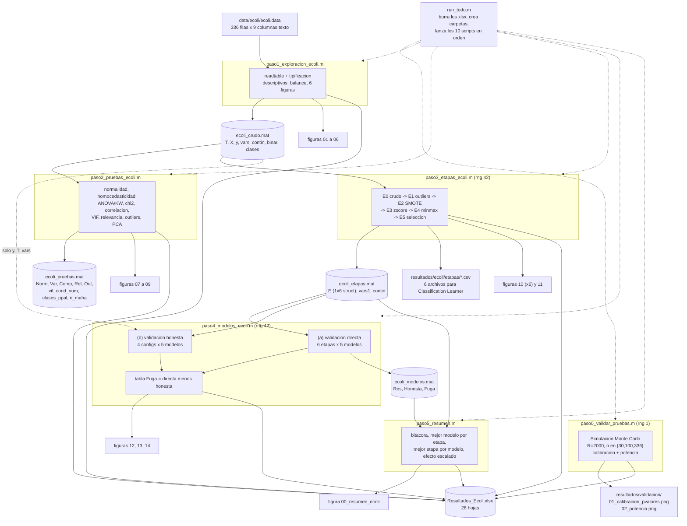

# Reporte técnico interno: pipeline del dataset ECOLI

Documento para ti mismo, no para entregar. Sirve para volver dentro de tres meses y entender qué hace cada línea sin releer todo el código. Todo lo que aparece aquí sale del código real de `Primera actividad\codigo`; no hay números inventados.

TL;DR del recorrido del dato: `ecoli.data` entra con 336 filas y 9 columnas de texto, se convierte en una tabla `T` de 336x8 (7 predictoras numéricas más la clase), se le corren pruebas estadísticas que no modifican el dato, y luego se fabrica una cadena de seis versiones del dataset (`E0` a `E5`) donde se quita `chg`, se winsorizan atípicos, se descartan tres clases raras, se aplica SMOTE hasta 715 filas, se escala y se quita `alm2`. Sobre esas seis versiones se corren cinco clasificadores con validación cruzada de 5 pliegues, y aparte se corre la misma evaluación de forma honesta (balanceo y escalado dentro del pliegue) para medir cuánto se infla la métrica cuando se balancea antes de partir.

---

## 1. Diagrama del pipeline completo



Las funciones auxiliares no aparecen como nodos porque no producen archivos, se llaman desde dentro de los scripts. La relación es esta: `paso0` usa `swtest`, `dagostino_k2` y `guardar_fig`; `paso2` usa esas dos más `cramersv` y `calcular_vif`; `paso3` usa `tratar_outliers`, `balancear` (que llama a `smote_simple`) y `guardar_fig`; `paso4` usa `evaluar_cv`, que a su vez llama a `balancear` y a `metricas_clf`.

---

## 2. Tabla maestra de dónde a dónde

| Paso | Script | Estado del dato al entrar | Qué le hace el código | Estado del dato al salir | Archivos que escribe |
|---|---|---|---|---|---|
| 0 | `paso0_validar_pruebas.m` | Nada del disco. Genera muestras sintéticas con `randn`, `exprnd`, `rand`, `trnd`, `lognrnd` bajo `rng(1)` | 2000 repeticiones por escenario, 3 tamaños (30, 100, 336) y 5 distribuciones (normal más 4 alternativas). Compara `swtest` y `dagostino_k2` contra `lillietest` y `adtest` en tasa de rechazo y potencia | `Calib` 12x6 y `Potencia` 48x4, más `P_guardado` 2000x4 y `Pot30` 4x4 en memoria | `resultados/validacion/01_calibracion_pvalores.png`, `02_potencia.png`, hojas `00_Validacion_calibracion` y `00_Validacion_potencia` en los dos libros de Excel |
| 1 | `paso1_exploracion_ecoli.m` | `data/ecoli/ecoli.data`, texto plano separado por espacios de ancho variable, 336 líneas de 9 campos | `readtable` con delimitador de espacio y colapso de delimitadores consecutivos, renombra columnas, borra `secuencia`, calcula descriptivos, detecta varianza casi nula, mide el desbalance con chi2, IR y entropía normalizada, y dibuja 6 figuras | `T` 336x8 table, `X` 336x7 double, `y` 336x1 cell de char, `clases` 8x1 cell. El dato numérico no se altera | `ecoli_crudo.mat`, figuras `01` a `06`, hojas `E1_Descriptivos`, `E1_Balance_clase`, `E1_Balance_test` |
| 2 | `paso2_pruebas_ecoli.m` | `ecoli_crudo.mat` | Solo mide, no transforma. Normalidad global y por clase, Levene y Bartlett, ANOVA y Kruskal-Wallis con tamaños de efecto, post-hoc Bonferroni, chi2 y V de Cramer para las binarias, tres correlaciones, VIF y número de condición, cuatro rankings de relevancia, conteo de atípicos univariados y Mahalanobis robusto, y PCA | Doce tablas de diagnóstico. `X` sigue intacto, no sale de aquí ninguna versión modificada del dataset | `ecoli_pruebas.mat`, figuras `07`, `08`, `09`, doce hojas con prefijo `E2_` |
| 3 | `paso3_etapas_ecoli.m` | `ecoli_crudo.mat` (usa `T`, `y`, `vars`, `contin`) | Construye la cadena de seis etapas. Quita `chg`, winsoriza al 1.5 IQR las cinco continuas restantes, filtra clases con menos de 10 muestras, aplica SMOTE hasta igualar la mayoritaria, estandariza, normaliza a [0,1] y quita `alm2` | `E` struct 1x6. `E(1).X` 336x7, `E(2).X` 336x6, `E(3).X` a `E(5).X` 715x6, `E(6).X` 715x5. Las etiquetas pasan de 336x1 con 8 clases a 715x1 con 5 clases | `ecoli_etapas.mat`, seis CSV en `resultados/ecoli/etapas/`, seis figuras `10_etapa_*`, figura `11_balance_antes_despues`, hoja `E3_Etapas` |
| 4 | `paso4_modelos_ecoli.m` | `ecoli_etapas.mat` más `T`, `y`, `vars` de `ecoli_crudo.mat` | Corre `evaluar_cv` con k=5 y semilla 42 sobre las seis etapas (validación directa) y sobre cuatro configuraciones honestas construidas desde `E(2).X` filtrado. Cruza ambas para armar la tabla de fuga y dibuja la confusión del mejor par etapa-modelo | `Res` 30x9, `Honesta` 20x7, `Fuga` 15x6 | `ecoli_modelos.mat`, figuras `12`, `13`, `14`, hojas `E4_Modelos_directa`, `E4_Modelos_honesta`, `E4_Comparacion_fuga` |
| 5 | `paso5_resumen.m` | `ecoli_etapas.mat` y `ecoli_modelos.mat` (y los equivalentes de Bank, en un bucle de dos datasets) | Arma la bitácora de cambios entre etapas consecutivas con deltas de filas, variables y clases, saca el mejor modelo por etapa y la mejor etapa por modelo, mide la ganancia de estandarizar comparando `E2_balanceado` contra `E3_estandarizado` | `Bitacora` 6x11, `Conteos` 36x4, `Resumen` 6x8, `PorModelo` 5x6, `Escalado` 5x4 | Figura `00_resumen_ecoli`, hojas `00_Bitacora_etapas`, `00_Balance_por_etapa`, `00_Resumen_por_etapa`, `00_Resumen_por_modelo`, `00_Efecto_escalado` |

El orquestador `run_todo.m` no toca el dato: solo crea las carpetas de salida, borra los dos `.xlsx` para que no queden hojas viejas de corridas previas, y lanza los diez scripts en orden dentro de la función local `correr`, que existe precisamente para que el `clear` con el que empieza cada script no borre las variables del propio `run_todo`.

---

## 3. Script por script

### 3.1 `run_todo.m`

No carga ningún `.mat`. Calcula `base` como `fileparts(fileparts(mfilename('fullpath')))`, es decir la carpeta `Primera actividad`, y agrega al path `codigo` y `codigo/funciones`.

El primer bloque crea cinco carpetas si no existen: `resultados/ecoli/figuras`, `resultados/ecoli/etapas`, `resultados/bank/figuras`, `resultados/bank/etapas` y `resultados/validacion`. El segundo bloque borra `Resultados_Ecoli.xlsx` y `Resultados_Bank.xlsx` si existen. Esto es deliberado: `writetable` con la opción `Sheet` sobrescribe la hoja pero no borra las que ya no se escriben, así que sin el `delete` quedarían hojas fantasma de una versión anterior del código.

El tercer bloque define el cell `scripts` con los diez nombres en orden y los recorre midiendo tiempos con `tic`/`toc`. La función local `correr(nombre)` hace `run(nombre)` dentro de su propio espacio de variables. El comentario del código lo dice explícito y es la razón de que exista esa función de una sola línea.

### 3.2 `paso0_validar_pruebas.m`

No carga `.mat`. Fija `rng(1)`, distinto de la semilla 42 del resto del pipeline, porque esto es una simulación independiente y no un experimento de modelado.

Apaga cuatro warnings de MATLAB (`stats:lillietest:OutOfRangePLow`, `stats:adtest:OutOfRangePLow` y sus versiones `High`) porque `lillietest` y `adtest` avisan cada vez que el p valor cae fuera de su tabla interna, y con 2000 repeticiones por escenario eso llenaría la consola.

Los parámetros de la simulación son `R = 2000` repeticiones, `alfa = 0.05` y `tam = [30 100 336]`. El 336 está ahí a propósito porque es el tamaño exacto del dataset Ecoli. El cell `pruebas` tiene cuatro entradas: las dos propias (`swtest`, `dagostino_k2`) y las dos de MATLAB (`lillietest`, `adtest`).

El bloque de calibración genera `x = randn(n,1)` y llena una matriz `P` de `R x 4` con los cuatro p valores. Cuando `n == 336` guarda esa matriz en `P_guardado` para el histograma. Para cada prueba calcula `tasa = mean(p < alfa)`, que debería quedar cerca de 0.05, y además contrasta la uniformidad de los p valores con `kstest` contra `makedist('Uniform','lower',0,'upper',1)`. Esa segunda comprobación es más exigente que la primera: una prueba puede rechazar al 5 por ciento y aun así tener p valores mal repartidos. El resultado es `Calib`, tabla 12x6 (3 tamaños por 4 pruebas) con columnas `Prueba`, `n`, `Tasa_rechazo_H0`, `Nominal`, `Desvio`, `p_uniformidad`.

El bloque de potencia recorre los mismos tres tamaños contra cuatro alternativas elegidas por el motivo que rompe la normalidad en cada caso: exponencial para asimetría fuerte, uniforme para colas cortas sin pico central, t de Student con 5 grados de libertad para colas pesadas, y lognormal con sigma 0.25 para asimetría leve, que es el caso difícil. `pot = mean(P < alfa)` da un vector 1x4 y cuando `n == 30` se guarda la fila en `Pot30`, matriz 4x4. El resultado es `Potencia`, tabla 48x4 (3 tamaños por 4 alternativas por 4 pruebas) con columnas `Distribucion`, `n`, `Prueba`, `Potencia`. En consola se muestra con `unstack` para verla como matriz.

Las figuras son dos. `01_calibracion_pvalores` es un panel 2x2 de histogramas de `P_guardado` con 20 bins normalizados a probabilidad y una `yline` en 1/20, que es la altura esperada si los p valores fueran uniformes. `02_potencia` es un diagrama de barras de `100*Pot30` con las cuatro alternativas en el eje x.

Al final escribe `Calib` y `Potencia` en los dos libros, con las hojas `00_Validacion_calibracion` y `00_Validacion_potencia`. Ojo con el bucle `for xls = {xls_e, xls_b}`: al iterar sobre un cell row, `xls` es un cell 1x1 en cada vuelta, por eso hay que escribir `xls{1}` dentro.

### 3.3 `paso1_exploracion_ecoli.m`

El comentario de cabecera dice "Paso 0" pero el archivo es el paso 1. No carga ningún `.mat`, es el punto de entrada del dato real.

**Bloque 1, carga.** `readtable` sobre `data/ecoli/ecoli.data` con `'FileType','text'`, `'Delimiter',' '`, `'ConsecutiveDelimitersRule','join'`, `'LeadingDelimitersRule','ignore'` y `'ReadVariableNames',false`. Las dos reglas de delimitadores son las que importan: el archivo de UCI separa columnas con espacios de ancho variable, así que sin `join` cada bloque de espacios generaría columnas vacías, y sin `ignore` los espacios iniciales de algunas líneas generarían una primera columna vacía. Después asigna a mano `T.Properties.VariableNames = {'secuencia','mcg','gvh','lip','chg','aac','alm1','alm2','clase'}` y elimina la columna identificadora con `T.secuencia = []`.

Las estructuras que quedan son estas.

| Variable | Tipo y tamaño | Contenido |
|---|---|---|
| `T` | table 336x8 | 7 columnas double más `clase` como cell de char |
| `vars` | cell 1x7 | `mcg`, `gvh`, `lip`, `chg`, `aac`, `alm1`, `alm2` |
| `contin` | cell 1x5 | `mcg`, `gvh`, `aac`, `alm1`, `alm2`, las continuas en [0,1] |
| `binar` | cell 1x2 | `lip`, `chg`, binarias según el archivo `.names` |
| `X` | double 336x7 | `T{:, vars}` |
| `y` | cell 336x1 de char | `T.clase` |
| `clases` | cell 8x1 | `unique(y)`, las 8 localizaciones |

**Bloque 2, faltantes.** `n_falt = sum(ismissing(T{:,vars}),1)'` da un vector 7x1. En este dataset la suma total es cero, pero el chequeo se deja porque el resto del pipeline asume que no hay `NaN` (por ejemplo `zscore` y `robustcov` se comportan distinto si los hay).

**Bloque 3, descriptivos.** Construye `Desc`, tabla 7x12, con `mean`, `median`, `std`, `var`, `min`, `max`, el rango intercuartílico calculado como `quantile(X,0.75) - quantile(X,0.25)`, `skewness`, `kurtosis`, el número de valores únicos vía `arrayfun(@(j) numel(unique(X(:,j))), ...)` y los faltantes. Todo se transpone con `'` porque esas funciones devuelven vectores fila cuando se les pasa una matriz.

Después hay un bucle de detección de varianza casi nula que usa `groupcounts` sobre cada columna y avisa cuando el valor más frecuente concentra más del 98 por ciento de las filas. Es el que dispara la alerta sobre `chg` y es lo que justifica que en el paso 3 se elimine esa variable.

**Bloque 4, balance de la clase.** `[cnt, nom] = groupcounts(y)` da los conteos por clase. Con `n = 336` y `k = 8`, el esperado uniforme es `n/k`. El chi2 de bondad de ajuste se calcula a mano como `sum((cnt - esperado).^2 / esperado)` y el p valor con `chi2cdf(chi2_bal, k-1, 'upper')`, que es la cola superior. Se usa `'upper'` en vez de `1 - chi2cdf(...)` para no perder precisión cuando el p valor es diminuto. Además calcula el imbalance ratio `IR = max(cnt)/min(cnt)` y la entropía normalizada `H = -sum((cnt/n).*log(cnt/n))/log(k)`, que vale 1 si el reparto es perfecto. Los conteos reales del archivo son `cp` 143, `im` 77, `pp` 52, `imU` 35, `om` 20, `omL` 5, `imS` 2, `imL` 2.

Salen dos tablas: `Balance` (8x4, una fila por clase) y `Resumen_bal` (7x2, formato indicador-valor con `chi2`, `gl`, `p_valor`, `IR_max_min`, `Entropia_norm`, `N_total`, `N_clases`).

**Bloque 5, figuras.** Seis figuras, todas creadas con `'Visible','off'` y cerradas por `guardar_fig`.

| Figura | Qué dibuja | Por qué |
|---|---|---|
| `01_histogramas_crudo` | `histogram` de las 7 predictoras en un panel 2x4 | Ver forma y detectar `chg` casi constante |
| `02_boxplot_crudo` | `boxplot(X, 'Labels', vars)` | Los puntos rojos son la regla 1.5 IQR, la misma que aplica `tratar_outliers` |
| `03_balance_clases_crudo` | Barras por clase con `yline` en el esperado uniforme y los conteos escritos con `text` | Respaldo visual del chi2 de balance |
| `04_boxplot_por_clase` | `boxplot(T.(contin{j}), y)` para las 5 continuas | Respaldo visual de ANOVA y Kruskal-Wallis del paso 2 |
| `05_qqplots` | `qqplot` de cada continua | Complemento visual de las pruebas de normalidad |
| `06_scatter_matrix` | `gplotmatrix(T{:,contin}, [], y, [], [], 6, 'on', 'grpbars', contin)` | Ver separabilidad por pares y correlaciones altas |

**Bloque 6, salida.** Escribe `Desc` en la hoja `E1_Descriptivos`, `Balance` en `E1_Balance_clase` y `Resumen_bal` en `E1_Balance_test`. Guarda `ecoli_crudo.mat` con `T`, `X`, `y`, `vars`, `contin`, `binar` y `clases`.

### 3.4 `paso2_pruebas_ecoli.m`

Carga `ecoli_crudo.mat` completo con `load`, sin lista de variables, así que entran `T`, `X`, `y`, `vars`, `contin`, `binar` y `clases`. Define `alfa = 0.05`, `Xc = T{:, contin}` que es 336x5, y `nc = 5`.

Antes de nada define el subconjunto de clases con el que trabajarán las pruebas por grupo: `clases_ppal = nom(cnt >= 20)`, que deja fuera `omL` (5), `imS` (2) e `imL` (2) y conserva cinco clases. `mask_ppal = ismember(y, clases_ppal)` es un logical 336x1 con 327 verdaderos. El umbral 20 aquí es distinto del umbral 10 del paso 3, y conviene tenerlo presente.

**Bloque de normalidad.** Matriz `R` de 5x8. Para cada continua corre cuatro pruebas por razones distintas: `swtest` es la de referencia para n menor a 2000, `lillietest` es la versión del Kolmogorov-Smirnov cuando media y varianza se estiman de la muestra, `adtest` es más sensible en las colas, y `dagostino_k2` descompone el problema en asimetría y curtosis. Las columnas de `R` son `W`, `p_sw`, `p_lil`, `p_ad`, `K2`, `p_k2`, `skewness`, `kurtosis`. De ahí sale `Norm`, tabla 5x10, con la columna lógica `Normal_alfa05` construida como `R(:,2) > alfa`, o sea el criterio manda con Shapiro-Wilk.

Después repite Shapiro-Wilk pero por combinación variable-clase, recorriendo las 5 continuas por las 5 clases principales. El resultado es `NormClase`, tabla 25x6 con `Variable`, `Clase`, `N`, `W_Shapiro`, `p_Shapiro`, `Normal_alfa05`. Esto es lo que de verdad importa antes de un ANOVA, porque el supuesto es normalidad dentro de cada grupo, no de la variable completa.

**Bloque de homocedasticidad.** Matriz `V` de 5x4. Usa `vartestn` dos veces con `'Display','off'`, una con `'TestType','LeveneAbsolute'` y otra con `'TestType','Bartlett'`. Se corren las dos porque Bartlett asume normalidad y Levene no, así que cuando discrepan la que vale es Levene. Sale `Var`, tabla 5x5, con las columnas de decisión convertidas explícitamente con `logical(...)` porque venían de una matriz double.

**Bloque de comparación entre clases.** Matriz `C` de 5x6. Corre `anova1(x, g, 'off')` y extrae `F = tbl{2,5}` y el tamaño de efecto `eta2 = tbl{2,2}/tbl{4,2}`, es decir la suma de cuadrados entre grupos sobre la suma total. Corre también `kruskalwallis(x, g, 'off')`, extrae `H = tblk{2,5}` y calcula `eps2 = (H - k + 1)/(n - k)`, el epsilon cuadrado, que es el equivalente no paramétrico del eta cuadrado. Se corren las dos rutas para poder justificar cuál se reporta. Sale `Comp`, tabla 5x7.

El post-hoc se hace sobre la variable con mayor `eps2`, localizada con `[~, jmax] = max(C(:,6))`. Vuelve a llamar a `kruskalwallis` pidiendo la tercera salida `st`, y le pasa esa estructura a `multcompare` con `'CType','bonferroni'`. Con cinco clases salen 10 pares. `cmp` es 10x6 y se convierte a `Post`, tabla 10x7 tras reordenar columnas, donde `Grupo_A` y `Grupo_B` se rellenan indexando `clases_ppal` con las dos primeras columnas de `cmp`.

**Bloque de binarias.** `lip` y `chg` no admiten pruebas de normalidad, así que se les aplica `cramersv`, que devuelve la V de Cramer, el chi2, el p valor y los grados de libertad. Además calcula a mano la matriz de frecuencias esperadas como `esp = sum(tabla,2)*sum(tabla,1)/sum(tabla(:))` para reportar el mínimo esperado y verificar la regla de que ninguna celda esperada baje de 5. Sale `Cat`, tabla 2x7. La conclusión de este bloque, junto con la alerta de varianza del paso 1, es lo que motiva quitar `chg` en `E1`.

**Bloque de correlación y multicolinealidad.** Calcula tres matrices 5x5 con `corr`: `Rp` Pearson (lineal), `Rs` Spearman (monótona, robusta a atípicos) y `Rk` Kendall (concordancia de pares, útil con n pequeño y empates). Calcula `vif = calcular_vif(Xc)`, vector 5x1, y `cond_num = cond(zscore(Xc))`, que mide la colinealidad global de la matriz estandarizada. Cada matriz se envuelve en `array2table` con `'VariableNames'` y `'RowNames'` iguales a `contin` para que la hoja de Excel salga etiquetada. El bucle `[fi, co] = find(triu(abs(Rp),1) > 0.6)` imprime los pares con correlación alta; usa `triu` con desplazamiento 1 para no repetir pares ni contar la diagonal. La figura `07_correlacion` son dos `imagesc` con escala fija `[-1 1]` y los valores escritos encima con `text`.

**Bloque de relevancia.** Cuatro criterios para no depender de uno solo. Aquí están las dos trampas de API que el propio código comenta.

| Llamada | Qué devuelve realmente | Cómo lo maneja el código |
|---|---|---|
| `[idx_mrmr, sc_mrmr] = fscmrmr(Xc, y)` | `idx_mrmr` son los índices ordenados por ranking, pero `sc_mrmr` viene en el orden ORIGINAL de las columnas | Usa `sc_mrmr(:)` tal cual, sin reordenar, porque la tabla `Rel` ya está en orden de columnas. Para ver el ranking habría que hacer `sc_mrmr(idx_mrmr)` |
| `[~, w_relief] = relieff(Xc, y, 10)` | La PRIMERA salida son los índices ordenados, no los pesos. Los pesos son la segunda | Descarta la primera con `~` y usa `w_relief'` transpuesto |

`Rel` es una tabla 5x9: `Variable`, `F_ANOVA` (reusa `C(:,1)`), `H_KruskalWallis` (reusa `C(:,4)`), `Score_MRMR`, `Peso_ReliefF` y cuatro columnas de ranking calculadas con la función local `ranking(v)`, que hace `[~, orden] = sort(v,'descend')` y luego `r(orden) = 1:numel(v)`, de forma que la posición 1 corresponde al valor más alto.

**Bloque de outliers.** Matriz `O` de 5x4. Por variable cuenta atípicos con la regla de Tukey (`q(1)-1.5*ri` y `q(2)+1.5*ri`) y con z score mayor a 3, y guarda conteos y porcentajes. Después corre `robustcov(Xc)` pidiendo la tercera salida `d2`, que es el vector 336x1 de distancias de Mahalanobis robustas al cuadrado, y compara contra `umbral = chi2inv(0.975, nc)` con `nc = 5` grados de libertad. `robustcov` en vez de una covarianza clásica porque la covarianza muestral se contamina con los propios atípicos que se quieren detectar. Sale `Out`, tabla 5x5, y el escalar `n_maha`. La figura `08_mahalanobis` es un `plot` de `d2` con la `yline` del umbral.

**Bloque de PCA.** `[~, score, ~, ~, expl] = pca(zscore(Xc))`. Se estandariza antes porque el PCA sobre la covarianza sin escalar le daría peso a las variables de mayor varianza. `score` es 336x5 y `expl` es 5x1 con el porcentaje de varianza explicada. La figura `09_pca` tiene el `gscatter` de las dos primeras componentes coloreado por clase y el diagrama de barras de varianza explicada con la acumulada superpuesta.

**Salida.** Doce hojas de Excel: `E2_Normalidad`, `E2_Normalidad_clase`, `E2_Varianzas`, `E2_Comparacion`, `E2_PostHoc`, `E2_Categoricas`, `E2_Corr_Pearson`, `E2_Corr_Spearman`, `E2_Corr_Kendall`, `E2_VIF`, `E2_Relevancia`, `E2_Outliers`. Las tres de correlación se escriben con `'WriteRowNames', true` para conservar las etiquetas de fila. Guarda `ecoli_pruebas.mat` con `Norm`, `Var`, `Comp`, `Rel`, `Out`, `vif`, `cond_num`, `clases_ppal` y `n_maha`. Ninguna otra parte del pipeline lee ese `.mat`; existe para consulta.

### 3.5 `paso3_etapas_ecoli.m`

Fija `rng(42)` en la línea 8, antes de cualquier operación aleatoria. Es la semilla que hace repetible el SMOTE. Carga `ecoli_crudo.mat` completo y usa `T`, `y`, `vars` y `contin`. Crea `E = struct()`, que se va llenando por índice.

**E0, crudo.** `E(1).X = T{:, vars}` es 336x7, `E(1).y = y` es 336x1 cell, `E(1).vars = vars` con 7 nombres. Es el dataset tal como viene de UCI, con las 8 clases.

**E1, outliers y variables inútiles.** Dos decisiones en un solo paso. Primero `vars1 = setdiff(vars, {'chg'}, 'stable')`, que deja `{mcg, gvh, lip, aac, alm1, alm2}`, 6 nombres. El `'stable'` es obligatorio: sin él `setdiff` devuelve el resultado ordenado alfabéticamente y las columnas de `X1` dejarían de corresponder con los nombres. `X1 = T{:, vars1}` es 336x6.

Después `cols_cont = find(ismember(vars1, contin))`, que da `[1 2 4 5 6]`, es decir todas menos `lip`, que está en la posición 3 y es binaria. La regla IQR solo se aplica a esas cinco columnas. La llamada es `[X1, info_out] = tratar_outliers(X1, cols_cont, 'winsor', 1.5)`. El modo `'winsor'` recorta al límite en vez de borrar filas, y el motivo está escrito en el propio código: con 336 muestras borrar filas cuesta caro. `X1` sigue siendo 336x6 después de winsorizar; el número de filas no cambia. `info_out` tiene tres campos: `detalle` (5x4 con conteo, porcentaje, límite inferior y límite superior por columna tratada), `filas_malas` (logical 336x1) y `pct_filas` (escalar).

`E(2).X = X1` (336x6), `E(2).y = y` (336x1, sigue con las 8 clases), `E(2).vars = vars1`.

**E2, balanceo.** Primero el filtrado de clases raras. `clases_ok = nom(cnt >= 10)` conserva `cp`, `im`, `pp`, `imU` y `om`, y descarta `omL` (5), `imS` (2) e `imL` (2), que son 9 muestras de 336, el 2.7 por ciento. El motivo escrito en el código es doble: con n menor a 10 no se puede validar de forma cruzada ni generar sintéticos decentes, porque SMOTE necesita al menos k vecinos dentro de la clase.

Luego `[X2, y2] = balancear(X1(mask,:), y(mask), 'smote')`. Fíjate en el orden: entra `X1`, o sea el dato ya winsorizado, filtrado por `mask` a 327 filas. SMOTE lleva cada clase hasta el tamaño de la mayoritaria, que son las 143 de `cp`, así que `X2` queda en 715x6 (5 clases por 143) y `y2` en 715x1 cell. Se elige SMOTE y no submuestreo porque recortar `cp` de 143 a 20 dejaría 100 muestras en total, que no alcanzan para entrenar nada.

**E3, estandarización.** `E(4).X = zscore(X2)`, 715x6. Se aplica sobre `X2`, no sobre `X1`, o sea que la media y la desviación se calculan incluyendo los sintéticos de SMOTE.

**E4, normalización.** Min-max calculado a mano sobre `X2`: `mn = min(X2)`, `mx = max(X2)`, `rg = mx - mn` y la guarda `rg(rg == 0) = 1` para no dividir por cero si alguna columna quedara constante. `E(5).X = (X2 - mn) ./ rg`, 715x6. Se hace a mano y no con `normalize(X,'range')` porque así el mismo patrón se reusa en `evaluar_cv`, donde los parámetros tienen que venir solo del bloque de entrenamiento.

**E5, selección de variables.** `vars5 = setdiff(vars1, {'alm2'}, 'stable')`, 5 nombres, y `sel = ismember(vars1, vars5)`, logical 1x6. La clave está en `E(6).X = E(4).X(:, sel)`: parte de E3, el estandarizado, no de E4. Queda 715x5. La justificación en el código es que `alm1` y `alm2` tienen Pearson 0.81 y son las dos de VIF más alto (4.05 y 3.71), y se conserva `alm1` porque es la de mayor F en el ANOVA.

Resumen de las seis etapas.

| Índice | `E(i).nombre` | Dimensión de `X` | Filas | Variables | Clases |
|---|---|---|---|---|---|
| 1 | `E0_crudo` | 336x7 | 336 | 7 | 8 |
| 2 | `E1_outliers` | 336x6 | 336 | 6 (sin `chg`) | 8 |
| 3 | `E2_balanceado` | 715x6 | 715 | 6 | 5 |
| 4 | `E3_estandarizado` | 715x6 | 715 | 6 | 5 |
| 5 | `E4_normalizado` | 715x6 | 715 | 6 | 5 |
| 6 | `E5_seleccion` | 715x5 | 715 | 5 (sin `alm2`) | 5 |

**Resumen y CSV.** El bucle final recorre las seis etapas, recalcula `IR` y entropía normalizada sobre `E(i).y`, y agrega estadísticos globales de toda la matriz (`min(Xi(:))`, `max(Xi(:))`, `mean(Xi(:))`, `std(Xi(:))`). Esos globales son los que dejan ver de un vistazo que E3 está centrado en cero y E4 vive en [0,1]. Sale `Etapas`, tabla 6x11.

En el mismo bucle escribe los CSV. Construye `Ti = array2table(Xi, 'VariableNames', E(i).vars)`, le agrega `Ti.clase = yi` y llama a `writetable` con el nombre `ecoli_<nombre>.csv` dentro de `resultados/ecoli/etapas`. Los seis archivos son `ecoli_E0_crudo.csv` (336 filas, 8 columnas), `ecoli_E1_outliers.csv` (336x7), `ecoli_E2_balanceado.csv`, `ecoli_E3_estandarizado.csv` y `ecoli_E4_normalizado.csv` (715x7 cada uno) y `ecoli_E5_seleccion.csv` (715x6). Están pensados para arrastrarlos directamente a Classification Learner.

**Figuras.** Un panel de tres subplots por etapa (`10_etapa_E0_crudo` hasta `10_etapa_E5_seleccion`, seis archivos): boxplot de las predictoras, histograma de todos los valores aplanados con `E(i).X(:)`, y barras de balance de clase con el IR en el título. Aparte, `11_balance_antes_despues` compara `E(1).y` contra `E(3).y` en dos subplots.

**Salida.** Hoja `E3_Etapas` y archivo `ecoli_etapas.mat` con `E`, `vars1` y `contin`.

### 3.6 `paso4_modelos_ecoli.m`

Fija `rng(42)` y hace dos cargas distintas: `ecoli_etapas.mat` completo (trae `E`, `vars1`, `contin`) y `ecoli_crudo.mat` pero solo con `'T'`, `'y'`, `'vars'`. La segunda carga es selectiva a propósito, porque si trajera todo sobrescribiría `contin` y compañía. De ahí se usa realmente solo `y`, para reconstruir la máscara de clases del bloque honesto.

`modelos = {'Arbol','KNN','LDA','NaiveBayes','SVM'}`, cinco nombres que `evaluar_cv` traduce a llamadas de entrenamiento.

**Parte (a), validación directa.** Bucle sobre las seis etapas. En cada vuelta arma `op = struct('k',5, 'semilla',42, 'modelos',{modelos})`. Los dobles corchetes alrededor de `modelos` son necesarios: si pasas un cell a `struct` sin envolverlo, MATLAB genera un array de structs, uno por elemento del cell. Envolviéndolo, el campo queda como un único cell 1x5. No se pasan `balanceo` ni `escala`, así que `evaluar_cv` usa sus defaults `'ninguno'` y `'ninguna'`, y el modelo recibe la etapa ya transformada tal cual. Eso es exactamente lo que hace Classification Learner cuando le arrastras el CSV.

A cada tabla devuelta le agrega `Etapa`, `N` y `Clases` con `repmat`, y acumula con `Res = [Res; Ti]`. Al final mueve esas tres columnas al frente con `movevars(..., 'Before', 'Modelo')` y elimina `Recall_pos`, `Precision_pos` y `F1_pos` con `removevars`, porque solo aplican a problemas binarios y aquí son todas `NaN`. `Res` queda 30x9 (6 etapas por 5 modelos) con columnas `Etapa`, `N`, `Clases`, `Modelo`, `Exactitud`, `ExactBalanceada`, `F1_macro`, `Kappa`, `Segundos`.

**Parte (b), validación honesta.** Reconstruye el filtrado de clases (`cnt >= 10`) sobre `y` y arma `Xh = E(2).X(mask,:)`, que es 327x6, y `yh = y(mask)`, 327x1. El punto es partir de E1, que ya está sin `chg` y winsorizado, pero sin balancear ni escalar. El balanceo y el escalado se delegan a `evaluar_cv` para que ocurran dentro de cada pliegue.

| `configs{c,1}` | `configs{c,2}` (balanceo) | `configs{c,3}` (escala) | Con qué etapa directa se compara |
|---|---|---|---|
| `H0_sin_nada` | `ninguno` | `ninguna` | ninguna, es la referencia |
| `H1_smote_en_fold` | `smote` | `ninguna` | `E2_balanceado` |
| `H2_smote_zscore` | `smote` | `zscore` | `E3_estandarizado` |
| `H3_smote_minmax` | `smote` | `minmax` | `E4_normalizado` |

`Honesta` queda 20x7 (4 configs por 5 modelos) con `Config` movida al frente y las tres columnas binarias eliminadas.

**Comparación directa contra honesta.** El cell `pares` define los tres emparejamientos de la tabla anterior. Para cada par y cada modelo busca la `ExactBalanceada` de un lado y del otro con indexación lógica sobre `strcmp`, y guarda la diferencia. `Fuga` queda 15x6 con columnas `Etapa_directa`, `Config_honesta`, `Modelo`, `ExactBal_directa`, `ExactBal_honesta`, `Diferencia`. `mean(Fuga.Diferencia)` es el número que resume cuánto se infla la métrica por balancear antes de partir, y el comentario de cabecera dice que esa diferencia es el resultado más importante del trabajo.

**Figuras.** `12_modelos_por_etapa` construye la matriz `M` de 6x5 recorriendo etapas por modelos y la dibuja con `bar`, con leyenda de modelos. `13_fuga_por_balanceo` usa `reshape(Fuga.ExactBal_directa, numel(modelos), [])` para pasar de la tabla larga a una matriz 5x3, y grafica solo las dos primeras columnas (E2 y E3) en dos subplots. El `reshape` funciona porque el bucle que construyó `Fuga` recorre primero modelos dentro de cada par, así que el orden de memoria es el correcto.

`14_confusion_mejor` es el bloque más delicado. Localiza el máximo global con `[~, imej] = max(Res.ExactBalanceada)`, saca `etapa_mej` y `mod_mej`, y encuentra el índice de esa etapa en el struct con `find(strcmp({E.nombre}, etapa_mej))`. Después hace su propia `cvpartition(E(ie).y, 'KFold', 5)` y su propio bucle de cinco pliegues con un `switch` que duplica las llamadas de entrenamiento de `evaluar_cv`: `fitctree`, `fitcknn` con `'NumNeighbors',5`, `fitcdiscr` con `'DiscrimType','pseudoLinear'`, `fitcnb` con `'DistributionNames','kernel'` y `fitcecoc` con `templateSVM('KernelFunction','linear','Standardize',true)`. Acumula `yreal` y `ypred` como cells y los pasa a `confusionchart` con `'RowSummary','row-normalized'`. La variable `op` que se define justo antes de este bloque no se usa; es código muerto.

**Salida.** Hojas `E4_Modelos_directa`, `E4_Modelos_honesta`, `E4_Comparacion_fuga` y archivo `ecoli_modelos.mat` con `Res`, `Honesta` y `Fuga`.

### 3.7 `paso5_resumen.m`

Este script trabaja los dos datasets en un solo bucle sobre el struct `DS`, que es 1x2. Para Ecoli los campos son `nombre` igual a `Ecoli`, `carpeta` igual a `ecoli`, `xls` apuntando a `Resultados_Ecoli.xlsx`, `balanceo` igual a `SMOTE`, `etapa_sin_escalar` igual a `E2_balanceado` y `etapa_escalada` igual a `E3_estandarizado`.

Carga en variables nombradas para no contaminar el espacio: `Mod = load(... 'ecoli_modelos.mat')` y `Eta = load(... 'ecoli_etapas.mat')`, y de ahí saca `Et = Eta.E` y `R = Mod.Res`.

**Bitácora.** Recorre las seis etapas y calcula los deltas contra la etapa anterior: `dfil` de filas, `dvar` de variables, `dcla` de clases, más las variables eliminadas y agregadas con `setdiff` en ambas direcciones. Para `i == 1` pone todos los deltas en cero. Si un `setdiff` sale vacío lo reemplaza por `{'-'}` para que `strjoin` no produzca una cadena vacía en el Excel. `Bitacora` queda 6x11. Hay un comentario explícito de por qué la columna se llama `N_variables` y no `Variables`: ese nombre choca con el nombre de dimensión que traen las tablas de MATLAB.

En el mismo bucle se llena `Conteos`, con una fila por combinación etapa-clase. Para Ecoli son 8 más 8 más 5 más 5 más 5 más 5, es decir 36 filas por 4 columnas (`Etapa`, `Clase`, `N`, `Porcentaje`). El `char(ni(c))` es necesario porque `groupcounts` sobre un cell devuelve las categorías en un formato que hay que convertir para meterlo en un cell de char.

**Mejor modelo por etapa.** Con `unique(R.Etapa, 'stable')` conserva el orden de aparición, que es el orden E0 a E5, y no el alfabético. Por etapa toma el máximo de `ExactBalanceada` y reporta también `Exactitud`, `Kappa` y `F1_macro` de esa misma fila. Agrega `Cambio_vs_etapa_previa = [NaN; diff(...)]`, con el `NaN` inicial para que el vector calce en longitud. `Resumen` queda 6x8.

**Mejor etapa por modelo.** Por modelo saca el máximo y el mínimo de `ExactBalanceada` y su diferencia, que llama `Sensibilidad`, o sea cuánto le afecta a ese modelo el preprocesamiento. Ordena descendente por `Mejor`. `PorModelo` queda 5x6.

**Efecto de estandarizar.** Compara `E2_balanceado` contra `E3_estandarizado` modelo por modelo y guarda `Ganancia = b - a`. El `if isempty(a) || isempty(b), continue; end` protege contra que uno de los dos nombres no exista en `R`. `Escalado` queda 5x4.

**Figura de cierre.** `00_resumen_ecoli` tiene cuatro subplots: barras de la mejor exactitud balanceada por etapa, barras del cambio respecto a la etapa anterior coloreadas en verde o rojo según el signo usando `b.FaceColor = 'flat'` y asignación por filas en `b.CData`, barras horizontales de la ganancia por estandarizar con el mismo esquema de color, y la comparación directa contra honesta para el primer par de `Fuga`.

**Salida.** Cinco hojas: `00_Bitacora_etapas`, `00_Balance_por_etapa`, `00_Resumen_por_etapa`, `00_Resumen_por_modelo`, `00_Efecto_escalado`. No guarda ningún `.mat`.

---

## 4. Las funciones de `codigo\funciones`

### 4.1 `swtest.m`

Firma `[p, W] = swtest(x)`. Implementa Shapiro-Wilk con el algoritmo de Royston de 1992 (AS R94), porque MATLAB no la trae de fábrica y la guía la pide como primera opción para muestras chicas y medianas. Válida aproximadamente entre n igual a 3 y n igual a 5000.

Preprocesa con `x = x(:)`, quita `NaN`, ordena ascendente y calcula `n`. Si `n < 3` devuelve `NaN` en ambas salidas.

El primer paso es construir los valores esperados de los estadísticos de orden bajo normalidad con la aproximación de Blom: `m = norminv(((1:n)' - 0.375)/(n + 0.25))`, un vector n x 1. Después normaliza a norma unitaria con `c = m / sqrt(m'*m)` y define `u = 1/sqrt(n)`, que es la variable en la que están escritos los polinomios de corrección.

Los pesos `a` arrancan siendo `c` y luego se corrigen en las colas, que es donde la aproximación de Blom se queda corta. El peso del extremo superior se recalcula con un polinomio de grado 5 en `u`:

```
a(n) = polyval([-2.706056 4.434685 -2.071190 -0.147981 0.221157 c(n)], u)
a(1) = -a(n)
```

Como `polyval` toma los coeficientes en potencias descendentes, el último elemento del vector es el término independiente, y ahí está metido `c(n)`. O sea, la corrección es un polinomio en `u` sumado al valor de Blom. La antisimetría `a(1) = -a(n)` sale de que los pesos de Shapiro-Wilk son antisimétricos respecto al centro.

Si `n > 5` se corrige también el segundo peso desde cada extremo con otro polinomio de grado 5, `a(n-1)` y `a(2) = -a(n-1)`, y el bloque central se define como `medio = 3:(n-2)`. Si `n <= 5` no hay segundo peso que corregir y `medio = 2:(n-1)`. El factor de normalización `phi` cambia en consecuencia: con dos pesos corregidos por lado es `(m'*m - 2*m(n)^2 - 2*m(n-1)^2) / (1 - 2*a(n)^2 - 2*a(n-1)^2)`, y con uno solo es `(m'*m - 2*m(n)^2) / (1 - 2*a(n)^2)`. El numerador quita del total la contribución de los órdenes ya corregidos y el denominador quita la masa de peso que esos órdenes ya consumieron, de modo que el bloque central `a(medio) = m(medio)/sqrt(phi)` complete la norma. El estadístico es entonces `W = (a'*x)^2 / sum((x - mean(x)).^2)`, un cociente entre el cuadrado de una combinación lineal ponderada de los datos ordenados y la suma de cuadrados. Cerca de 1 significa que la muestra se parece a una normal.

La parte de los tramos está en la transformación a p valor, que es donde Royston aproxima la distribución de `W` con una normal después de transformarla. Son tres tramos.

| Tramo | Condición | Cómo obtiene el p valor |
|---|---|---|
| Exacto | `n == 3` | `p = max(0, min(1, 6/pi * (asin(sqrt(W)) - asin(sqrt(0.75)))))`. Con tres puntos la distribución de `W` es conocida en forma cerrada. El `max`/`min` recorta al intervalo [0,1] por seguridad numérica |
| Muestras chicas | `4 <= n <= 11` | Usa tres polinomios en `n` directamente. `gama = 0.459*n - 2.273`, `mu` es cúbico en `n` con coeficientes `[-0.0006714 0.025054 -0.39978 0.5440]`, y `sg` es la exponencial de otro cúbico con `[-0.0020322 0.062767 -0.77857 1.3822]`. La transformación es `z = (-log(gama - log(1-W)) - mu)/sg`, un doble logaritmo con un desplazamiento `gama` que es lo que estabiliza la cola |
| Muestras medianas y grandes | `n >= 12` | Cambia la variable a `ln = log(n)`. `mu` es cúbico en `ln` con `[0.0038915 -0.083751 -0.31082 -1.5861]` y `sg` es la exponencial de un cuadrático con `[0.0030302 -0.082676 -0.4803]`. La transformación es simple: `z = (log(1-W) - mu)/sg` |

Para Ecoli, con `nc = 5` variables de 336 muestras cada una, siempre aplica el tercer tramo. Las pruebas por clase, con grupos de entre 20 y 143 muestras, también caen en el tercero.

En los dos últimos tramos el p valor se calcula como `p = normcdf(-z)` y no como `1 - normcdf(z)`. El comentario del código lo dice y es correcto: con `z` grande, `normcdf(z)` vale prácticamente 1 y la resta pierde todos los dígitos significativos, mientras que `normcdf(-z)` evalúa directamente la cola.

### 4.2 `dagostino_k2.m`

Firma `[p, K2] = dagostino_k2(x)`. Junta asimetría y curtosis en un solo estadístico chi cuadrado con 2 grados de libertad. Sirve de complemento a Shapiro-Wilk porque dice por qué falla la normalidad, no solo que falla.

Preprocesa igual (vectoriza, quita `NaN`) y devuelve `NaN` si `n < 20`. Ese corte está porque las aproximaciones normales de los dos bloques no son fiables con n chico. Es una diferencia práctica con `swtest`, que funciona desde n igual a 3.

**Bloque de asimetría hacia Z1.** Usa `b1 = skewness(x, 1)`, con el flag 1, que es la versión sesgada (sin corrección por grados de libertad), porque las fórmulas de D'Agostino están escritas para el momento muestral crudo. Después:

```
Y   = b1 * sqrt((n+1)*(n+3) / (6*(n-2)))
b2t = 3*(n^2 + 27*n - 70)*(n+1)*(n+3) / ((n-2)*(n+5)*(n+7)*(n+9))
W2  = -1 + sqrt(2*(b2t - 1))
del = 1 / sqrt(log(sqrt(W2)))
alf = sqrt(2/(W2 - 1))
Z1  = del * asinh(Y/alf)
```

`Y` es la asimetría escalada por su desviación estándar aproximada bajo normalidad. `b2t` es la curtosis teórica de la propia distribución de la asimetría muestral, y `W2` sale de resolver la ecuación que la ajusta a una familia de Johnson SU. El `asinh` es la transformación de Johnson que convierte una variable con colas pesadas en una aproximadamente normal, y `del` y `alf` son sus dos parámetros. `Z1` queda con distribución aproximadamente normal estándar bajo la hipótesis de normalidad.

**Bloque de curtosis hacia Z2.** Usa `b2 = kurtosis(x, 1)`, otra vez la versión sesgada. Después:

```
Eb2 = 3*(n-1)/(n+1)
Vb2 = 24*n*(n-2)*(n-3) / ((n+1)^2*(n+3)*(n+5))
Xx  = (b2 - Eb2) / sqrt(Vb2)
sb1 = 6*(n^2 - 5*n + 2)/((n+7)*(n+9)) * sqrt(6*(n+3)*(n+5)/(n*(n-2)*(n-3)))
A   = 6 + 8/sb1 * (2/sb1 + sqrt(1 + 4/sb1^2))
Z2  = ((1 - 2/(9*A)) - ((1 - 2/A)/(1 + Xx*sqrt(2/(A-4))))^(1/3)) / sqrt(2/(9*A))
```

`Eb2` y `Vb2` son la media y la varianza exactas de la curtosis muestral bajo normalidad. Ojo con `Eb2`: vale `3*(n-1)/(n+1)`, no 3, porque `kurtosis` de MATLAB con flag 1 devuelve la curtosis no centrada (normal igual a 3) y además está sesgada. `Xx` es la curtosis estandarizada. `sb1` es la asimetría de la distribución de la curtosis muestral, que no es cero, y `A` es el parámetro de la transformación de Anscombe y Glynn que la corrige. La expresión de `Z2` es una transformación de Wilson-Hilferty, la raíz cúbica que normaliza una chi cuadrado.

**Cierre.** `K2 = Z1^2 + Z2^2` y `p = chi2cdf(K2, 2, 'upper')`. Los 2 grados de libertad son porque es la suma de dos normales estándar al cuadrado independientes. El `'upper'` de nuevo por precisión en la cola. La lectura práctica es que si `K2` es grande y el aporte viene sobre todo de `Z1`, el problema es la asimetría; si viene de `Z2`, es la curtosis.

### 4.3 `cramersv.m`

Firma `[V, chi2, p, gl] = cramersv(a, b)`. Envuelve `crosstab(a, b)`, que ya devuelve la tabla de contingencia, el chi cuadrado y su p valor. Lo único que agrega es el tamaño de efecto: `gl = (r-1)*(c-1)` y `V = sqrt(chi2 / (n * min(r-1, c-1)))`, donde `n = sum(tabla(:))`. La razón está en el comentario: el chi cuadrado crece con el tamaño muestral y no dice nada del tamaño del efecto, mientras que la V queda entre 0 y 1 y sí es comparable entre variables. En `paso2` se usa sobre `lip` y `chg` contra la clase.

### 4.4 `calcular_vif.m`

Firma `vif = calcular_vif(X)`. Devuelve un vector `p x 1`. Para cada columna `j` toma las demás con `X(:, setdiff(1:p, j))`, les antepone una columna de unos como intercepto, resuelve por mínimos cuadrados con el operador de barra invertida `otras \ yj`, calcula los residuos y de ahí `R2 = 1 - sum(res.^2)/sum((yj - mean(yj)).^2)`. Finalmente `vif(j) = 1 / max(1 - R2, 1e-12)`.

Dos detalles no obvios. El `max(..., 1e-12)` es la guarda contra división por cero cuando una columna es combinación lineal exacta de las otras y el R cuadrado da 1; sin eso saldría `Inf`. Y el uso de `\` en vez de `regress` o `fitlm` evita depender de la Statistics Toolbox para algo que es una resolución de sistema lineal, y además `\` usa QR con pivoteo, que se degrada de forma más elegante que la ecuación normal cuando la matriz está mal condicionada. La regla de lectura escrita en el código es que un VIF mayor a 5 huele a colinealidad y mayor a 10 es problema seguro.

### 4.5 `tratar_outliers.m`

Firma `[Xout, info] = tratar_outliers(X, cols, modo, factor)`, con `factor` igual a 1.5 si no se pasa. Aplica la regla de Tukey solo a las columnas indicadas en `cols`, porque no tiene sentido aplicársela a binarias o dummies.

Por cada columna calcula los cuartiles con `quantile(X(:,j), [0.25 0.75])` y el rango intercuartílico. Aquí está el detalle más importante de la implementación: si `iqr_j == 0` la columna se salta por completo, se registra `[0, 0, q(1), q(2)]` en `det` y se hace `continue`. El motivo está comentado y es real: si más del 75 por ciento de los datos está en un mismo valor, el IQR es cero, la regla de Tukey marcaría como atípico todo lo que no sea ese valor, y al winsorizar la variable quedaría constante. Es exactamente lo que pasaría con `chg` si no se hubiera eliminado antes.

Si el IQR es distinto de cero, calcula `li = q(1) - factor*iqr_j` y `ls = q(2) + factor*iqr_j`, marca `fuera` como logical, acumula en `marca` con un OR (por eso `filas_malas` cuenta filas que están fuera en al menos una columna, no valores) y registra en `det(i,:)` el conteo, el porcentaje sobre `n`, y los dos límites.

En modo `'winsor'` reemplaza los valores por debajo de `li` con `li` y los de arriba de `ls` con `ls`, sin borrar nada. La asignación se hace sobre `Xout` pero la condición se evalúa sobre `X`, el original, lo cual es correcto y evita cualquier efecto de orden. En modo `'eliminar'` borra las filas marcadas al final con `Xout(marca,:) = []`. Nota importante: en modo eliminar la función devuelve `Xout` con menos filas pero no devuelve las etiquetas filtradas, así que quien la llame tiene que filtrar `y` por su cuenta usando `info.filas_malas`.

La salida `info` tiene `detalle` (una fila por columna tratada, cuatro columnas), `filas_malas` (logical `n x 1`) y `pct_filas` (porcentaje de filas tocadas).

### 4.6 `smote_simple.m`

Firma `Xnew = smote_simple(X, n_nuevos, k)`, con `k` igual a 5 por defecto. Recibe la matriz de una sola clase, no todo el dataset. Devuelve `n_nuevos x size(X,2)`.

Primero acota `k = min(k, n-1)`, porque no puede haber más vecinos que puntos disponibles. Si `n < 2` o `n_nuevos <= 0` devuelve una matriz vacía con el número correcto de columnas, `zeros(0, size(X,2))`, para que la concatenación de quien la llame no falle.

El núcleo son cuatro líneas. `idx = knnsearch(X, X, 'K', k+1)` busca los vecinos de cada punto contra el propio conjunto, y se pide `k+1` porque la primera columna del resultado es siempre el punto consigo mismo (distancia cero); por eso justo después hace `idx = idx(:, 2:end)`, quedando `n x k`. Luego `base = randi(n, n_nuevos, 1)` elige el punto de partida de cada sintético, y `vecino = idx(sub2ind(size(idx), base, randi(k, n_nuevos, 1)))` elige uno de sus k vecinos. El `sub2ind` es la forma de indexar con un par de vectores fila-columna en una sola pasada, evitando un bucle. Finalmente `lambda = rand(n_nuevos,1)` y `Xnew = X(base,:) + lambda .* (X(vecino,:) - X(base,:))`, que es la interpolación lineal en el segmento entre el punto y su vecino, con el mismo `lambda` para todas las dimensiones de un mismo sintético.

Solo tiene sentido con variables continuas. En el pipeline de Ecoli se aplica sobre `X1(mask,:)`, que incluye la columna binaria `lip` en la posición 3, así que los sintéticos pueden tener valores intermedios en esa columna. Es un compromiso consciente de la implementación simple.

### 4.7 `balancear.m`

Firma `[Xb, yb] = balancear(X, y, metodo)`. Tres métodos: `'smote'`, `'submuestreo'` y `'sobremuestreo'`.

Obtiene las clases con `categories(removecats(categorical(y)))`. El `removecats` es clave porque elimina las categorías que quedaron sin observaciones, cosa que pasa siempre dentro de `evaluar_cv` cuando un pliegue de entrenamiento no recibe muestras de alguna clase. Cuenta con un bucle de `sum(strcmp(cellstr(y), clases{i}))`.

El objetivo depende del método: `min(conteo)` para `'submuestreo'` y `max(conteo)` para todo lo demás, incluido `'smote'` y `'sobremuestreo'`. Fíjate que el `otherwise` cubre los dos, así que si escribes mal el nombre del método terminas sobremuestreando por replicación sin darte cuenta.

El bucle por clase hace tres cosas según el caso. Si la clase tiene más muestras que el objetivo, recorta con `randperm(ni, objetivo)`, un muestreo sin reemplazo. Si tiene menos, genera lo que falta: con `'smote'` llama a `smote_simple(Xi, faltan, 5)` y concatena; con cualquier otro método replica con reemplazo usando `Xi(randi(ni, faltan, 1), :)`. Si tiene exactamente el objetivo, no la toca.

Al final revuelve todo con `orden = randperm(size(Xb,1))` para que las clases no queden en bloques contiguos. Eso importa porque varios entrenadores y particionadores de MATLAB son sensibles al orden de las filas.

Para Ecoli, con `objetivo = 143` y cinco clases, `Xb` sale 715x6 y `yb` 715x1 cell.

### 4.8 `metricas_clf.m`

Firma `m = metricas_clf(yreal, ypred, clases, clase_pos)`. Devuelve un struct.

Construye la matriz de confusión con `confusionmat(cellstr(yreal), cellstr(ypred), 'Order', clases)`. El `'Order'` explícito es importante: sin él, `confusionmat` ordena las clases según lo que encuentre en los datos, y si un pliegue no vio alguna clase la matriz cambiaría de tamaño entre llamadas.

De ahí saca `aciertos = diag(C)`, `por_fila = sum(C,2)` que es el soporte real de cada clase, y `por_col = sum(C,1)'` que es cuántas veces se predijo cada clase. Las métricas por clase son `recall = aciertos ./ max(por_fila, 1)` y `precision = aciertos ./ max(por_col, 1)`. Los `max(..., 1)` evitan dividir por cero cuando una clase no aparece ni como real ni como predicha. El F1 es `2*precision.*recall ./ max(precision + recall, eps)` y después se pone a `NaN` donde `por_fila == 0`, es decir donde la clase no tenía representación real, para que no contamine el promedio macro.

Las métricas agregadas son estas.

| Campo | Fórmula | Qué significa |
|---|---|---|
| `m.exactitud` | `sum(aciertos)/n` | Proporción global de aciertos. Engaña con clases desbalanceadas |
| `m.exact_balance` | `mean(recall(por_fila > 0))` | Promedio de recalls sobre las clases que sí aparecieron. Es la métrica principal de todo el trabajo |
| `m.f1_macro` | `mean(f1(~isnan(f1)))` | Promedio no ponderado de los F1 por clase |
| `m.kappa` | `(exactitud - pe)/max(1-pe, eps)` con `pe = sum(por_fila.*por_col)/n^2` | Kappa de Cohen, la exactitud corregida por el acierto esperado al azar |

Los tres campos `recall_pos`, `precision_pos` y `f1_pos` arrancan en `NaN` y solo se llenan si se pasó `clase_pos` y ese nombre aparece en `clases`. En Ecoli nunca se pasa, por eso `paso4` las elimina de las tablas con `removevars`. El struct incluye también `m.confusion` con la matriz completa.

### 4.9 `evaluar_cv.m`

Firma `T = evaluar_cv(X, y, opciones)`. Es el corazón del paso 4. Devuelve una tabla con una fila por modelo y nueve columnas: `Modelo`, `Exactitud`, `ExactBalanceada`, `F1_macro`, `Kappa`, `Recall_pos`, `Precision_pos`, `F1_pos`, `Segundos`.

Los defaults se rellenan con seis `if ~isfield(...)`: `k` igual a 5, `semilla` igual a 42, `balanceo` igual a `'ninguno'`, `escala` igual a `'ninguna'`, `modelos` igual a `{'Arbol','KNN','LDA'}` y `clase_pos` vacío.

Después hace `y = cellstr(y)`, `clases = unique(y)` (orden alfabético, y ese orden es el que se le pasa a `metricas_clf`), y `rng(opciones.semilla)`. Esa llamada a `rng` dentro de la función es la que garantiza que dos invocaciones con la misma `y` produzcan exactamente la misma partición y el mismo SMOTE, independientemente de lo que haya pasado antes en el script.

Silencia `stats:cvpartition:KFoldMissingGrp` porque en el dataset crudo hay clases con 2 muestras y algún pliegue se queda sin ellas. El comentario aclara que eso no se está tapando, se está esperando: mostrar que el crudo no se puede validar bien es parte del resultado.

`part = cvpartition(y, 'KFold', opciones.k)` es estratificada por construcción cuando la entrada son etiquetas.

El bucle exterior es sobre modelos y el interior sobre pliegues. Dentro de cada pliegue el orden de operaciones es exactamente este y no se puede alterar sin cambiar el significado del experimento. Primero se parte con `training(part,f)` y `test(part,f)`. Segundo, si `balanceo` no es `'ninguno'`, se llama a `balancear(Xtr, ytr, opciones.balanceo)` solo sobre el bloque de entrenamiento. Tercero, el escalado: en `'zscore'` calcula `mu` y `sg` de `Xtr` (con `sg(sg==0)=1`) y aplica la misma transformación a `Xtr` y a `Xte`; en `'minmax'` hace lo mismo con `mn`, `mx` y `rg`. Los parámetros nunca se calculan sobre `Xte`. Cuarto, entrena y predice dentro de un `try`/`catch`; si algo revienta imprime el mensaje, pone `ok = false` y rompe el bucle de pliegues, dejando la fila de ese modelo en `NaN`.

Las predicciones de los cinco pliegues se acumulan en `yreal_todo` y `ypred_todo` como cells, y las métricas se calculan una sola vez al final sobre la concatenación completa. Eso es distinto de promediar las métricas de cada pliegue y es la opción correcta cuando hay clases pequeñas, porque evita que un pliegue con pocas muestras de una clase pese lo mismo que otro con muchas.

La función local `entrenar(nombre, X, y)` mapea nombres a llamadas.

| Nombre | Llamada | Detalle |
|---|---|---|
| `Arbol` | `fitctree(X, y)` | Todo por defecto |
| `KNN` | `fitcknn(X, y, 'NumNeighbors', 5, 'Distance', 'euclidean')` | k igual a 5, sin estandarizar internamente, por eso el escalado externo le afecta |
| `LDA` | `fitcdiscr(X, y, 'DiscrimType', 'pseudoLinear')` | `pseudoLinear` usa la pseudoinversa y evita que reviente con columnas colineales, que es justo el caso de `alm1` y `alm2` |
| `NaiveBayes` | `fitcnb(X, y, 'DistributionNames', 'kernel')` | Kernel en vez de normal porque las pruebas de normalidad del paso 2 salen negativas |
| `SVM` | `fitcecoc(X, y, 'Learners', templateSVM('KernelFunction','linear','Standardize',true))` | ECOC porque el SVM base es binario y aquí hay 5 clases. El `'Standardize',true` estandariza internamente, así que este modelo es el menos sensible al escalado externo |
| `Logistica` | `fitclinear(X, y, 'Learner', 'logistic')` | Disponible pero no se usa en Ecoli |

### 4.10 `guardar_fig.m`

Firma `guardar_fig(fig, carpeta, nombre)`. Crea la carpeta si no existe. Intenta `fig.Theme = 'light'` dentro de un `try` porque desde R2025a las figuras salen con tema oscuro por defecto, y si esa propiedad no existe cae al `catch` que hace `set(fig, 'Color', 'w')`. Llama a `drawnow` para forzar el renderizado antes de exportar, y guarda con `exportgraphics(..., 'Resolution', 150, 'BackgroundColor', 'white')` en PNG. Al final cierra la figura con `close(fig)`, que es lo que permite correr los scripts de corrido sin llenar la pantalla de ventanas, y es también por lo que todas las figuras se crean con `'Visible','off'`.

---

## 5. Puntos delicados del código de Ecoli

Esta sección es la que importa si vas a tocar algo.

**El orden winsorización antes de filtrado de clases.** En `paso3_etapas_ecoli.m` la winsorización ocurre en la línea de `tratar_outliers` sobre las 336 filas completas, con las 8 clases dentro, y solo después se aplica `mask` para quitar las clases con menos de 10 muestras. Esto significa que los cuartiles y por tanto los límites `li` y `ls` se calculan incluyendo las 9 muestras de `omL`, `imS` e `imL` que luego se descartan. Si inviertes el orden y filtras primero, los cuartiles cambian, los límites cambian y `E1` en adelante ya no es el mismo dataset. Y como `paso4` usa `E(2).X(mask,:)` para el bloque honesto, el cambio se propaga a las cuatro configuraciones `H0` a `H3`.

**Dónde está exactamente la semilla.** Hay tres puntos de siembra distintos y no son intercambiables. `paso0_validar_pruebas.m` fija `rng(1)` en la línea 21. `paso3_etapas_ecoli.m` fija `rng(42)` en la línea 8, antes de cualquier cosa, y es la que hace repetible el SMOTE de `E2` (y por herencia `E3`, `E4` y `E5`). `paso4_modelos_ecoli.m` fija `rng(42)` en la línea 14, pero eso es casi decorativo porque `evaluar_cv` vuelve a hacer `rng(opciones.semilla)` en su línea 25 en cada invocación. La consecuencia práctica es que las diez llamadas a `evaluar_cv` de `paso4` arrancan todas desde el mismo estado. Lo que sí depende del `rng(42)` del script es el bloque de la figura `14_confusion_mejor`, porque su `cvpartition` se crea con el estado que quedó después de la última llamada a `evaluar_cv`, no con un `rng` fresco. Es decir, esa partición es reproducible solo si corres el script completo de arriba abajo. Si ejecutas ese bloque suelto en el editor, la matriz de confusión sale distinta.

**Por qué `evaluar_cv` particiona a mano en vez de usar `crossval`.** Está escrito en el encabezado de la función y es el argumento central del trabajo. `crossval` y `kfoldLoss` reciben un modelo ya entrenado o una función de entrenamiento, pero no dejan meter una transformación que dependa solo del bloque de entrenamiento de cada iteración. Si balanceas o escalas antes de llamar a `crossval`, el bloque de prueba de cada pliegue ya vio información del resto del dataset: con SMOTE, porque un sintético de entrenamiento puede haberse construido interpolando un punto que cae en el pliegue de prueba; con z-score, porque la media y la desviación se calcularon con todo. Haciendo el bucle a mano, el balanceo se aplica sobre `Xtr` después de partir y los parámetros de escala se calculan sobre `Xtr` y se aplican a `Xte`. La tabla `Fuga` es exactamente la medición de esa diferencia.

**El umbral de 10 muestras.** Aparece en `paso3` (`clases_ok = nom(cnt >= 10)`) y otra vez en `paso4` en el bloque honesto, escrito literal, no importado. Si lo cambias tienes que cambiarlo en los dos sitios o las dos validaciones dejan de ser comparables y la tabla `Fuga` compara cosas distintas. Los efectos de moverlo: bajándolo a 5 entraría `omL` con 5 muestras, serían 6 clases, `smote_simple` acotaría `k` a 4 y tendría que generar 138 sintéticos a partir de 5 puntos reales, con lo que la clase quedaría casi enteramente fabricada; además `cvpartition` con 5 pliegues sobre 5 muestras deja pliegues sin representación y saltaría el warning que la función silencia. Subiéndolo a 21 saldría también `om` con 20, quedarían 4 clases y el dataset balanceado bajaría a 572 filas. Cualquiera de los dos cambios altera `N`, `IR`, la entropía y todas las métricas de `Res` y `Honesta`.

**El otro umbral, el 20 de `paso2`.** En `paso2_pruebas_ecoli.m` el filtro es `cnt >= 20`, no 10. Para este dataset ambos dan las mismas cinco clases porque no hay ninguna clase entre 10 y 19, pero son dos constantes independientes y si tocas una sin la otra las pruebas estadísticas y las etapas dejan de referirse al mismo subconjunto.

**`fscmrmr` contra `relieff`, las dos convenciones opuestas.** Están comentadas en el código y vale la pena repetirlo porque es fácil de invertir. `fscmrmr` devuelve como primera salida los índices ordenados por ranking y como segunda los scores en el orden original de las columnas; por eso `sc_mrmr_ord = sc_mrmr(:)` se usa sin reordenar. `relieff` devuelve como primera salida los índices ordenados y como segunda los pesos, también en orden original; por eso el código descarta la primera con `~`. Si por descuido usas `idx_mrmr` como si fueran scores, o la primera salida de `relieff` como si fueran pesos, la tabla `Rel` sale con números que parecen razonables (son enteros de 1 a 5) pero significan lo contrario.

**`setdiff` sin `'stable'`.** Las dos eliminaciones de variables (`vars1` y `vars5`) usan `'stable'`. Sin esa opción `setdiff` devuelve orden alfabético, con lo que `vars1` pasaría a ser `{aac, alm1, alm2, gvh, lip, mcg}` mientras que `X1 = T{:, vars1}` seguiría extrayendo en ese mismo orden, así que la matriz no se corrompería, pero `cols_cont = find(ismember(vars1, contin))` cambiaría de `[1 2 4 5 6]` a `[1 2 3 4 6]` y `sel` en `E5` seleccionaría otra columna. Y en `paso5`, el `setdiff` de la bitácora sí quedaría desalineado con el resto.

**`E5` parte de `E3`, no de `E4`.** La línea es `E(6).X = E(4).X(:, sel)`, es decir del estandarizado. El nombre `E5_seleccion` no lo sugiere. Si alguien asume que la cadena es estrictamente secuencial y cambia eso a `E(5).X(:, sel)`, la etapa pasa a estar normalizada a [0,1] en vez de estandarizada y las métricas de KNN y Naive Bayes se mueven.

**La comparación de `paso5` está clavada a nombres de etapa.** El campo `DS(d).etapa_sin_escalar` vale `'E2_balanceado'` y `etapa_escalada` vale `'E3_estandarizado'`. Si renombras una etapa en `paso3`, la tabla `Escalado` se vacía silenciosamente por el `if isempty(a) || isempty(b), continue; end`, y no hay error, solo una tabla de cero filas y una figura con un subplot vacío.

**El `reshape` de `Fuga`.** Tanto `paso4` como `paso5` hacen `reshape(Fuga.ExactBal_directa, numel(modelos), [])`. Eso solo es válido porque el bucle que construye `Fuga` tiene los modelos en el bucle interno y los pares en el externo. Si inviertes los dos bucles, el `reshape` sigue funcionando sin error pero mezcla modelos con pares y las figuras `13` y `00_resumen_ecoli` quedan mal.

**El `delete` de los `.xlsx` en `run_todo.m`.** Si corres un paso suelto sin haber borrado el libro, `writetable` sobrescribe solo las hojas que ese paso escribe y deja intactas las demás. Eso está bien para iterar, pero significa que un libro puede contener hojas de dos versiones distintas del código sin que nada lo avise.

**`load` completo contra `load` selectivo en `paso4`.** El script hace primero `load(... 'ecoli_etapas.mat')`, que trae `E`, `vars1` y `contin`, y luego `load(... 'ecoli_crudo.mat', 'T', 'y', 'vars')` con lista explícita. Si le quitas la lista, `ecoli_crudo.mat` sobrescribiría `contin` (mismo nombre, mismo contenido en este caso, pero es una coincidencia) y añadiría `X` y `clases`, que podrían chocar con nombres locales.

**`struct('modelos', {modelos})`.** Los corchetes de más son obligatorios. `struct('modelos', modelos)` con `modelos` siendo un cell 1x5 crea un array 1x5 de structs, no un struct con un campo cell. Aparece en `paso4` tres veces y en el bloque de la confusión con doble envoltura `{{mod_mej}}`.

---

## 6. Tabla de recetas: si quiero cambiar X, toco Y

| Quiero cambiar | Archivo y bloque | Qué toco exactamente | Qué más se mueve |
|---|---|---|---|
| El número de pliegues de la validación cruzada | `paso4_modelos_ecoli.m`, líneas del `op = struct('k',5,...)` en el bloque (a) y en el bloque (b), más el bloque de la figura `14` | Los dos `'k',5`, más el `cvpartition(E(ie).y,'KFold',5)` y el `for fo = 1:5` del bloque de la confusión. El default de `evaluar_cv` también es 5 y está en su línea 16 | Con clases de 20 muestras, subir a 10 pliegues deja 2 muestras por pliegue de prueba y las métricas se vuelven muy ruidosas |
| Agregar un modelo nuevo | `codigo\funciones\evaluar_cv.m`, función local `entrenar`, más `paso4_modelos_ecoli.m` línea del cell `modelos` | Añades un `case` en el `switch` de `entrenar` y el nombre en `modelos = {'Arbol','KNN','LDA','NaiveBayes','SVM'}` | También hay que agregar el `case` en el `switch` duplicado del bloque de la figura `14` de `paso4`, o la confusión falla si ese modelo resulta ser el mejor. `Res` pasa de 30 filas a 36 y `Fuga` de 15 a 18 |
| Cambiar el método de balanceo de `E2` | `paso3_etapas_ecoli.m`, línea `[X2, y2] = balancear(X1(mask,:), y(mask), 'smote')` | El tercer argumento a `'submuestreo'` o `'sobremuestreo'` | Con `'submuestreo'` el objetivo pasa de 143 a 20 y `X2` cae de 715x6 a 100x6, con lo que `E3`, `E4` y `E5` también. Hay que cambiar además `configs{2,2}`, `configs{3,2}` y `configs{4,2}` en `paso4` para que la comparación de fuga siga siendo par a par, y `DS(1).balanceo` en `paso5` que solo afecta el texto de los títulos |
| Cambiar los vecinos de SMOTE | `codigo\funciones\balancear.m`, línea `smote_simple(Xi, faltan, 5)` | El tercer argumento. El default de `smote_simple` también es 5, en su línea 8 | `smote_simple` acota con `k = min(k, n-1)`, así que subirlo no rompe nada pero en clases pequeñas queda acotado igual |
| Cambiar el criterio de outliers | `paso3_etapas_ecoli.m`, línea `tratar_outliers(X1, cols_cont, 'winsor', 1.5)` | El factor 1.5 (por ejemplo a 3, que es el criterio de atípico extremo) o el modo a `'eliminar'` | Si pones `'eliminar'`, `tratar_outliers` devuelve menos filas pero no filtra `y`, así que `E(2).y = y` quedaría desalineado. Habría que hacer `y1 = y(~info_out.filas_malas)` y propagarlo. Cambiar el factor no cambia dimensiones, solo valores, pero mueve `E2` en adelante porque los sintéticos se generan sobre datos distintos |
| Aplicar la regla IQR también a `lip` | `paso3_etapas_ecoli.m`, línea `cols_cont = find(ismember(vars1, contin))` | Cambiar a `1:numel(vars1)` | No pasa nada visible: `lip` es binaria y su IQR probablemente sea 0, así que `tratar_outliers` la salta por la guarda `if iqr_j == 0` |
| Cambiar el umbral de clases raras | `paso3_etapas_ecoli.m` línea `clases_ok = nom(cnt >= 10)` y `paso4_modelos_ecoli.m` línea `clases_ok = nom(cnt >= 10)` del bloque (b) | Los dos `>= 10`, obligatoriamente los dos | Cambia el número de clases, `IR`, la entropía, el objetivo de SMOTE y el número de filas de `E2` a `E5`. Ver los efectos detallados en la sección 5 |
| Cambiar el umbral de las pruebas por grupo | `paso2_pruebas_ecoli.m`, línea `clases_ppal = nom(cnt >= 20)` | El `>= 20` | Afecta `NormClase` (número de filas), `Var`, `Comp`, `Post` (número de pares del post-hoc) y las columnas `F_ANOVA` y `H_KruskalWallis` de `Rel`, porque se reusan de `C` |
| Quitar o conservar una variable distinta | `paso3_etapas_ecoli.m`, líneas `vars1 = setdiff(vars, {'chg'}, 'stable')` y `vars5 = setdiff(vars1, {'alm2'}, 'stable')` | El cell del segundo argumento | Mantén siempre el `'stable'`. Al cambiar `vars1` se recalcula automáticamente `cols_cont`, pero verifica que la variable que quitas no sea una de las continuas que la winsorización necesitaba |
| Cambiar la métrica que decide "el mejor" | `paso4_modelos_ecoli.m` línea `[~, imej] = max(Res.ExactBalanceada)` y `paso5_resumen.m` en los tres bloques que hacen `max(sub.ExactBalanceada)` | El nombre de columna, por ejemplo a `F1_macro` o `Kappa` | También hay que cambiar las columnas que se leen en el bloque de la tabla `Fuga` de `paso4` (`Res.ExactBalanceada` y `Honesta.ExactBalanceada`) y las etiquetas de eje de las figuras `12`, `13` y `00_resumen_ecoli` |
| Cambiar el escalado de `E3` o `E4` | `paso3_etapas_ecoli.m`, líneas `E(4).X = zscore(X2)` y el bloque `mn`/`mx`/`rg` de `E4` | La transformación | Si cambias `E3`, ojo que `E5` se construye desde `E(4).X`. Y para que la comparación de fuga siga siendo válida hay que replicar la misma transformación como un nuevo `case` en el `switch opciones.escala` de `evaluar_cv` |
| Añadir una prueba de normalidad | `paso2_pruebas_ecoli.m`, bloque 2, matriz `R = nan(nc, 8)` | Ampliar `R` a `nc x 9` o más, añadir la llamada dentro del bucle y una entrada en `'VariableNames'` de `Norm` | Si quieres validarla también, hay que sumarla al cell `pruebas` de `paso0`, ampliar `P = nan(R,4)` a 5 columnas, ajustar los dos bucles `for k = 1:4` y el `subplot(2,2,k)` de la figura de calibración |
| Cambiar el número de repeticiones de la simulación del paso 0 | `paso0_validar_pruebas.m`, línea `R = 2000` | El valor | Es lo que domina el tiempo de `run_todo.m`. Bajarlo acelera mucho pero engrosa el error de Monte Carlo de las tasas de rechazo |
| Cambiar la resolución o el formato de las figuras | `codigo\funciones\guardar_fig.m`, línea del `exportgraphics` | `'Resolution', 150` o la extensión `.png` del nombre de archivo | Afecta las 20 figuras de Ecoli (6 del paso 1, 3 del paso 2, 7 del paso 3, 3 del paso 4 y 1 del paso 5) más las 2 de validación |
| Cambiar el nombre de una hoja de Excel | El `writetable(..., 'Sheet', '...')` correspondiente | El literal de la hoja | Ninguna otra parte del código lee las hojas, así que es seguro. Pero recuerda que sin borrar el `.xlsx` la hoja vieja se queda ahí |
| Cambiar el nombre de una etapa | `paso3_etapas_ecoli.m`, campos `E(i).nombre` | El literal | Se propaga al nombre del CSV, al nombre de la figura `10_etapa_*`, a la columna `Etapa` de `Res` y a los emparejamientos `pares` de `paso4` y a `DS(d).etapa_sin_escalar` / `etapa_escalada` de `paso5`. Son cinco sitios |

---

## 7. Inventario de salidas del pipeline de Ecoli

| Tipo | Ruta o nombre | Quién lo escribe |
|---|---|---|
| MAT | `resultados/ecoli/ecoli_crudo.mat` | `paso1` |
| MAT | `resultados/ecoli/ecoli_pruebas.mat` | `paso2` |
| MAT | `resultados/ecoli/ecoli_etapas.mat` | `paso3` |
| MAT | `resultados/ecoli/ecoli_modelos.mat` | `paso4` |
| CSV | `resultados/ecoli/etapas/ecoli_E0_crudo.csv` a `ecoli_E5_seleccion.csv` | `paso3` |
| PNG | `resultados/validacion/01_calibracion_pvalores.png`, `02_potencia.png` | `paso0` |
| PNG | `resultados/ecoli/figuras/01_histogramas_crudo` a `06_scatter_matrix` | `paso1` |
| PNG | `resultados/ecoli/figuras/07_correlacion`, `08_mahalanobis`, `09_pca` | `paso2` |
| PNG | `resultados/ecoli/figuras/10_etapa_E0_crudo` a `10_etapa_E5_seleccion`, `11_balance_antes_despues` | `paso3` |
| PNG | `resultados/ecoli/figuras/12_modelos_por_etapa`, `13_fuga_por_balanceo`, `14_confusion_mejor` | `paso4` |
| PNG | `resultados/ecoli/figuras/00_resumen_ecoli` | `paso5` |
| Excel | `Resultados_Ecoli.xlsx`, hojas `00_Validacion_calibracion`, `00_Validacion_potencia` | `paso0` |
| Excel | Hojas `E1_Descriptivos`, `E1_Balance_clase`, `E1_Balance_test` | `paso1` |
| Excel | Hojas `E2_Normalidad`, `E2_Normalidad_clase`, `E2_Varianzas`, `E2_Comparacion`, `E2_PostHoc`, `E2_Categoricas`, `E2_Corr_Pearson`, `E2_Corr_Spearman`, `E2_Corr_Kendall`, `E2_VIF`, `E2_Relevancia`, `E2_Outliers` | `paso2` |
| Excel | Hoja `E3_Etapas` | `paso3` |
| Excel | Hojas `E4_Modelos_directa`, `E4_Modelos_honesta`, `E4_Comparacion_fuga` | `paso4` |
| Excel | Hojas `00_Bitacora_etapas`, `00_Balance_por_etapa`, `00_Resumen_por_etapa`, `00_Resumen_por_modelo`, `00_Efecto_escalado` | `paso5` |
