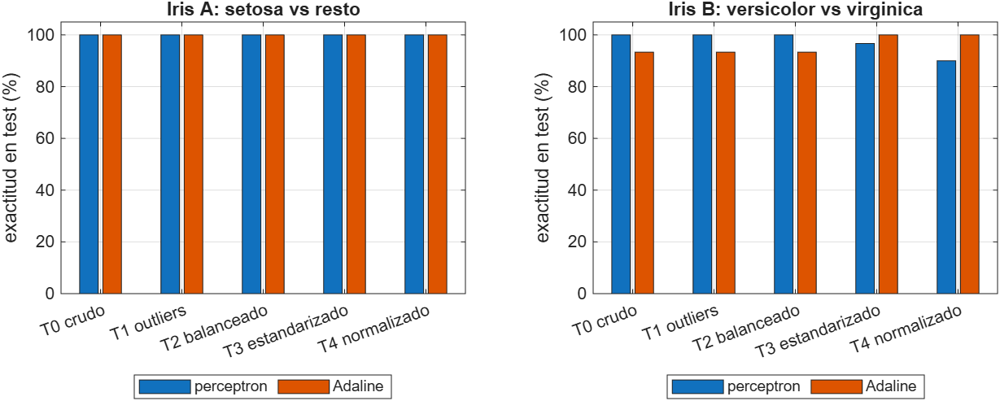
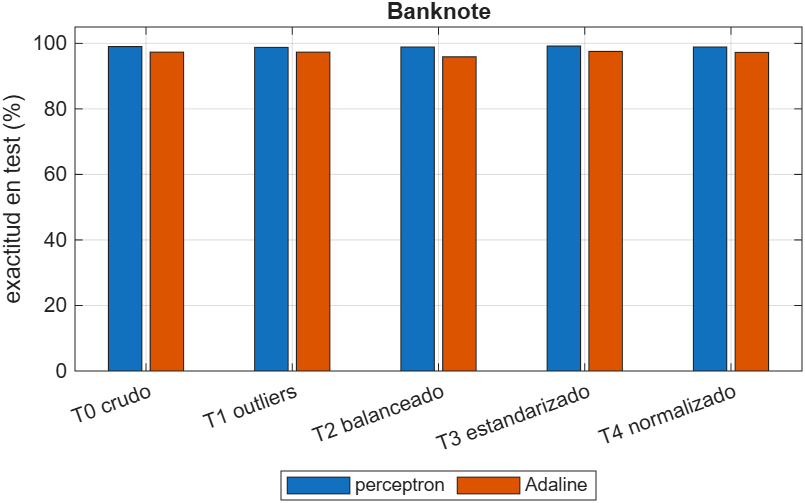

# Taller 1. Revisión de los datos y su efecto sobre el perceptrón y el Adaline

Inteligencia Computacional. Datasets del taller: Iris y banknote.

Antes de entrenar la neurona hay que mirar con qué datos se va a trabajar. Para cada dataset se hace lo mismo. Se mira el dato crudo, se corrige por pasos, y sobre cada versión se entrena el perceptrón y el Adaline del taller para ver qué paso le sirve a la red y cuál no. Los scripts `R1_revision_iris.mlx` y `R2_revision_banknote.mlx` hacen la revisión y dejan cinco tablas, `T0_crudo`, `T1_outliers`, `T2_balanceado`, `T3_estandarizado` y `T4_normalizado`. El script `R3_modelos_por_paso.mlx` entrena los dos modelos sobre cada una, partiendo 70 y 30 con la misma semilla, el perceptrón con la regla 3 y alfa 0,1 y el Adaline con alfa 0,01.

## 1. Iris

150 flores, cuatro medidas en centímetros (largo y ancho del sépalo, largo y ancho del pétalo) y la especie, que puede ser setosa, versicolor o virginica.

### 1.1 Cómo viene el dato

*Las medidas del pétalo separan setosa de las otras dos sin ayuda. Las del sépalo se pisan más.*

*Las cuatro están en centímetros y en rangos parecidos, entre 0 y 8. No hay una que domine a las demás por escala.*

*50 de cada clase. Ya viene balanceado.*

*Largo contra ancho del pétalo. Setosa queda sola abajo a la izquierda. Versicolor y virginica se traslapan en la frontera.*

### 1.2 Los pasos de corrección

**Outliers.** Regla del 1,5 por rango intercuartil, recortando al borde en vez de borrar la fila. Solo el ancho del sépalo tenía 4 valores fuera.

*Casi igual al crudo.*

**Balanceo.** No hay nada que balancear, son 50, 50 y 50. `T2_balanceado` es igual a `T1_outliers`.

**Estandarización y normalización.** Las dos parten del balanceado y son alternativas, no pasos seguidos.

*Media 0 y desviación 1 en las cuatro.*

*Todo entre 0 y 1.*

### 1.3 Perceptrón y Adaline sobre cada versión

La neurona es una sola, así que se arman dos problemas de dos clases. El problema A es setosa contra las otras dos, que se separa con una recta. El problema B es versicolor contra virginica, que no se separa del todo. La exactitud se mide en el 30 por ciento de prueba, 45 flores en A y 30 en B.

| Problema | Paso | Perceptrón, épocas | Perceptrón, exactitud | Adaline, épocas | Adaline, exactitud |
|---|---|---|---|---|---|
| A | crudo | 2 | 100 % | 372 | 100 % |
| A | sin outliers | 2 | 100 % | 346 | 100 % |
| A | balanceado | 2 | 100 % | 346 | 100 % |
| A | estandarizado | 2 | 100 % | 40 | 100 % |
| A | normalizado | 4 | 100 % | 500 | 100 % |
| B | crudo | 200 | 100 % | 500 | 93,3 % |
| B | sin outliers | 200 | 100 % | 500 | 93,3 % |
| B | balanceado | 200 | 100 % | 500 | 93,3 % |
| B | estandarizado | 200 | 96,7 % | 211 | 100 % |
| B | normalizado | 200 | 90,0 % | 500 | 100 % |

*Perceptrón y Adaline sobre las cinco versiones de Iris.*

**Qué se ve.** En el problema A los dos modelos aciertan el 100 por ciento en las cinco versiones. El perceptrón converge en 2 épocas y no se inmuta con nada. Al Adaline el escalado sí le cambia la vida, pero no en la exactitud sino en la velocidad. Con el dato crudo necesita 372 épocas para estabilizar el error y con el dato estandarizado necesita 40. Es la regla delta en acción. La corrección es proporcional al valor de la entrada, y con las cuatro medidas centradas en cero y con la misma dispersión el descenso va derecho al mínimo.

En el problema B el perceptrón nunca converge y agota las 200 épocas en las cinco versiones, porque versicolor y virginica no se separan con una recta. Aun así acierta las 30 flores de prueba con el dato crudo, y baja a 96,7 y 90 por ciento con el dato escalado. Ese 100 por ciento hay que leerlo con cuidado. Como no converge, los pesos con los que termina son los de la última corrección que hizo, y con 30 flores de prueba que le vaya bien o mal depende de en qué punto lo pilló la época 200. El Adaline hace lo contrario. Da 93,3 por ciento con el dato crudo y 100 por ciento con el dato escalado, y además con el dato estandarizado sí logra estabilizar el error en 211 épocas.

Para Iris el único paso que hizo algo fue escalar, y lo hizo sobre el Adaline. Outliers y balanceo no tenían nada que corregir.

## 2. Banknote

1372 billetes. A cada uno le tomaron una foto, le aplicaron una transformada wavelet y de ahí sacaron cuatro números que describen la textura. Son la varianza, la asimetría, la curtosis y la entropía. La clase es si el billete es auténtico o falso.

### 2.1 Cómo viene el dato

*La varianza separa bastante. Los falsos se concentran en valores negativos. La entropía casi no distingue.*

*Cuatro escalas distintas. La curtosis llega a 18 y la entropía no pasa de 2,5.*

*762 auténticos y 610 falsos. Desbalance suave.*

*Varianza contra asimetría. Las dos nubes están separadas, pero la línea que las divide no es recta.*

### 2.2 Los pasos de corrección

**Outliers.** Regla del 1,5 por rango intercuartil, recortando al borde. Se recortan 57 valores de curtosis y 33 de entropía.

*Se recortan las colas de la curtosis y la entropía.*

**Balanceo.** Se toman 610 auténticos al azar para igualar a los 610 falsos. Quedan 1220 filas.

*610 y 610.*

**Estandarización y normalización.**

*Ahora las cuatro se comparan.*

*Todo entre 0 y 1.*

### 2.3 Perceptrón y Adaline sobre cada versión

La exactitud se mide en el 30 por ciento de prueba, 412 billetes en las dos primeras versiones y 366 en las balanceadas.

| Paso | Filas | Perceptrón, épocas | Perceptrón, exactitud | Adaline, épocas | Adaline, error cuadrático final | Adaline, exactitud |
|---|---|---|---|---|---|---|
| crudo | 1372 | 200 | 99,0 % | 6 | 46,8 | 97,3 % |
| sin outliers | 1372 | 200 | 98,8 % | 6 | 32,1 | 97,3 % |
| balanceado | 1220 | 43 | 98,9 % | 6 | 29,4 | 95,9 % |
| estandarizado | 1220 | 23 | 99,2 % | 7 | 13,4 | 97,5 % |
| normalizado | 1220 | 42 | 98,9 % | 161 | 13,1 | 97,3 % |

*Perceptrón y Adaline sobre las cinco versiones de banknote.*

**Qué se ve.** La exactitud casi no se mueve. El perceptrón queda entre 98,8 y 99,2 por ciento y el Adaline entre 95,9 y 97,5 por ciento en las cinco versiones. Lo que sí cambia es cómo llegan ahí.

El perceptrón con el dato crudo y con el dato sin outliers no converge y agota las 200 épocas. Con el dato balanceado converge en 43 épocas, con el estandarizado en 23 y con el normalizado en 42. O sea que el conjunto de entrenamiento completo no es linealmente separable, pero al quitar 152 auténticos al azar el subconjunto que queda sí lo es, y la neurona encuentra la recta. La exactitud en prueba es la misma, alrededor de 99 por ciento, porque los billetes que quedan del lado equivocado de cualquier recta siguen ahí en el conjunto de prueba.

Al Adaline el paso que le importa es escalar, y se ve en el error cuadrático, que pasa de 46,8 con el dato crudo a 13,4 con el estandarizado. Sin escalar, la curtosis que llega a 18 domina las correcciones y el error se queda alto. Con el dato normalizado entre 0 y 1 el error también baja, pero tarda 161 épocas en vez de 7, porque con todas las entradas comprimidas entre 0 y 1 cada corrección es más pequeña y el mismo alfa de 0,01 avanza más despacio.

### 2.4 Por qué el perceptrón no llega al 100 por ciento ni con el dato procesado

La pregunta es si los billetes son linealmente separables, o sea si existe un plano que deje todos los auténticos de un lado y todos los falsos del otro. La respuesta es que casi, pero no. El perceptrón sobre el dato completo nunca converge, y si las clases fueran separables tendría que converger, por el teorema de convergencia del perceptrón. Hay alrededor de un 1 por ciento de billetes que quedan del lado equivocado de cualquier plano.

Lo que sí pasa es que las dos clases no se traslapan. No hay billetes auténticos y falsos con los mismos cuatro valores. Se ve en la dispersión de varianza contra asimetría de la sección 2.1. Las dos nubes están separadas pero la línea que las divide tiene una curva que un plano no puede seguir. Una neurona sola solo sabe dibujar planos, así que se queda en el 99 por ciento, con el dato crudo y con el procesado. El procesamiento no puede enderezar esa curva. Quitar outliers recortando al borde no mueve ningún billete al otro lado de la frontera, balancear quita filas pero la nube es la misma, y escalar cambia las unidades pero no la forma.

## 3. Conclusión

En ninguno de los dos datasets el procesamiento mejoró la exactitud de forma clara, y eso es lo que había que aprender de la revisión. Iris viene balanceado, en una sola escala y con un problema separable y otro que no lo es. Banknote tiene escalas distintas y un desbalance suave, pero las clases no se traslapan y la frontera es curva. En los dos casos lo que el procesamiento sí cambió fue el entrenamiento. Escalar le bajó al Adaline las épocas de 372 a 40 en Iris y el error cuadrático de 46,8 a 13,4 en banknote, y balancear hizo que el perceptrón convergiera en banknote cuando con el dato completo no lo hacía. La exactitud final es la misma porque el límite no lo pone el dato sino el modelo. Una neurona sola dibuja una recta, y donde las clases no se separan con una recta, ningún paso de limpieza lo arregla. La forma de saber qué pasos hacían falta fue mirar las gráficas antes de entrenar nada.
