# Taller 1. Revisión de los datos antes de la red

Inteligencia Computacional. Datasets del taller: Iris y banknote.

Antes de entrenar el perceptrón y el Adaline hay que mirar con qué datos se va a trabajar. Para cada dataset se hace lo mismo: se mira el dato crudo, se corrige por pasos, y después de cada paso se entrenan todos los modelos de Classification Learner para ver si mejoran. Los scripts `R1_revision_iris.mlx` y `R2_revision_banknote.mlx` dejan en el workspace una tabla por paso: `T0_crudo`, `T1_outliers`, `T2_balanceado`, `T3_estandarizado` y `T4_normalizado`.

## 1. Iris

150 flores, cuatro medidas en centímetros (largo y ancho del sépalo, largo y ancho del pétalo) y la especie: setosa, versicolor o virginica.

### 1.1 Dato crudo

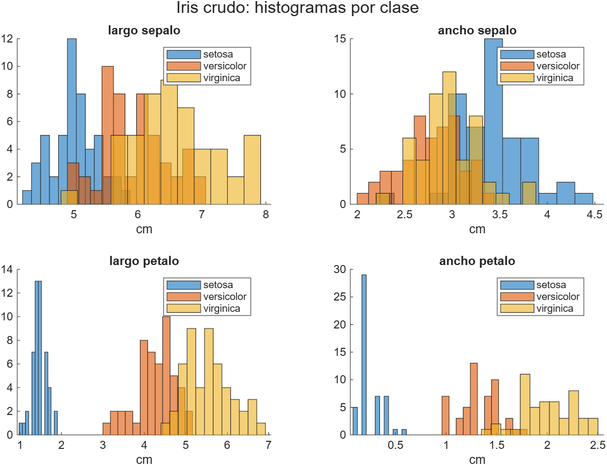
*Las medidas del pétalo separan setosa de las otras dos sin ayuda. Las del sépalo se pisan más.*

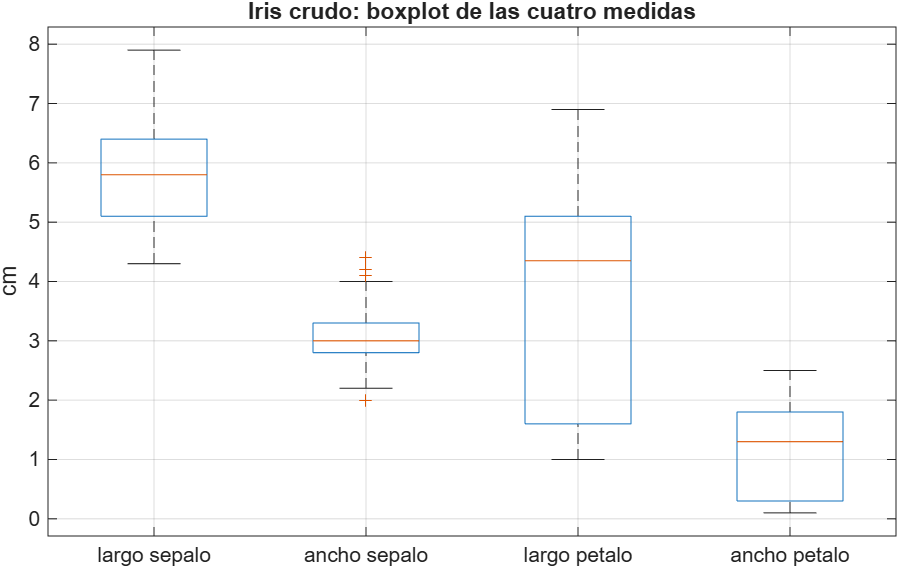
*Las cuatro están en centímetros y en rangos parecidos, entre 0 y 8. No hay una que domine a las demás por escala.*

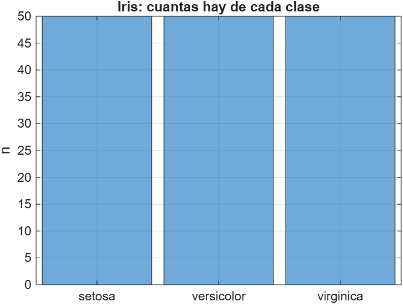
*50 de cada clase. Ya viene balanceado.*

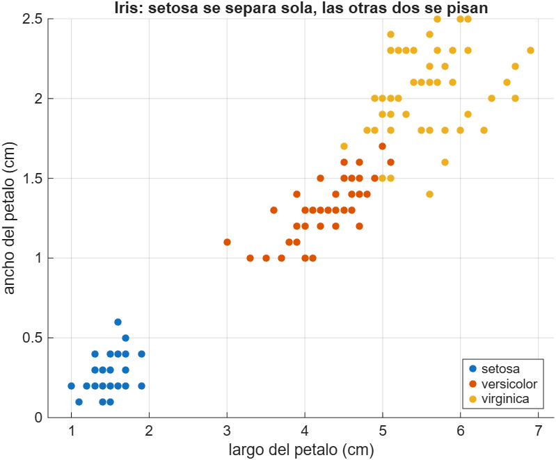
*Largo contra ancho del pétalo. Setosa queda sola abajo a la izquierda; versicolor y virginica se traslapan en la frontera.*

Modelos con el dato crudo:

*Classification Learner con T0_crudo, validación cruzada de 5 pliegues.*

| Mejor modelo | Exactitud |
|---|---|
| Linear Discriminant y Quadratic Discriminant | 98,0 % |

Con el dato tal como viene ya se llega al 98 %. Es un dataset fácil: setosa se separa sola y el error está en las 3 flores de la frontera entre versicolor y virginica.

### 1.2 Corrigiendo outliers

Regla del 1,5 por rango intercuartil, recortando al borde en vez de borrar la fila. Solo el ancho del sépalo tenía unos pocos valores fuera.

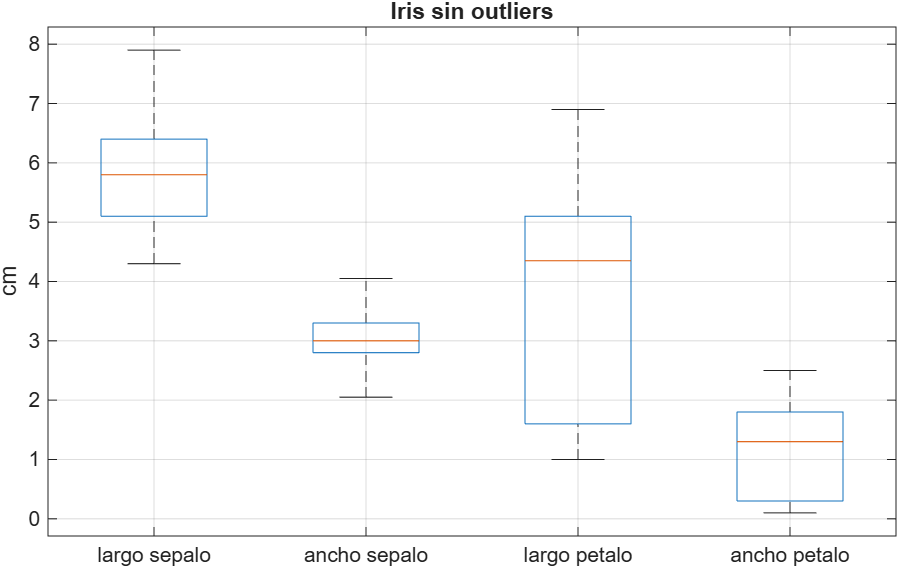
*Casi igual al crudo. En Iris este paso no cambia nada.*

*Classification Learner con T1_outliers.*

| Mejor modelo | Exactitud | Cambió respecto al paso anterior |
|---|---|---|
| Linear Discriminant | 98,0 % | no |

Recortar 4 valores del ancho del sépalo no mueve al mejor modelo. Los árboles bajaron de 96,7 a 96,0 y el SVM cúbico de 95,3 a 92,7, pero son diferencias de una o dos flores.

### 1.3 Balanceando las clases

No hay nada que balancear, son 50, 50 y 50. La tabla `T2_balanceado` es la misma que `T1_outliers` y se deja con ese nombre para seguir el orden.

*Classification Learner con T2_balanceado, que son los mismos datos de T1.*

| Mejor modelo | Exactitud | Cambió |
|---|---|---|
| Efficient Linear SVM | 98,7 % | sube 0,7 puntos |

Ojo con este 98,7 %: los datos son exactamente los mismos de T1. Lo que cambió es que la app volvió a repartir al azar los 5 pliegues de la validación cruzada, y con 150 flores un pliegue distinto mueve el resultado una flor. 98,7 contra 98,0 es una flor de 150. No es una mejora del balanceo, porque no hubo balanceo.

### 1.4 Estandarizando

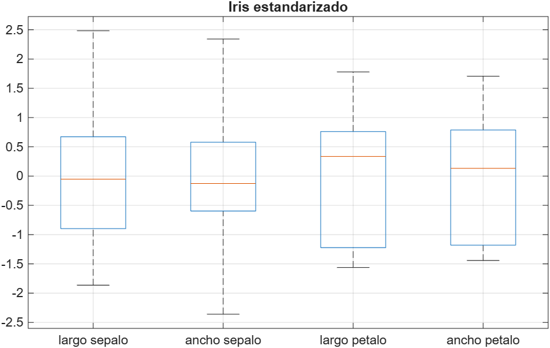
*Media 0 y desviación 1 en las cuatro.*

*Classification Learner con T3_estandarizado.*

| Mejor modelo | Exactitud | Cambió |
|---|---|---|
| Linear Discriminant, Quadratic Discriminant y Quadratic SVM | 98,0 % | no |

Estandarizar no cambia el techo del 98 %, pero sube el SVM cuadrático de 97,3 a 98,0 y baja los árboles finos a 94,7. Tiene sentido: a los discriminantes y a los árboles la escala no les importa, a los SVM sí.

### 1.5 Normalizando

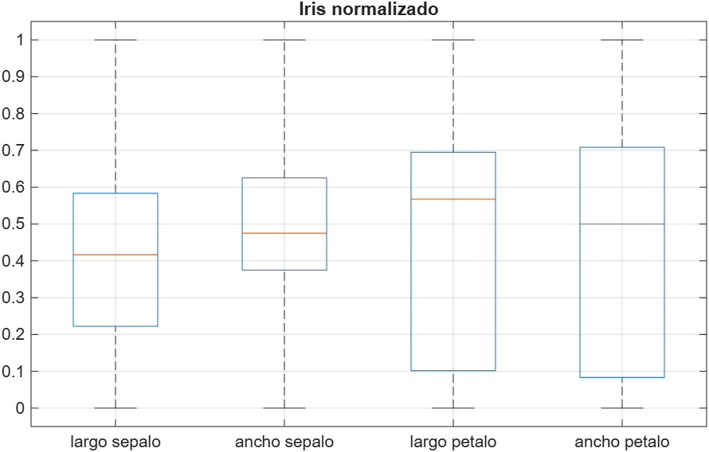
*Todo entre 0 y 1.*

*Classification Learner con T4_normalizado.*

| Mejor modelo | Exactitud | Cambió |
|---|---|---|
| Linear Discriminant | 98,0 % | no |

Igual que estandarizar. El discriminante lineal da 98 % con cualquier versión de los datos.

### 1.6 Qué pasó en Iris

Los 12 modelos de la app en cada paso, exactitud de validación en %:

| Modelo | T0 crudo | T1 outliers | T2 balanceado | T3 estandarizado | T4 normalizado |
|---|---|---|---|---|---|
| Fine Tree | 96,7 | 96,0 | 96,0 | 94,7 | 95,3 |
| Medium Tree | 96,7 | 96,0 | 96,0 | 94,7 | 95,3 |
| Coarse Tree | 96,7 | 96,0 | 96,0 | 96,7 | 95,3 |
| Linear Discriminant | **98,0** | **98,0** | 98,0 | **98,0** | **98,0** |
| Quadratic Discriminant | **98,0** | 96,7 | 97,3 | **98,0** | 96,7 |
| Efficient Logistic Regression | 96,7 | 97,3 | 96,7 | 96,0 | 95,3 |
| Efficient Linear SVM | 97,3 | 97,3 | **98,7** | 96,7 | 96,0 |
| Gaussian Naive Bayes | 94,7 | 95,3 | 96,0 | 95,3 | 95,3 |
| Kernel Naive Bayes | 96,0 | 96,0 | 96,0 | 95,3 | 96,0 |
| Linear SVM | 95,3 | 96,7 | 96,7 | 96,0 | 95,3 |
| Quadratic SVM | 96,7 | 94,7 | 97,3 | **98,0** | 96,7 |
| Cubic SVM | 95,3 | 92,7 | 96,0 | 96,7 | 94,7 |

| Paso | Filas | Mejor modelo | Exactitud |
|---|---|---|---|
| Crudo | 150 | Linear y Quadratic Discriminant | 98,0 % |
| Sin outliers | 150 | Linear Discriminant | 98,0 % |
| Balanceado | 150 | Efficient Linear SVM | 98,7 % |
| Estandarizado | 150 | Linear Discriminant, Quadratic Discriminant, Quadratic SVM | 98,0 % |
| Normalizado | 150 | Linear Discriminant | 98,0 % |

En Iris ningún paso ayudó de verdad, y eso es lo que había que ver. El dataset viene limpio, balanceado y con las cuatro medidas en la misma escala, así que corregir outliers, balancear y escalar no tenían nada que corregir. El discriminante lineal da 98 % en las cinco versiones. Las subidas y bajadas de las otras filas son de una o dos flores y cambian con solo volver a repartir los pliegues. El único modelo al que sí le importa el escalado es el SVM, que con datos estandarizados sube al 98 %.

## 2. Banknote

1372 billetes. A cada uno le tomaron una foto, le aplicaron una transformada wavelet y de ahí sacaron cuatro números que describen la textura: varianza, asimetría, curtosis y entropía. La clase es si el billete es auténtico o falso.

### 2.1 Dato crudo

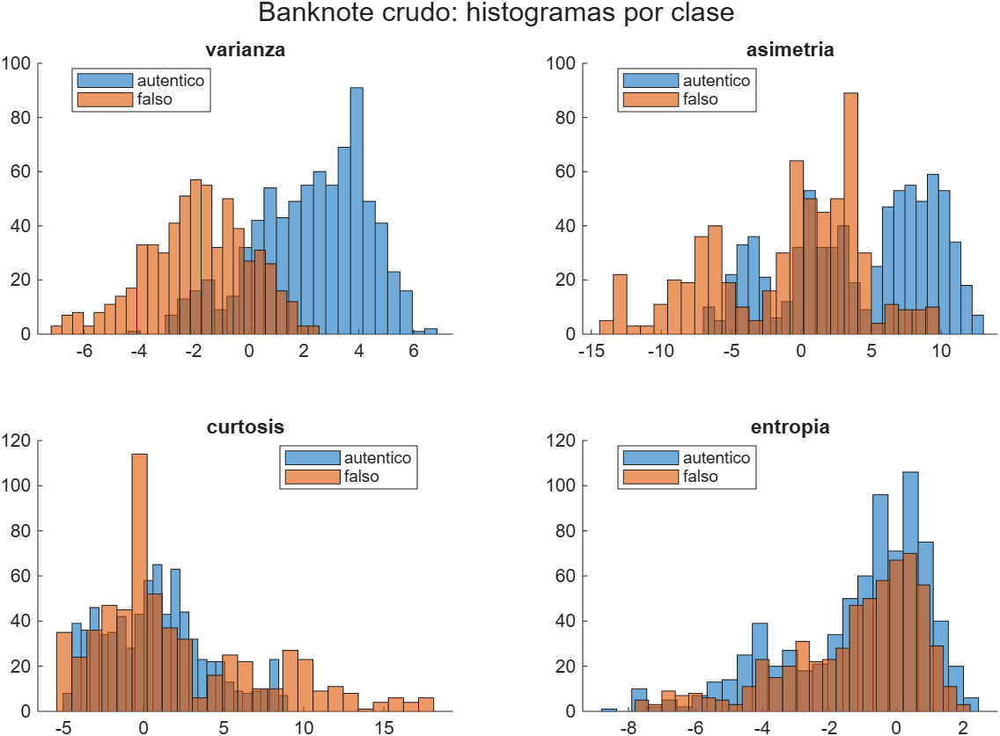
*La varianza separa bastante: los falsos se concentran en valores negativos. La entropía casi no distingue.*

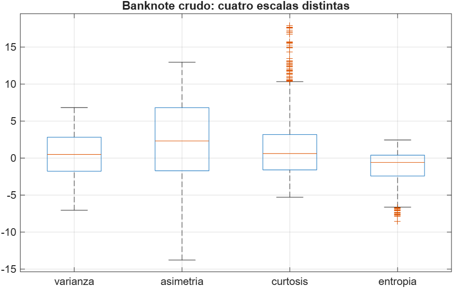
*Cuatro escalas distintas. La curtosis llega a 18 y la entropía no pasa de 2,5. Aquí sí va a importar escalar.*

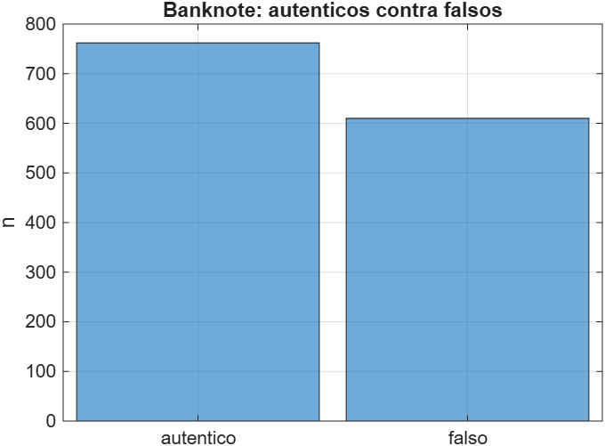
*762 auténticos y 610 falsos. Desbalance suave.*

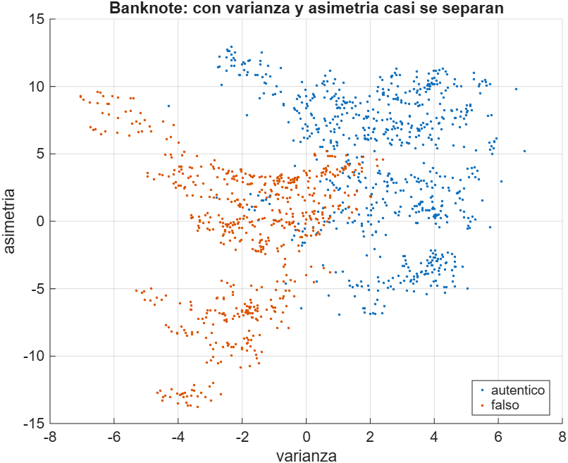
*Varianza contra asimetría. Con solo esas dos ya casi se separan.*

*Classification Learner con T0_crudo, validación cruzada de 5 pliegues.*

| Mejor modelo | Exactitud |
|---|---|
| Quadratic SVM, Fine Gaussian SVM y Medium Gaussian SVM | 100 % |

Con el dato crudo, sin tocar nada, tres SVM clasifican los 1372 billetes sin un solo error, y los KNN quedan en 99,9 %. El SVM lineal se queda en 98,8 % y el Naive Bayes gaussiano en 84,2 %.

### 2.2 Corrigiendo outliers

Regla del 1,5 por rango intercuartil, recortando al borde. Se recortan 57 valores de curtosis y 33 de entropía.

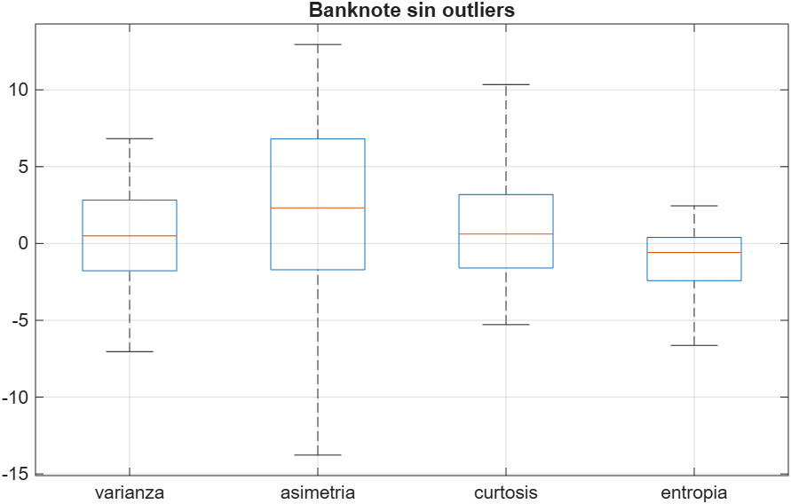
*Se recortan las colas de la curtosis y la entropía.*

No se corrió en la app. Como el crudo ya daba 100 %, se saltó directo a la última versión del dato para ver si el procesamiento completo cambiaba algo.

### 2.3 Balanceando las clases

Se toman 610 auténticos al azar para igualar a los 610 falsos. Quedan 1220 filas.

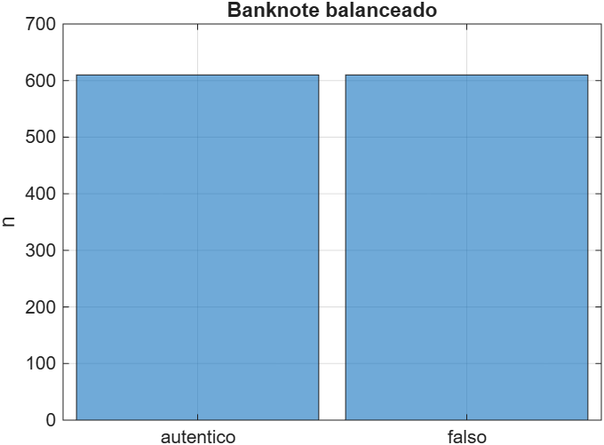
*610 y 610.*

No se corrió en la app por la misma razón.

### 2.4 Estandarizando

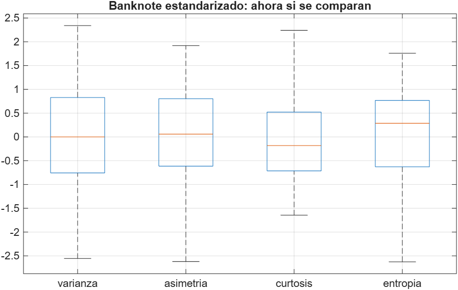
*Ahora las cuatro se comparan.*

No se corrió en la app.

### 2.5 Normalizando

Es el dato con todo el procesamiento encima: sin outliers, balanceado y entre 0 y 1.

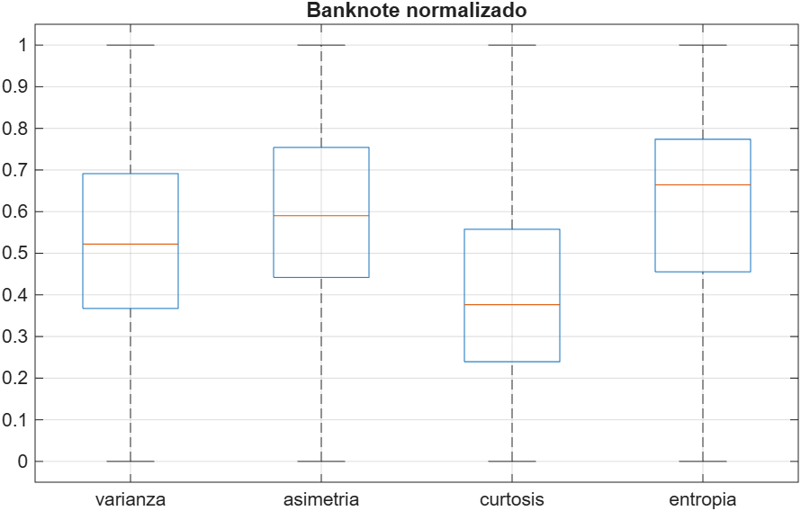
*Todo entre 0 y 1.*

*Classification Learner con T4_normalizado, 1220 billetes.*

| Mejor modelo | Exactitud | Cambió |
|---|---|---|
| Cubic SVM y Fine Gaussian SVM | 100 % | no |

Lo mismo que con el crudo. Cambia cuál SVM llega al 100 % y cuál se queda en 99,9 %, pero eso es un billete de 1220.

### 2.6 Qué pasó en banknote

Los modelos de la app en los dos pasos que se corrieron, exactitud de validación en %:

| Modelo | T0 crudo (1372) | T4 procesado (1220) |
|---|---|---|
| Gaussian Naive Bayes | 84,2 | 84,8 |
| Kernel Naive Bayes | 91,6 | 92,4 |
| Linear SVM | 98,8 | 98,8 |
| Quadratic SVM | **100** | 99,9 |
| Cubic SVM | 99,9 | **100** |
| Fine Gaussian SVM | **100** | **100** |
| Medium Gaussian SVM | **100** | 99,8 |
| Coarse Gaussian SVM | 97,9 | 97,5 |
| Fine KNN | 99,9 | 99,8 |
| Medium KNN | 99,9 | 99,7 |
| Coarse KNN | 97,3 | 97,5 |
| Cosine KNN | 98,8 | 99,1 |

**Por qué da 100 % con el dato crudo y también con el procesado.** Hay dos preguntas distintas mezcladas aquí.

La primera es si las clases son linealmente separables, o sea si existe un plano que deje todos los auténticos de un lado y todos los falsos del otro. La respuesta es que casi, pero no del todo. El SVM lineal, que es el modelo que busca exactamente ese plano, se queda en 98,8 %: hay alrededor de 16 billetes que quedan del lado equivocado de cualquier plano. Eso coincide con lo que pasó en el taller con el perceptrón, que nunca convergió en 200 épocas sobre este dataset aunque acertara el 98 o 99 %. Si fueran linealmente separables el perceptrón tendría que haber convergido, por el teorema de convergencia.

La segunda es si las clases se pueden separar con una frontera curva. Ahí la respuesta es sí, y limpiamente. El SVM cuadrático, el cúbico y el gaussiano llegan al 100 %, y los KNN al 99,9 %. Eso quiere decir que las dos clases no se traslapan en ninguna parte del espacio de las cuatro variables: no hay billetes auténticos y falsos con los mismos valores. Lo único que pasa es que la frontera que los separa tiene una curva que un plano no puede seguir. Se ve en la dispersión de varianza contra asimetría de la sección 2.1: las dos nubes están separadas pero la línea que las divide no es recta.

Por eso el procesamiento no cambia nada. Quitar outliers recortando al borde no mueve ningún billete al otro lado de la frontera. Balancear quita 152 auténticos al azar, y una clase con 610 en vez de 762 sigue siendo la misma nube. Y escalar tampoco importa para el resultado, por una razón práctica: Classification Learner estandariza las entradas por defecto antes de entrenar los SVM y los KNN, así que a esos modelos les llega el dato ya escalado aunque uno le pase el crudo. Los únicos que sí ven el dato tal cual son los Naive Bayes, y son justamente los que peor van, 84 y 92 %, porque asumen que cada variable es una campana y las cuatro tienen colas largas.

En resumen: banknote no es linealmente separable, pero sí es separable, y con una frontera curva cualquier modelo flexible lo resuelve completo con el dato crudo. El preprocesamiento no tenía nada que arreglar.

## 3. Conclusión

En ninguno de los dos datasets el preprocesamiento mejoró el mejor modelo, y eso es lo que había que aprender de esta revisión. Iris viene balanceado, en una sola escala y casi separable: el discriminante lineal da 98 % con las cinco versiones del dato y los 3 errores son flores de la frontera entre versicolor y virginica que ningún paso puede mover. Banknote tiene escalas distintas y un desbalance suave, pero las clases no se traslapan, así que un SVM con kernel llega al 100 % con el dato crudo y con el procesado. Lo que sí se vio en los dos es qué modelos dependen de la escala y cuáles no: discriminantes y árboles no la notan, los SVM sí, y la app se la corrige sola. Corregir outliers, balancear y escalar son pasos que hay que hacer cuando el dato lo necesita; estos dos no lo necesitaban, y la forma de saberlo fue mirar las gráficas antes de correr nada.
